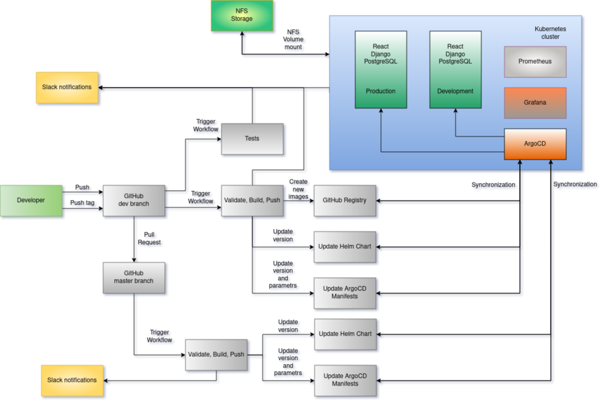

This is a tutorial project designed to download videos from YouTube.

**Project's reporter:** Vladislav Miazhenny

**Group number:** m-sa2-31-25

### Description of application for deployment

- Yt_downloader
- Languages were used: JavaScript, Python
- DB is PosgreSQL
- [Application repository](https://github.com/infinity-step/final_project)

### Pipeline. High Level Design

### Technologies which were used in project

Python, Bash, JavaScript, GitHub Actions, ArgoCD, React, Django, k8s, PostgreSQL, docker, webhook, hadolint, kubeseal, Prometheus, Grafana

**Notifications:** Slack

**CI Description:**

The project has 2 deployment environments: `dev` for tests(development) and `prod` for production

1. Developer pushes changes in the development brach
2. Triggers Github Actions:
	- Validates projects code
	- Validates Dockerfiles
3. Developer adds new tag:
	- Build a Docker image with the new tag
	- Pushes image to GitHub Registry
	- Creates Helm Chart and updates the ArgoCD manifest
	- Sends notificatin to Slack
	- ArgoCD updates development environment
4. Developer creates PR from development to master branch
	- Determines the latest tag from development branch
	- Creates Helm Chart and updates the ArgoCD manifest
	- Sends notification to Slack
	- Check image in GitHub Registry
	- ArgoCD updates production environment

**Deployment flows short description:**
The new version of the application is deployed to the development environment. If everything is successful, developer makes PR to the master branch and this version is deployed to the production environment.
Deployment occurs using CI/CD pipelines in GitHub Actions.
Deployment is configured using ArgoCD, to which a repository with Helm charts and ArgoCD manifests is connected.
PostgreSQL database and user data are stored in a Persistent Volume Claim (PVC)

**Rollback flow description and implementation:**

Rollback is done through the ArgoCD UI.
Rollback occurs without data loss as they are stored in PVC.

### Links
[Helm chart and ArgoCD manifests repository](https://github.com/infinity-step/final_project)
