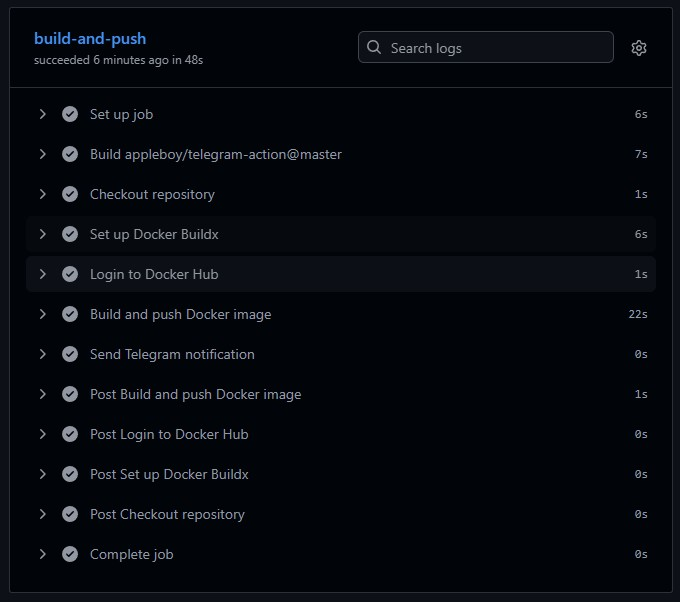
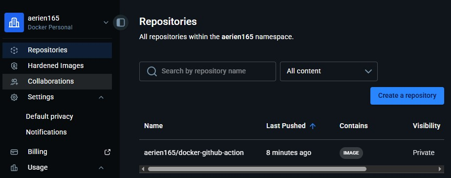
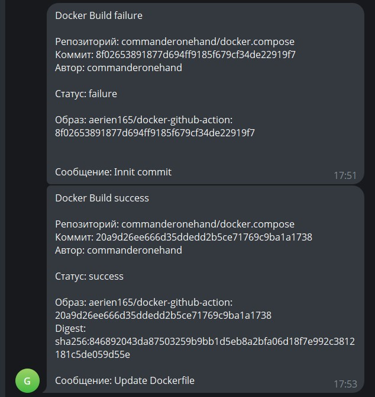

# 08. Docker. Docker compose
## 01. Docker Compose for Application Stacks
### `docker-compose.yaml`
```yaml
services:
  db:
    image: postgres:alpine
    container_name: node_pg_db
    restart: always
    environment:
      POSTGRES_DB: testdb
      POSTGRES_USER: testuser
      POSTGRES_PASSWORD: testpass
    volumes:
      - postgres_data:/var/lib/postgresql/data
    networks:
      - app_network
    healthcheck:
      test: ["CMD-SHELL", "pg_isready -U testuser -d testdb"]
      interval: 5s
      timeout: 5s
      retries: 5

  app:
    build: .
    container_name: node_app
    restart: always
    depends_on:
      db:
        condition: service_healthy
    ports:
      - "3000:3000"
    environment:
      DB_HOST: db
      DB_NAME: testdb
      DB_USER: testuser
      DB_PASSWORD: testpass
    networks:
      - app_network

volumes:
  postgres_data:
    name: node_postgres_data

networks:
  app_network:
    name: node_app_network
    driver: bridge
```
### local docker compose
```bash
user@debian:/home/node-app# docker compose up -d
[+] up 12/12
 ✔ Image postgres:alpine Pulled                                                                                    23.1s
[+] Building 17.4s (9/10)
 => [internal] load local bake definitions                                                                         0.0s
 => => reading from stdin 470B                                                                                     0.0s
 => [internal] load build definition from Dockerfile                                                               0.0s
 => => transferring dockerfile: 184B                                                                               0.0s
 => [internal] load metadata for docker.io/library/node:alpine                                                     2.6s
 => [internal] load .dockerignore                                                                                  0.0s
 => => transferring context: 2B                                                                                    0.0s
 => [1/5] FROM docker.io/library/node:alpine@sha256:5209bcaca9836eb3448b650396213dbe9d9a34d31840c2ae1f206cb2986a  11.9s
 => => resolve docker.io/library/node:alpine@sha256:5209bcaca9836eb3448b650396213dbe9d9a34d31840c2ae1f206cb2986a8  0.1s
 => => sha256:6cabc93857eeddbefbddb29f7ea0c2fce2fc6f4a79e524f847bc7c48bae462fd 1.26MB / 1.26MB                     0.6s
 => => sha256:9dda8d3ac8176c4285f11115dc0135ab2acc33a40eaf3b8a0fda0f5db9d2ec7e 447B / 447B                         0.8s
 => => sha256:43fe546295be092060ba08bc17b429bfe4d5e31f4709cae608280bee5b35b0af 54.61MB / 54.61MB                   7.5s
 => => extracting sha256:43fe546295be092060ba08bc17b429bfe4d5e31f4709cae608280bee5b35b0af                          4.0s
 => => extracting sha256:6cabc93857eeddbefbddb29f7ea0c2fce2fc6f4a79e524f847bc7c48bae462fd                          0.2s
 => => extracting sha256:9dda8d3ac8176c4285f11115dc0135ab2acc33a40eaf3b8a0fda0f5db9d2ec7e                          0.2s
 => [internal] load build context                                                                                  0.0s
 => => transferring context: 2.75kB                                                                                0.0s
 => [2/5] WORKDIR /app                                                                                             0.2s
 => [3/5] COPY package*.json ./                                                                                    0.0s
 #typo in Dockerfile, fixed it and ran again
 user@debian:/home/node-app# docker compose up -d
[+] Building 9.2s (12/12) FINISHED
 => [internal] load local bake definitions                                                                         0.0s
 => => reading from stdin 470B                                                                                     0.0s
 => [internal] load build definition from Dockerfile                                                               0.0s
 => => transferring dockerfile: 173B                                                                               0.0s
 => [internal] load metadata for docker.io/library/node:alpine                                                     1.7s
 => [internal] load .dockerignore                                                                                  0.0s
 => => transferring context: 2B                                                                                    0.0s
 => [1/5] FROM docker.io/library/node:alpine@sha256:5209bcaca9836eb3448b650396213dbe9d9a34d31840c2ae1f206cb2986a8  0.0s
 => => resolve docker.io/library/node:alpine@sha256:5209bcaca9836eb3448b650396213dbe9d9a34d31840c2ae1f206cb2986a8  0.0s
 => [internal] load build context                                                                                  0.0s
 => => transferring context: 60B                                                                                   0.0s
 => CACHED [2/5] WORKDIR /app                                                                                      0.0s
 => CACHED [3/5] COPY package*.json ./                                                                             0.0s
 => [4/5] RUN npm install                                                                                          6.3s
 => [5/5] COPY app.js .                                                                                            0.0s
 => exporting to image                                                                                             0.9s
 => => exporting layers                                                                                            0.4s
 => => exporting manifest sha256:1fccc6fb7b6754845eb6f48c614fc480329098a40b6de4ec82112fd5c32e9f65                  0.0s
 => => exporting config sha256:ffff3d3dd4106de759a0f916311ff9a6d3149ea4faf7c066e7179e15f19ac04a                    0.0s
 => => exporting attestation manifest sha256:d721ee520a3384826cea8c4a02a2d5e5932730a0c3bc65126b634e3fec1fd6f3      0.0s
 => => exporting manifest list sha256:8249d8af88812a0b89c8aeff59fbf2568e6d532f5692da3f8c1559f027b38bc2             0.0s
 => => naming to docker.io/library/node-app-app:latest                                                             0.0s
 => => unpacking to docker.io/library/node-app-app:latest                                                          0.4s
 => resolving provenance for metadata file                                                                         0.0s
[+] up 5/5
 ✔ Image node-app-app        Built                                                                                  9.3s
 ✔ Network node_app_network  Created                                                                                0.0s
 ✔ Volume node_postgres_data Created                                                                                0.0s
 ✔ Container node_pg_db      Healthy                                                                                6.1s
 ✔ Container node_app        Started                                                                                6.3s
user@debian:/home/node-app# docker compose ps
NAME         IMAGE             COMMAND                  SERVICE   CREATED          STATUS                    PORTS
node_app     node-app-app      "docker-entrypoint.s…"   app       49 seconds ago   Up 43 seconds             0.0.0.0:3000->3000/tcp, [::]:3000->3000/tcp
node_pg_db   postgres:alpine   "docker-entrypoint.s…"   db        49 seconds ago   Up 49 seconds (healthy)   5432/tcp
```
## 02. Docker build automation (github action)
### `docker-build.yaml`
```yaml
name: Build and Push Docker Image

on:
  push:
    branches: 
      - main
  pull_request:
    branches:
      - main
  workflow_dispatch:

env:
  DOCKER_IMAGE: ${{ secrets.DOCKER_USERNAME }}/docker-github-action
  DOCKER_TAG: ${{ github.sha }}

jobs:
  build-and-push:
    runs-on: ubuntu-latest
    
    steps:
      - name: Checkout repository
        uses: actions/checkout@v3

      - name: Set up Docker Buildx
        uses: docker/setup-buildx-action@v2

      - name: Login to Docker Hub
        uses: docker/login-action@v2
        with:
          username: ${{ secrets.DOCKER_USERNAME }}
          password: ${{ secrets.DOCKER_PASSWORD }}

      - name: Build and push Docker image
        id: docker_build
        uses: docker/build-push-action@v4
        with:
          context: .
          push: true
          tags: |
            ${{ env.DOCKER_IMAGE }}:latest
            ${{ env.DOCKER_IMAGE }}:${{ env.DOCKER_TAG }}
          cache-from: type=gha
          cache-to: type=gha,mode=max

      - name: Send Telegram notification
        if: always()
        uses: appleboy/telegram-action@master
        with:
          to: ${{ secrets.TELEGRAM_CHAT_ID }}
          token: ${{ secrets.TELEGRAM_BOT_TOKEN }}
          message: |
            Docker Build ${{ job.status }}
            
            Репозиторий: ${{ github.repository }}
            Коммит: ${{ github.sha }}
            Автор: ${{ github.actor }}
            
            Статус: ${{ job.status }}
            
            Образ: ${{ env.DOCKER_IMAGE }}:${{ env.DOCKER_TAG }}
            ${{ steps.docker_build.outputs.digest && format('Digest: {0}', steps.docker_build.outputs.digest) || '' }}
            
            ${{ github.event.head_commit.message && format('Сообщение: {0}', github.event.head_commit.message) || '' }}
```
### git action result

### dockerhub

### notification
