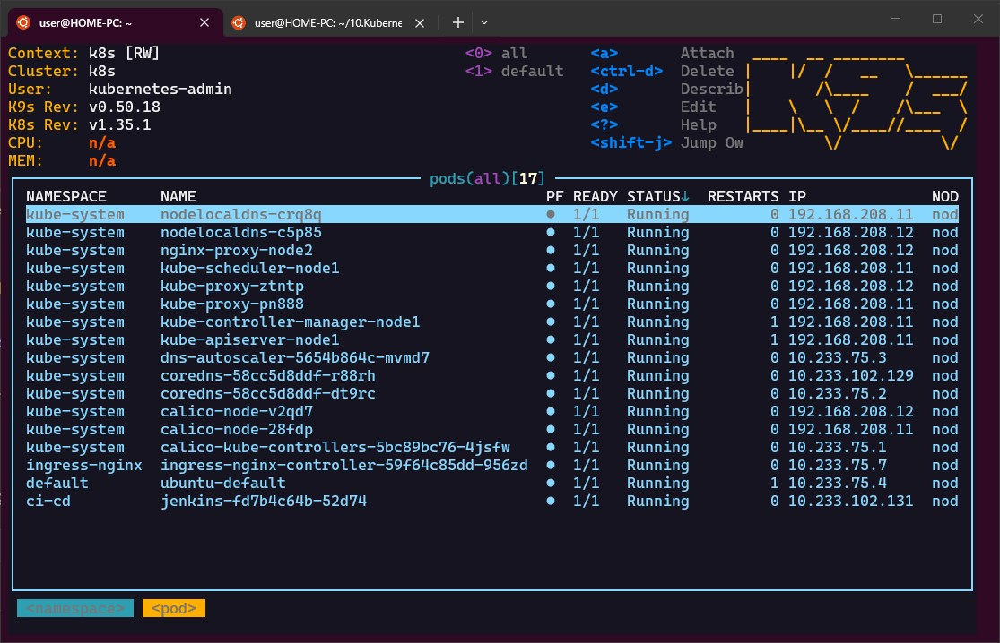
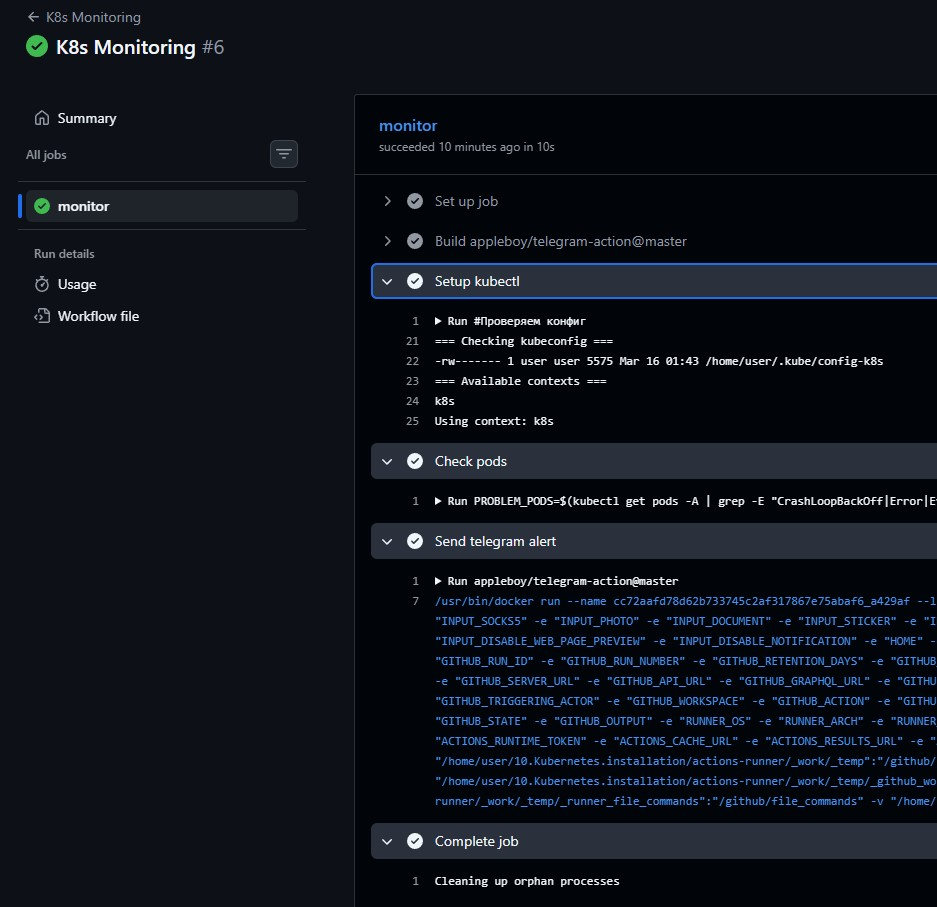

## 1. K8s Installation
```bash
   50  curl -LO "https://dl.k8s.io/release/$(curl -L -s https://dl.k8s.io/release/stable.txt)/bin/linux/amd64/kubectl"
   51  sudo install -o root -g root -m 0755 kubectl /usr/local/bin/kubectl

   58  wget https://github.com/derailed/k9s/releases/download/v0.50.18/k9s_linux_amd64.deb
   59  sudo dpkg -i k9s_linux_amd64.deb
   60  nc -w2 -v 127.0.0.1 6444
   61  k9s
```
### Screenshot k9s

### Screenshot GitHub action
