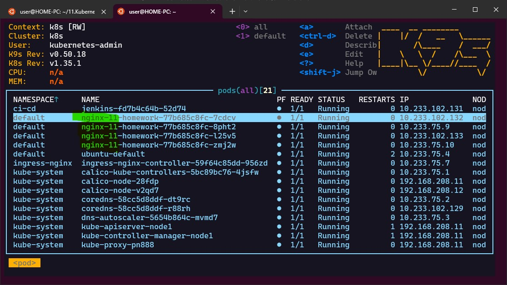

# 11. Kubernetes. Basic objects
## 1. Nginx deployment
### Screenshot

### comman history
```bash
  305  ssh -L 6443:127.0.0.1:6443 root@192.168.208.11 -f -N -o ServerAliveInterval=60
  306  kubectl get pods -A --context k8s
  307  mkdir 11.Kubernetes.Basic
  308  cd 11.Kubernetes.Basic/
  309  kubectl get ingressclass -A --context k8s #ingress from workshop 14
NAME    CONTROLLER             PARAMETERS   AGE
nginx   k8s.io/ingress-nginx   <none>       17d
  310  nano nginx.yaml
  311  kubectl --context k8s apply -f nginx.yaml
deployment.apps/nginx-11-homework created
service/nginx-11-service created
ingress.networking.k8s.io/nginx-ingress-11 created
  312  kubectl --context k8s get svc nginx-11-service
NAME               TYPE        CLUSTER-IP      EXTERNAL-IP   PORT(S)   AGE
nginx-11-service   ClusterIP   10.233.44.235   <none>        80/TCP    102s
  313  kubectl --context k8s get ingress
NAME               CLASS   HOSTS                  ADDRESS          PORTS   AGE
nginx-ingress-11   nginx   nginx-test.k8s-11.sa   192.168.208.12   80      111s
  314  kubectl --context k8s get pods -l app=nginx-11
NAME                                 READY   STATUS    RESTARTS   AGE
nginx-11-homework-77b685c8fc-7cdcv   1/1     Running   0          2m12s
nginx-11-homework-77b685c8fc-8pht2   1/1     Running   0          2m12s
nginx-11-homework-77b685c8fc-l25v5   1/1     Running   0          2m12s
nginx-11-homework-77b685c8fc-zmj2w   1/1     Running   0          2m12s
  315  kubectl --context k8s port-forward svc/nginx-11-service 8080:80
  316  curl http://localhost:8080
Handling connection for 8080
<!DOCTYPE html>
<html>
<head>
<title>Welcome to nginx!</title>
<style>
html { color-scheme: light dark; }
body { width: 35em; margin: 0 auto;
font-family: Tahoma, Verdana, Arial, sans-serif; }
</style>
</head>
<body>
<h1>Welcome to nginx!</h1>
<p>If you see this page, nginx is successfully installed and working.
Further configuration is required for the web server, reverse proxy,
API gateway, load balancer, content cache, or other features.</p>

<p>For online documentation and support please refer to
<a href="https://nginx.org/">nginx.org</a>.<br/>
To engage with the community please visit
<a href="https://community.nginx.org/">community.nginx.org</a>.<br/>
For enterprise grade support, professional services, additional
security features and capabilities please refer to
<a href="https://f5.com/nginx">f5.com/nginx</a>.</p>

<p><em>Thank you for using nginx.</em></p>
</body>
</html>
```
### nginx.yaml
```yaml
---
apiVersion: apps/v1
kind: Deployment
metadata:
  name: nginx-11-homework
  namespace: default
  labels:
    app: nginx-11
spec:
  replicas: 4
  selector:
    matchLabels:
      app: nginx-11
  strategy:
    type: RollingUpdate
    rollingUpdate:
      maxSurge: 1
      maxUnavailable: 0
  template:
    metadata:
      labels:
        app: nginx-11
    spec:
      containers:
      - name: nginx
        image: nginx:latest
        ports:
        - containerPort: 80
        resources:
          requests:
            cpu: 50m
            memory: 50Mi
          limits:
            cpu: 100m
            memory: 100Mi
        readinessProbe:
          httpGet:
            path: /
            port: 80
          initialDelaySeconds: 5
          periodSeconds: 5
---
apiVersion: v1
kind: Service
metadata:
  name: nginx-11-service
  namespace: default
  labels:
    run: nginx-11-service
spec:
  ports:
  - port: 80
    targetPort: 80
    protocol: TCP
  selector:
    app: nginx-11
  type: ClusterIP
---
apiVersion: networking.k8s.io/v1
kind: Ingress
metadata:
  name: nginx-ingress-11
  namespace: default
  annotations:
    nginx.ingress.kubernetes.io/rewrite-target: /
spec:
  ingressClassName: nginx
  rules:
  - host: nginx-test.k8s-11.sa
    http:
      paths:
      - path: /
        pathType: Prefix
        backend:
          service:
            name: nginx-11-service
            port:
              number: 80
```