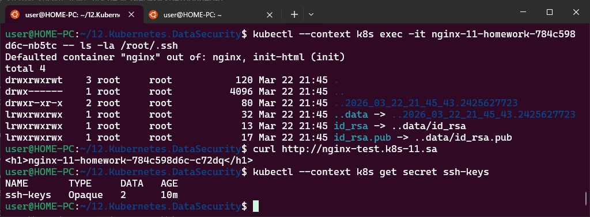

# 12. Kubernetes. Data. Security
## 1. Config maps and secrets
### Kubeseal install
```bash 
  329  curl -OL "https://github.com/bitnami-labs/sealed-secrets/releases/download/v0.36.0/kubeseal-0.36.0-linux-amd64.tar.gz"
  330  tar -xvzf kubeseal-0.36.0-linux-amd64.tar.gz kubeseal
  331  sudo install -m 755 kubeseal /usr/local/bin/kubeseal
  332  kubeseal --version
  333  kubectl --context k8s apply -f https://github.com/bitnami-labs/sealed-secrets/releases/download/v0.36.0/controller.yaml
```
### Generating pair public and private keys
```bash
  346  ssh-keygen -t rsa -b 4096 -f ./id_rsa -N ""
  347  kubectl create secret generic ssh-keys --from-file=id_rsa=./id_rsa --from-file=id_rsa.pub=./id_rsa.pub --dry-run=client -o yaml > secret.yaml
  348  ls
  349  cat secret.yaml
  350  kubeseal --format=yaml < secret.yaml > sealed-secret.yaml
  # forgot i should add context
  359  kubeseal --context k8s --format=yaml < secret.yaml > sealed-secret.yaml
  360  nano nginx.yaml # updated deployment yaml from lesson 11
  361  nano sealed-secret.yaml
  362  nano nginx.yaml
  363  kubectl --context k8s apply -f sealed-secret.yaml
  364  kubectl --context k8s apply -f nginx.yaml
```
### Validation
