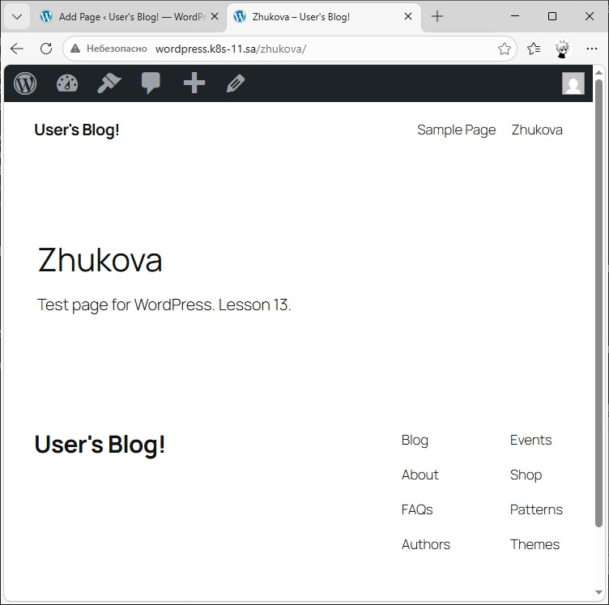
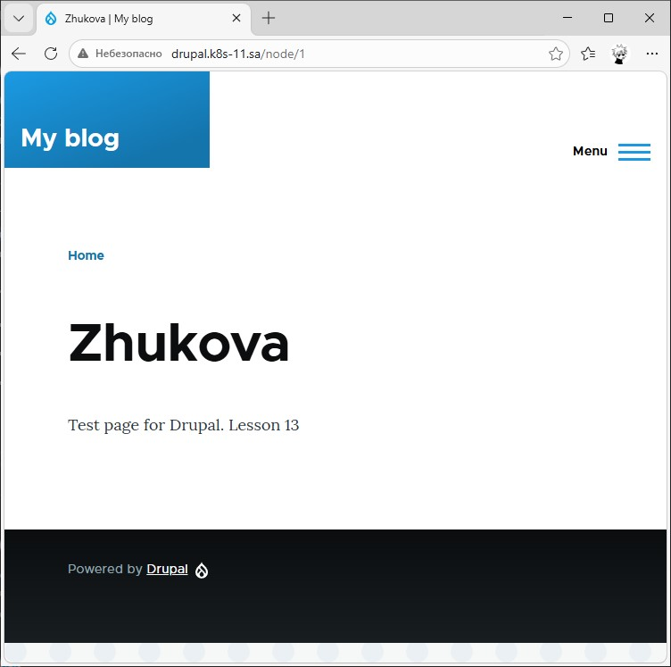

# 12. Kubernetes. Helm

## 1. Application deployment by Helm

### 1.1 Helm install

```bash
  308  cd 13.Kubernetes.Helm/
  309  mkdir -p {helm-releases,helm-sources}
  310  ls -l
  311  curl -fsSL -o get_helm.sh https://raw.githubusercontent.com/helm/helm/main/scripts/get-helm-4
  312  chmod 700 get_helm.sh
  313  ./get_helm.sh
  314  helm --help
  315  rm get_helm.sh
  316  helm version
```

### 1.2 Applications install

> For some reason I couldn't install both WordPress and Drupal at the same time no matter what I did, but they installed just fine sequentially. My theory is that it was due to resource constraints (I should have deleted Jenkins). I have a chart file for both, but I commented and updated dependencies when needed to deploy one app or the other. Plus, to keep variables in the virtualservice file, I edited host name in the cluster itself.

Chart.yaml
```yaml
apiVersion: v2
name: homework-apps
description: A Helm chart for Kubernetes

type: application

version: 0.1.0
appVersion: "1.16.0"

dependencies:
  - name: wordpress
    version: "29.1.2"
    repository: "oci://registry-1.docker.io/bitnamicharts"
  - name: drupal
    version: "23.0.0"
    repository: "oci://registry-1.docker.io/bitnamicharts"
```

---
Gateway.yaml
```yaml
apiVersion: networking.istio.io/v1alpha3
kind: Gateway
metadata:
  name: app-gateway
  namespace: homework-apps
spec:
  selector:
    istio: ingressgateway
  servers:
  - port:
      number: 80
      name: http
      protocol: HTTP
    hosts:
    - "*"
```

---
Virtualservice.yaml
```yaml
apiVersion: networking.istio.io/v1alpha3
kind: VirtualService
metadata:
  name: {{ .Release.Name }}-routing
  namespace: homework-apps
spec:
  gateways:
  - app-gateway
  hosts:
  - "wordpress.{{ .Values.global.domain }}"
  - "drupal.{{ .Values.global.domain }}"
  http:
  - match:
    - authority:
        exact: "wordpress.{{ .Values.global.domain }}"
    route:
    - destination:
        host: {{ .Release.Name }}-wordpress
        port:
          number: 80
  - match:
    - authority:
        exact: "drupal.{{ .Values.global.domain }}"
    route:
    - destination:
        host: {{ .Release.Name }}-drupal
        port:
          number: 80
```

---

#### 1.2.1 Wordpress 



```bash
  345  helm dependency update
  346  helm install wordpress-13 . -n homework-apps -f wordpress.yaml --kube-context k8s
  347  kubectl get svc -n homework-apps --context k8s
  348  kubectl edit vs -n homework-apps --context k8s
  349  helm uninstall wordpress-13 -n homework-apps --kube-context k8s
```

---

#### 1.2.2 Drupal



```bash
  351  nano Chart.yaml
  352  helm dependency update
  353  cp /mnt/d/homework/drupal.yaml .
  354  helm install drupal-13 . -n homework-apps -f drupal.yaml --kube-context k8s
  355  kubectl get svc -n homework-apps --context k8s
  356  kubectl edit vs -n homework-apps --context k8s
  357  helm uninstall drupal-13 -n homework-apps --kube-context k8s
```