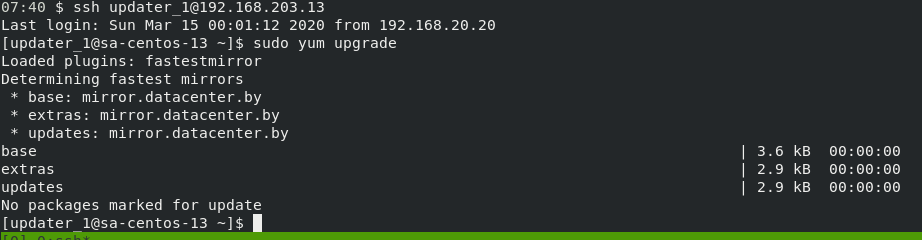

##    Playbook to display parameters form remote host:

  * [playbook.yaml](../Ansible/playbook.yaml):

```yaml
---
- hosts: all
  order: sorted
  #gather_facts: False
  remote_user: updater # play with user 
  become: yes
  tasks:
    - name: Print OS and version
      debug:
        msg: "{{ ansible_distribution }} | {{ ansible_distribution_version }}"

 # use gathering facts with filters (human_readable), and loop for list all mount points in system

    - name: Print Mountpoint, capasity and used
      debug:
        msg: 'Mountpoint {{ item.mount }}, 
              capasity: {{ item.size_total|human_readable(unit="G")}},
              free: {{ item.size_available|human_readable(unit="G")}}'
      loop:  "{{ ansible_mounts }}"
    - name: RAM
      debug: 
        msg: 'RAM capasity: {{ansible_memtotal_mb}} Mb, memory free: {{ansible_memfree_mb}} Mb'
```
  * [out_playbook.txt](./out_playbook.txt) 

## Playbook for create sudo user with ansible on all hosts:

  * Add pass from ansible-vaul to file:
```bash
echo 'XXXMyPassXXX' > .ansible_vault_pass 
echo '.ansible_vault_pass' >> ../../.gitignore
```
```
  - Add var in local ansible.cfg:
    vault_password_file = ./.ansible_vault_pass
```
  * Encrypt user files with ansible-vault:
```bash
ansible-vault encrypt ./users_home/updater_1/.ssh/*
```
[id_rsa.pub](./users_home/updater_1/.ssh/id_rsa.pub)


  * [useradd.yaml](../Ansible/useradd.yaml):

```yaml
---
- hosts: all
  #order: sorted
  #gather_facts: False
  remote_user: updater
  become: yes

# create vars with user name and his pub key from his home
  vars:
    name: updater_1
    key: "{{lookup('file', './users_home/updater_1/.ssh/id_rsa.pub') }}" 
  tasks:
  - name: Add sudoers users # use model user
    user:
      name: "{{ name }}"
      append: yes

# used modul lineinfile for add line in sudores file    
     
  - name: Allow "{{ name }}" to have passwordless sudo
    lineinfile:
      dest: /etc/sudoers
      state: present
      regexp: '^"{{ name }}"'
      line: '{{ name }} ALL=(ALL) NOPASSWD: ALL'
      validate: visudo -cf %s

# adding pub key in authorized_keys for user in directory ~/.ssh/
    
  - name: Set up authorized_keys for the "{{ name }}" user
    authorized_key:
      user: "{{ name }}"
      state: present
      key: "{{key}}" 
```
  * [out_useradd.txt](./out_useradd.txt)

  - test creating new user, ssh connect to host 192.168.203.13 :



  - test creating new user with task from 05.Ansible_start:

```bash
ansible ubuntu -m apt -a "update_cache=yes upgrade=full" -u updater_1 --become

```
  - out of test [test.txt](./test.txt)


     
