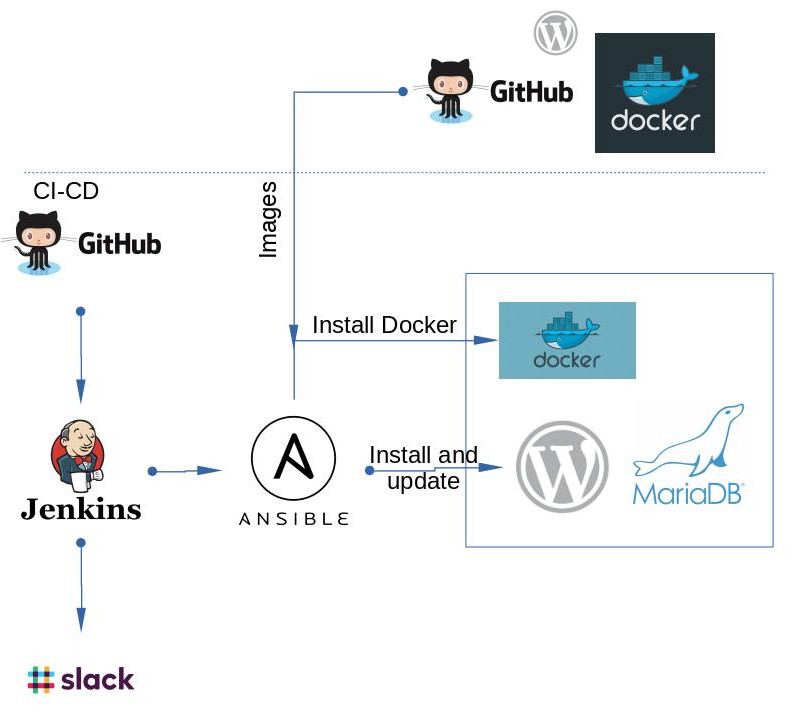

## Project report

### Project's reporter: Yas Kazeko
### Group number: m-sa2-12-20

## Description of application for deployment
- Name: Wordpress
- Application is written in PHP
- Used database: MariaDB
- Proxy: Nginx
- [GitHUB CI-CD repository](https://github.com/yaskazeko/wordpress)

### High Level Design

### Technologies which were used in project
- **Orchestration:** Jenkins
- **Automation tools:** Ansible
- **Container:** Docker
- **CVS:** GitHub
- **CI description:** by schedule
- **Notification:** Slack