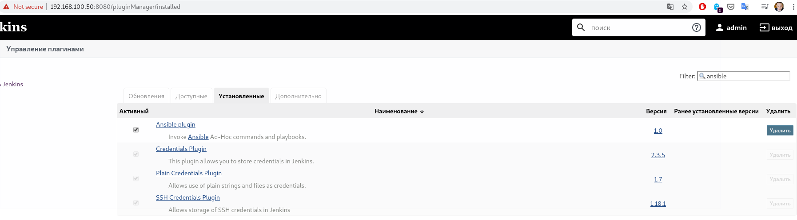
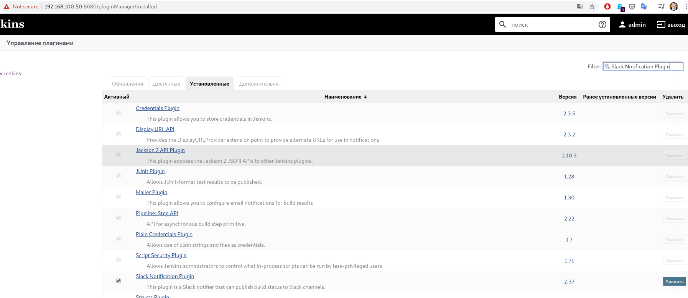
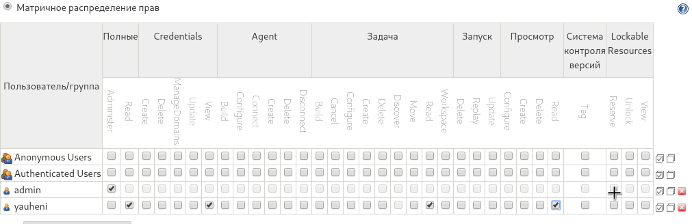

# Deploy Jenkins inside your home environment
## Setup Vagrant file
### master
```bash script
Vagrant.configure("2") do |config|
    config.vm.box = "centos/7"
    config.vm.define "Jenkins"
    config.vm.network "public_network", ip: "192.168.100.50",  bridge: "enp5s0"
    config.vm.provision :shell, :path => "bootstrap.sh"
end
```

### node 
File: [node/Vagrantfile](./node/Vagrantfile)

## Setup the following

### install plugins:

#### Ansible

#### Slack notification


### add restricted user to view Jobs, without any changes inside Jobs and Jenkins settings:


## Hide Jenkins behind the web server (Apache, Nginx)
