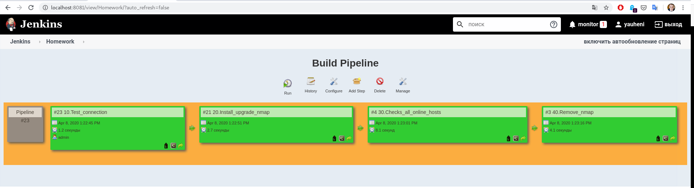

# Implement the following Pipeline:
## Check connection to the host
Output: [10.Test_connection.log](./logs/10.Test_connection.log)
## Install/upgrade nmap
Output: [20.Install_upgrade_nmap.log](./logs/20.Install_upgrade_nmap.log)
### Checks all online hosts:
Output: [30.Checks_all_online_hosts.log](./logs/30.Checks_all_online_hosts.log)
## Remove nmap
Output: [40.Remove_nmap.log](./logs/40.Remove_nmap.log)
## List of collected/online hosts
See log of checks [all online hosts.log](./logs/30.Checks_all_online_hosts.log)
## Pipeline screenshot

