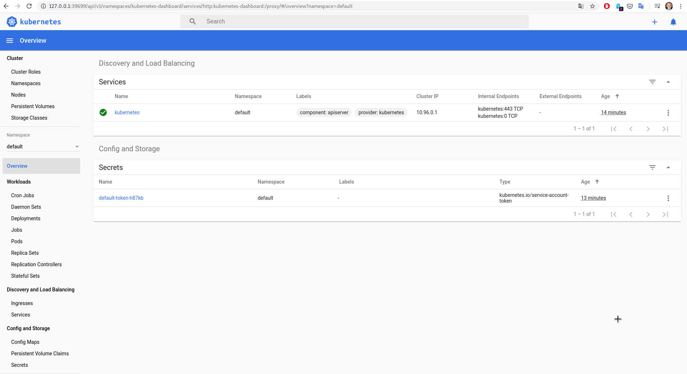

## Jenkinsfile
```shell script
node('113-debian'){
        stage("kubectl"){
            sh '''
                sudo echo "Install kubectl"
                sudo apt-get install -y conntrack
                sudo apt-get update && sudo apt-get install -y apt-transport-https
                curl -s https://packages.cloud.google.com/apt/doc/apt-key.gpg | sudo apt-key add -
                echo "deb https://apt.kubernetes.io/ kubernetes-xenial main" | sudo tee -a /etc/apt/sources.list.d/kubernetes.list
                sudo apt-get update
                sudo apt-get install -y kubectl
            '''
        }
        stage("docker"){
            sh '''
                sudo echo "Install docker"
                sudo apt-get remove docker docker-engine docker.io
                sudo apt-get install apt-transport-https ca-certificates curl software-properties-common
                sudo curl -fsSL https://download.docker.com/linux/debian/gpg | sudo apt-key add -
                sudo add-apt-repository "deb [arch=amd64] https://download.docker.com/linux/debian $(lsb_release -cs) stable"
                sudo apt-get update -qq
                sudo apt-get install -yqq docker-ce docker-ce-cli containerd.io
                sudo usermod -aG docker user
                sudo docker run hello-world
            '''
        }
        stage("minikube"){
            sh '''
                sudo echo "Install Minikube"
                sudo curl -Lo minikube https://storage.googleapis.com/minikube/releases/latest/minikube-linux-amd64
                sudo chmod +x minikube
                sudo mv minikube /usr/local/bin
            '''
        }
    }
```

## Printscreen of dashboard


