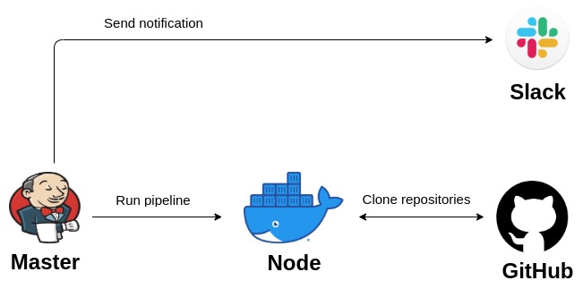

# Project Report
**Project's reporter**: Jauhien, Sliapcou

**Group number:** m-sa2-12-20

### Description of application for deployment**

 - Name of application: File versions history app
 - Which programming language is this application written in: Go, JavaScript
 - What kind of DB: PostrgeSQL 11.6, MongoDB 4.2
 - Link on git repository/site/package repository:_ [backend](https://github.com/sliaptsou/schneider_backend), [frontend](https://github.com/sliaptsou/schneider_frontend)

### Pipeline. High Level Design
 - Green deployment [pipeline](https://github.com/sliaptsou/jfs/blob/master/Deployment)
 - Upgrade backend [pipeline](https://github.com/sliaptsou/jfs/blob/master/Updating_backend)
 - Upgrade frontend [pipeline](https://github.com/sliaptsou/jfs/blob/master/Updating_frontend)
 

### Technologies which were used in project

**Orchestration:** Jenkins Pipeline

**CI description:** Schedule

**Deployment flows short description:**

Job starting on jenkins server by user. 

There are several stages in pipeline: 
- Cloning frontend: fetching source code of the frontend from the remote Git repository
- Starting frontend: run Docker Compose for building frontend (build frontend via yarn)
- Cloning backend: fetching source code of the backend from the remote Git repository
- Starting backend: run Docker Compose for building backend (`Nginx`, `MongoDB`, `PostgreSQL`, `api-server`)
- Send notification to Slack chanel
     
**Upgrading flows short description:** 

Job starting on jenkins server by schedule. 

Frontend and backend has identically upgrading flow: pulling from the remote Git repository and rebuild application.
       
### Links
- Backend [source](https://github.com/sliaptsou/schneider_backend)
- Frontend [source](https://github.com/sliaptsou/schneider_frontend)
- Jenkins pipeline [source](https://github.com/sliaptsou/jfs)
