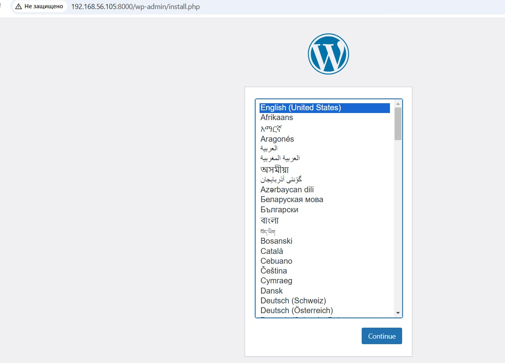
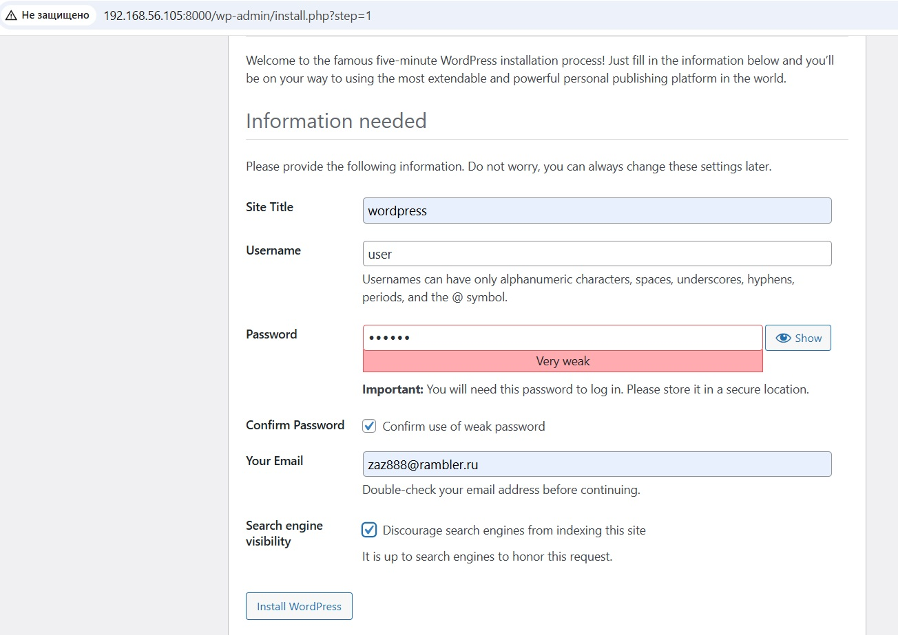
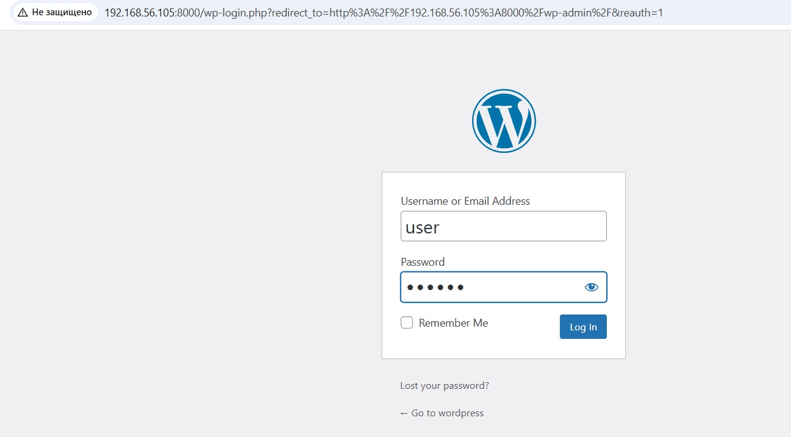
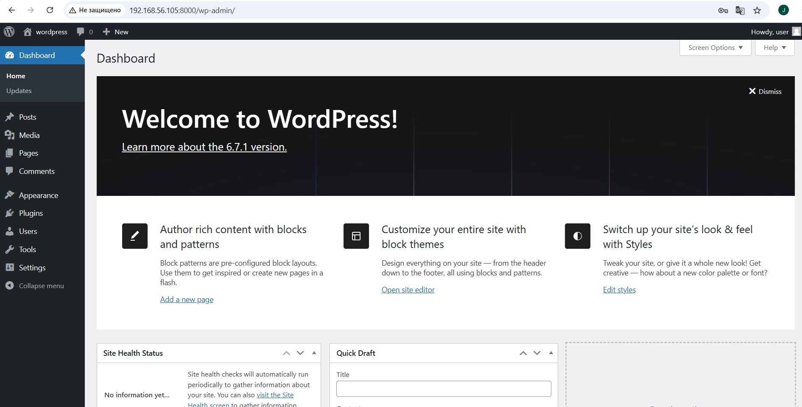
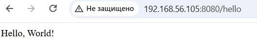
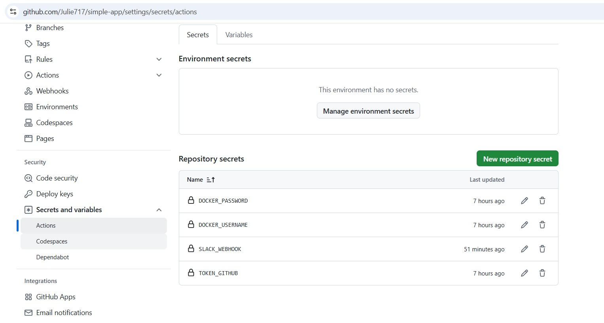
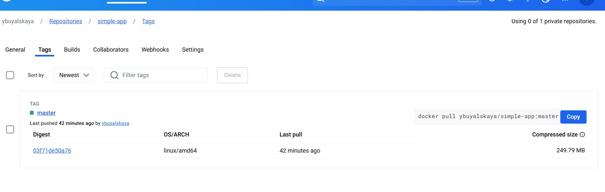
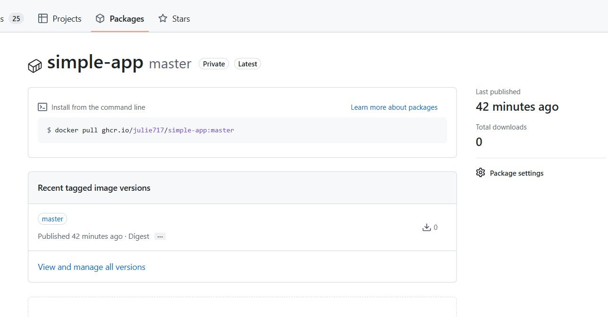

## Homework Assignment 1: Docker Compose for Application Stacks

There was used wordpress+mariadb of the latest versions. 

[Docker-compose file](../08.Docker.Docker-compose/Homework.Assignment1/docker-compose.yaml) \
[File](../08.Docker.Docker-compose/Homework.Assignment1/.env) with environment variables

Run docker compose

```shell
user@vm5:~/sa.it-academy.by/Yuliya_Buyalskaya/08.Docker.Docker-compose/Homework.Assignment1$ sudo docker compose up -d
[+] Running 32/2
 ✔ db Pulled                                                                                                                                          220.3s
 ✔ wordpress Pulled                                                                                                                                   216.9s
[+] Running 6/6
 ✔ Network homeworkassignment1_wordpress    Created                                                                                                     1.5s
 ✔ Network homeworkassignment1_database     Created                                                                                                     1.6s
 ✔ Volume "homeworkassignment1_db_data"     Created                                                                                                     0.0s
 ✔ Volume "homeworkassignment1_wp-content"  Created                                                                                                     0.0s
 ✔ Container db                             Started                                                                                                     5.3s
 ✔ Container wordpress                      Started                                                                                                     9.5s
 ✔ Container wordpress                      Started
```

Check that wordpress is running. Because docker container is running on Ubuntu virtual mashine to access wordpress from the Windows is used IP address of Virtual machine.







## Homework Assignment 2: Docker build automation (github action)

Use simple [spring-boot app](https://github.com/Julie717/simple-app) that was created in previous homework 07.Docker. \
[Dockerfile](https://github.com/Julie717/simple-app/blob/master/Dockerfile)

Build image

```shell
user@vm5:~/simple-app$ sudo docker build -t simple-app .
[+] Building 949.2s (13/13) FINISHED                             docker:default
 => [internal] load build definition from Dockerfile                       0.1s
 => => transferring dockerfile: 343B                                       0.0s
 => [internal] load metadata for docker.io/library/openjdk:17              2.5s
 => [internal] load metadata for docker.io/library/gradle:8.12-jdk-alpine  2.5s
 => [internal] load .dockerignore                                          0.1s
 => => transferring context: 2B                                            0.0s
 => [temp 1/4] FROM docker.io/library/gradle:8.12-jdk-alpine@sha256:8160c  0.0s
 => [stage-1 1/3] FROM docker.io/library/openjdk:17@sha256:528707081fdb95  0.0s
 => [internal] load build context                                          0.1s
 => => transferring context: 40.72kB                                       0.1s
 => CACHED [temp 2/4] WORKDIR /home/user/app/                              0.0s
 => [temp 3/4] COPY . .                                                    0.3s
 => [temp 4/4] RUN gradle build                                          944.5s
 => CACHED [stage-1 2/3] WORKDIR /home/user/app/                           0.0s
 => [stage-1 3/3] COPY --from=temp /home/user/app/ .                       0.3s
 => exporting to image                                                     0.5s
 => => exporting layers                                                    0.4s
 => => writing image sha256:1e93faba83e58f32c857b9ec4f3d4b55b026aa1d495d2  0.0s
 => => naming to docker.io/library/simple-app                               0.0s
```
Check that image was built

```shell
user@vm5:~/simple-app$ sudo docker images | grep simple-app
simple-app    latest    1e93faba83e5   4 minutes ago   493MB
```

Run container from image

```shell
user@vm5:~/simple-app$ sudo docker run -d -p 8080:8080 --name simple-app simple-app
c5a1dcd59fd627d8cce622a00ad5685cb25f5655c8dcc8414740253bb9a75e85
```

Check from Windows using virtual machine address



Add [Github workflow](https://github.com/Julie717/simple-app/blob/master/.github/workflows/push-image.yaml) for pushing image
to docker hub and github container register.

Secrets were added there



Check that image appears in docker hub and github container register




Check that slack notification works

