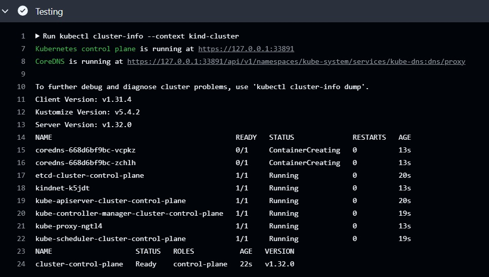
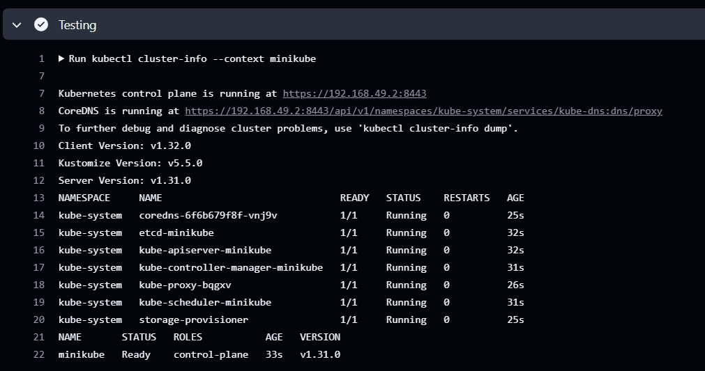
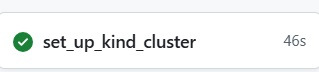
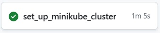

## Homework Assignment 0: Finish full install k8s

Clone kubespray

```shell
git clone git@github.com:kubernetes-sigs/kubespray.git
```

Use current list of commands to install requirements

````shell
VENVDIR=kubespray-venv
KUBESPRAYDIR=kubespray
apt install python3.12-venv
python3 -m venv $VENVDIR
source $VENVDIR/bin/activate
cd $KUBESPRAYDIR
pip install -U -r requirements.txt
````
Copy inventory sample
```shell
cp -rfp inventory/sample/ inventory/plu
```

Change it to
```shell
node1 ansible_host=192.168.208.3  ip=192.168.208.3 etcd_member_name=etcd1
node2 ansible_host=192.168.208.4  ip=192.168.208.4

[kube_control_plane]
node1

[etcd:children]
kube_control_plane

[kube_node]
node1
node2
```

Add hosts 192.168.208.3 192.168.208.4 to  ~/.ssh/config
```shell
Host 178.124.206.53
  Hostname 178.124.206.53
  IdentityFile ~/.ssh/ansible_key
  PreferredAuthentications publickey
  User jump_sa
  Port 32510
  ForwardAgent yes
Host 192.168.202.3 192.168.202.4 192.168.201.2 192.168.208.3 192.168.208.4
  ProxyJump 178.124.206.53
```
Run
```shell
ansible-playbook -i inventory/plu/inventory.ini cluster.yml -u root --ask
```
Result
```shell
PLAY RECAP *********************************************************************
node1                      : ok=679  changed=118  unreachable=0    failed=0    s                                                      kipped=1089 rescued=0    ignored=6
node2                      : ok=451  changed=62   unreachable=0    failed=0    s                                                      kipped=670  rescued=0    ignored=1

Sunday 12 January 2025  18:50:28 +0000 (0:00:00.170)       0:47:40.105 ********
===============================================================================
download : Download_file | Download item ------------------------------ 220.94s
download : Download_file | Download item ------------------------------ 195.05s
download : Download_file | Download item ------------------------------ 135.84s
download : Download_file | Download item ------------------------------- 90.33s
download : Download_file | Download item ------------------------------- 84.77s
download : Download_file | Download item ------------------------------- 73.30s
download : Download_file | Download item ------------------------------- 72.39s
download : Download_container | Download image if required ------------- 64.14s
container-engine/containerd : Download_file | Download item ------------ 62.44s
download : Download_container | Download image if required ------------- 57.00s
download : Download_container | Download image if required ------------- 54.08s
download : Download_container | Download image if required ------------- 47.06s
download : Download_container | Download image if required ------------- 45.62s
network_plugin/calico : Calico | Create calico manifests --------------- 40.73s
download : Download_container | Download image if required ------------- 40.66s
download : Download_container | Download image if required ------------- 38.19s
download : Download_container | Download image if required ------------- 34.01s
download : Download_container | Download image if required ------------- 31.83s
download : Download_file | Download item ------------------------------- 26.21s
policy_controller/calico : Create calico-kube-controllers manifests ---- 25.59s
```
Check the installation
```shell
root@node1:~#  kubectl get nodes
NAME    STATUS   ROLES           AGE   VERSION
node1   Ready    control-plane   23m   v1.31.4
node2   Ready    <none>          21m   v1.31.4
root@node1:~# kubectl cluster-info
Kubernetes control plane is running at https://127.0.0.1:6443

To further debug and diagnose cluster problems, use 'kubectl cluster-info dump'.
```

## Homework Assignment 1: KinD Kubernetes Cluster Setup
Docker was installed in [07.Docker](../07.Docker/README.md)

Install KinD

```shell
user@vm5:~$ [ $(uname -m) = x86_64 ] && curl -Lo ./kind https://kind.sigs.k8s.io/dl/v0.26.0/kind-linux-amd64
  % Total    % Received % Xferd  Average Speed   Time    Time     Time  Current
                                 Dload  Upload   Total   Spent    Left  Speed
100    97  100    97    0     0    210      0 --:--:-- --:--:-- --:--:--   210
  0     0    0     0    0     0      0      0 --:--:--  0:00:01 --:--:--     0
100  9.9M  100  9.9M    0     0  1280k      0  0:00:07  0:00:07 --:--:-- 1075k
user@vm5:~$ chmod +x ./kind
user@vm5:~$ sudo mv ./kind /usr/local/bin/kind
```
Create cluster

```shell
user@vm5:~/sa.it-academy.by/Yuliya_Buyalskaya/09.Kubernetes$ sudo kind create cluster --name first-cluster
Creating cluster "first-cluster" ...
 ✓ Ensuring node image (kindest/node:v1.32.0) 🖼
 ✓ Preparing nodes 📦
 ✓ Writing configuration 📜
 ✓ Starting control-plane 🕹️
 ✓ Installing CNI 🔌
 ✓ Installing StorageClass 💾
Set kubectl context to "kind-first-cluster"
You can now use your cluster with:

kubectl cluster-info --context kind-first-cluster

Have a nice day! 👋
```

Check that cluster was created
```shell
user@vm5:~/sa.it-academy.by/Yuliya_Buyalskaya/09.Kubernetes$ sudo kind get clusters
first-cluster
```

Install kubectl
```shell
user@vm5:~/sa.it-academy.by/Yuliya_Buyalskaya/09.Kubernetes$  curl -LO "https://dl.k8s.io/release/$(curl -L -s https://dl.k8s.io/release/stable.txt)/bin/linux/amd64/kubectl"
  % Total    % Received % Xferd  Average Speed   Time    Time     Time  Current
                                 Dload  Upload   Total   Spent    Left  Speed
100   138  100   138    0     0    380      0 --:--:-- --:--:-- --:--:--   380
100 54.6M  100 54.6M    0     0   684k      0  0:01:21  0:01:21 --:--:--  795k
user@vm5:~/sa.it-academy.by/Yuliya_Buyalskaya/09.Kubernetes$ sudo install -o root -g root -m 0755 kubectl /usr/local/bin/kubectl
user@vm5:~/sa.it-academy.by/Yuliya_Buyalskaya/09.Kubernetes$ kubectl version --client
Client Version: v1.32.0
Kustomize Version: v5.5.0
```

Change owner of config file and move config to the user's directory
```shell
root@vm5:~/.kube# chown user:user config
root@vm5:~# KUBECONFIG=$HOME/.kube/config
root@vm5:~/.kube# mv config /home/user/.kube
```

See that cluster is running
```shell
user@vm5:~/sa.it-academy.by/Yuliya_Buyalskaya/09.Kubernetes$ kubectl cluster-info --context kind-first-cluster
Kubernetes control plane is running at https://127.0.0.1:35823
CoreDNS is running at https://127.0.0.1:35823/api/v1/namespaces/kube-system/services/kube-dns:dns/proxy

To further debug and diagnose cluster problems, use 'kubectl cluster-info dump'.
```
See all nodes
```shell
user@vm5:~/sa.it-academy.by/Yuliya_Buyalskaya/09.Kubernetes$  kubectl get nodes
NAME                          STATUS   ROLES           AGE   VERSION
first-cluster-control-plane   Ready    control-plane   44m   v1.32.0
```

## Homework Assignment 2: Minikube Kubernetes Cluster Setup
Download minikube
```shell
user@vm5:~$ curl -Lo minikube https://storage.googleapis.com/minikube/releases/latest/minikube-linux-amd64   && chmod +x minikube
  % Total    % Received % Xferd  Average Speed   Time    Time     Time  Current
                                 Dload  Upload   Total   Spent    Left  Speed
100 99.0M  100 99.0M    0     0  6966k      0  0:00:14  0:00:14 --:--:-- 8676k
```

Install minikube
```shell
user@vm5:~$ sudo mkdir -p /usr/local/bin/
user@vm5:~$ sudo install minikube /usr/local/bin/
```

Start cluster
```shell
user@vm5:~$ sudo minikube start --vm-driver=docker
* minikube v1.34.0 on Ubuntu 24.04 (vbox/amd64)
* Using the docker driver based on user configuration

X Exiting due to RSRC_INSUFFICIENT_CORES:  has less than 2 CPUs available, but Kubernetes requires at least 2 to be available
```

Add user to docker group and reboot after it
```shell
user@vm5:~$ sudo usermod -aG docker user
```

Start minikube
```shell
user@vm5:~$ minikube start --driver=docker
* minikube v1.34.0 on Ubuntu 24.04 (vbox/amd64)
* Using the docker driver based on user configuration

X The requested memory allocation of 1967MiB does not leave room for system over head (total system memory: 1967MiB). You may face stability issues.
* Suggestion: Start minikube with less memory allocated: 'minikube start --memor y=1967mb'

* Using Docker driver with root privileges
* Starting "minikube" primary control-plane node in "minikube" cluster
* Pulling base image v0.0.45 ...
* Downloading Kubernetes v1.31.0 preload ...
    > preloaded-images-k8s-v18-v1...:  326.69 MiB / 326.69 MiB  100.00% 2.97 Mi
    > gcr.io/k8s-minikube/kicbase...:  487.07 MiB / 487.90 MiB  99.83% 4.33 MiB
* Creating docker container (CPUs=2, Memory=1967MB) ...
* Preparing Kubernetes v1.31.0 on Docker 27.2.0 ...
  - Generating certificates and keys ...
  - Booting up control plane ...
  - Configuring RBAC rules ...
* Configuring bridge CNI (Container Networking Interface) ...
* Verifying Kubernetes components...
  - Using image gcr.io/k8s-minikube/storage-provisioner:v5
* Enabled addons: default-storageclass, storage-provisioner
* Done! kubectl is now configured to use "minikube" cluster and "default" namespace by default
```

Check that minikube is running
```shell
user@vm5:~$ minikube status
minikube
type: Control Plane
host: Running
kubelet: Running
apiserver: Running
kubeconfig: Configured
```
```shell
user@vm5:~$ kubectl cluster-info --context minikube
Kubernetes control plane is running at https://192.168.58.2:8443
CoreDNS is running at https://192.168.58.2:8443/api/v1/namespaces/kube-system/services/kube-dns:dns/proxy

To further debug and diagnose cluster problems, use 'kubectl cluster-info dump'.
```
```shell
user@vm5:~$ kubectl get nodes --context minikube
NAME       STATUS   ROLES           AGE    VERSION
minikube   Ready    control-plane   8m2s   v1.31.0
```

## Homework Assignment 3: GitHub Actions for KinD Cluster Setup

[Github repository](https://github.com/Julie717/kubernetes) with workflows.

Workflow to setup a kind cluster.

```shell
name: Set up a KinD cluster

on:
  push:
    branches:
      - master

jobs:
  set_up_kind_cluster:
    runs-on: ubuntu-latest
    steps:
      - name: Create k8s Kind Cluster
        uses: helm/kind-action@v1
        with:
          cluster_name: cluster
      - name: Testing
        run: |
          kubectl cluster-info --context kind-cluster
          kubectl version
          kubectl get pods -n kube-system
          kubectl get nodes
```
Result of 

## Homework Assignment 4: GitHub Actions for Minikube Cluster Setup

Workflow to setup a minikube cluster.

```shell
name: Set up a minicube cluster

on:
  pull_request:
    types: [opened, reopened]

jobs:
  set_up_minikube_cluster:
    runs-on: ubuntu-latest
    steps:
      - name: start minikube
        id: minikube
        uses: medyagh/setup-minikube@latest
      - name: Testing
        run: |
          kubectl cluster-info --context minikube
          kubectl version
          kubectl get pods -A
          kubectl get nodes
```
Result of 

|                    | kind-cluster                             | minicube                                 |
|--------------------|------------------------------------------|------------------------------------------|
| node               | cluster-control-plane                    | minikube                                 |
| Kubernetes version | Client Version: v1.31.4                  | Client Version: v1.32.0                  |
|                    | Server Version: v1.32.0                  | Server Version: v1.31.0                  |
| time               |  |  |
