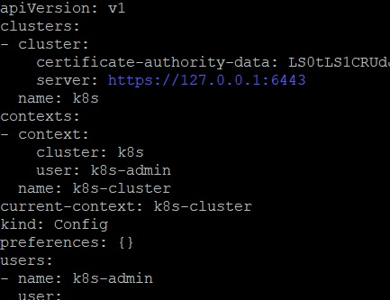
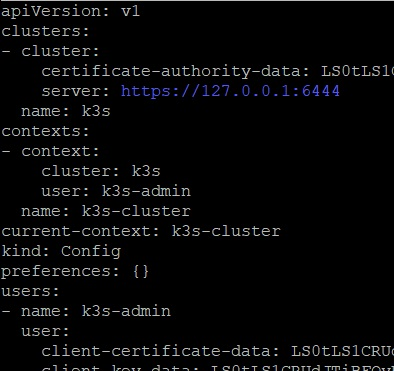
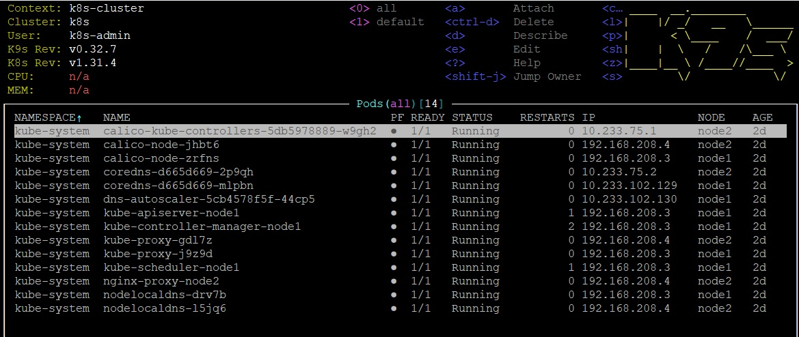
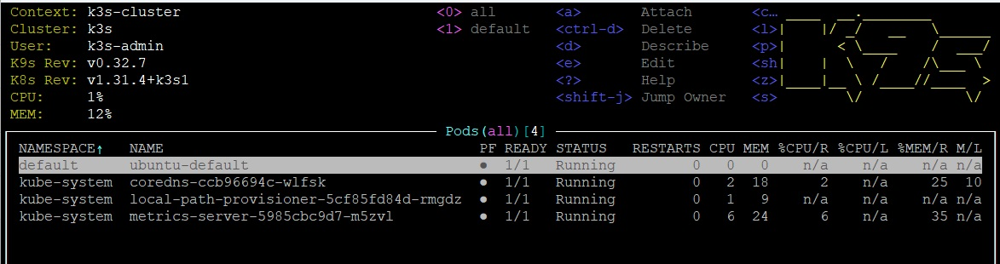
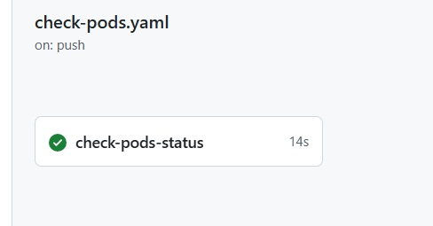
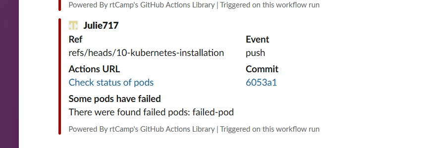

## Homework Assignment 1. K8s Installation

Install kubectl
```shell
curl -LO "https://dl.k8s.io/release/$(curl -L -s https://dl.k8s.io/release/stable.txt)/bin/linux/amd64/kubectl"
sudo install -o root -g root -m 0755 kubectl /usr/local/bin/kubectl
```
Copy config files
```shell
scp root@192.168.208.3:/root/.kube/config /home/user/.kube/config-k8s
scp root@192.168.203.2:/etc/rancher/k3s/k3s.yaml /home/user/.kube/config-k3s
```
Update them




Export kube configs and create tunnels
```shell
export KUBECONFIG=$HOME/.kube/config-k8s:$HOME/.kube/config-k3s
ssh -L 6443:127.0.0.1:6443 root@192.168.208.3 -f -N
ssh -L 6444:127.0.0.1:6443 root@192.168.203.2 -f -N
```

Install k9s
```shell
wget  https://github.com/derailed/k9s/releases/download/v0.32.7/k9s_linux_amd64.deb
dpkg -i k9s_linux_amd64.deb
```

View all pods in each cluster using k9s (search by :pod all @k8s-cluster)




Create pod
```yamll
apiVersion: v1
kind: Pod
metadata:
  name: shell-pod
spec:
  containers:
  - image: busybox
    command: ["/bin/sh", "-ec", "sleep 604800"]
    imagePullPolicy: IfNotPresent
    name: shell-pod
```

```shell
user@vm5:~$ kubectl apply -f pods/shell-pod.yaml
pod/shell-pod created
user@vm5:~$ kubectl get pods
NAME        READY   STATUS    RESTARTS   AGE
shell-pod   1/1     Running   0          112s
```

Create failed pod
```yaml
apiVersion: v1
kind: Pod
metadata:
  name: shell-pod
spec:
  containers:
  - image: busybox
    command: ["/bin/sh", "-ec", "sleep 604800"]
    imagePullPolicy: IfNotPresent
    name: shell-pod
```

```shell
user@vm5:~$ kubectl apply -f pods/failed-pod.yaml
pod/failed-pod created
user@vm5:~$ kubectl get pods
NAME         READY   STATUS             RESTARTS      AGE
failed-pod   0/1     CrashLoopBackOff   1 (11s ago)   12sshell-pod    1/1     Running            1 (30m ago)   52m
```

Write [github workflow](https://github.com/Julie717/kubernetes/blob/10-kubernetes-installation/.github/workflows/check-pods.yaml) to check if there are any failed pods

```shell
name: Check status of pods

on:
  push:
    branches:
      - 10-kubernetes-installation
      - master

jobs:
  check-pods-status:
    runs-on: ubuntu-latest
    steps:
      - uses: actions/checkout@v4
      - name: Check status of pods
        id: pods-status
        uses: appleboy/ssh-action@v1.2.0
        with:
          host: ${{ secrets.HOST }}
          username: ${{ secrets.USERNAME }}
          password: ${{ secrets.KEY }}
          proxy_host: ${{ secrets.PROXY_HOST }}
          proxy_port: ${{ secrets.PROXY_PORT }}
          proxy_username: ${{ secrets.PROXY_USERNAME }}
          proxy_password: ${{ secrets.PROXY_KEY }}
          script: |
            FAILED_PODS=`kubectl get pods -A | awk '$4!="Running" && $4!="Succeeded" { print $2 }' | tail +2`
            echo "$FAILED_PODS" > failed_pods.txt

      - name: Copy file
        uses: nicklasfrahm/scp-action@main
        with:
          host: ${{ secrets.HOST }}
          username: ${{ secrets.USERNAME }}
          key: ${{ secrets.SSH_KEY }}
          insecure_ignore_fingerprint: true
          proxy_host: ${{ secrets.PROXY_HOST }}
          proxy_port: ${{ secrets.PROXY_PORT }}
          proxy_username: ${{ secrets.PROXY_USERNAME }}
          proxy_key: ${{ secrets.PROXY_SSH_KEY }}
          proxy_fingerprint: true
          insecure_proxy_ignore_fingerprint: true
          direction: download
          source: "/root/failed_pods.txt"
          target: "./failed_pods.txt"

      - name: Read result
        id: result
        run: |
          echo "FAILED_PODS=$(cat ./failed_pods.txt)" >> $GITHUB_OUTPUT
      - name: Report to Slack
        if: steps.result.outputs.FAILED_PODS != ''
        uses: rtCamp/action-slack-notify@v2
        env:
          SLACK_CHANNEL: app
          SLACK_COLOR: failure
          SLACK_MESSAGE: "There were found failed pods: ${{ steps.result.outputs.FAILED_PODS }}"
          SLACK_TITLE: Some pods have failed
          SLACK_USERNAME: rtCamp
          SLACK_WEBHOOK: ${{ secrets.SLACK_WEBHOOK }}
```
[Result of running job](https://github.com/Julie717/kubernetes/actions/runs/12836952372):


