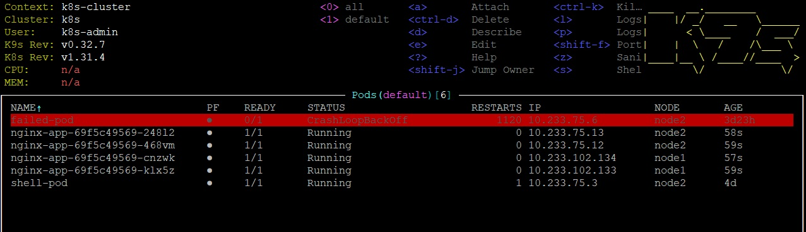
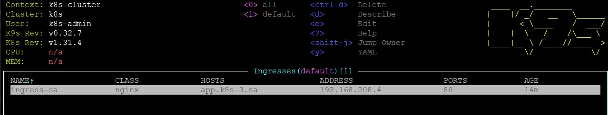
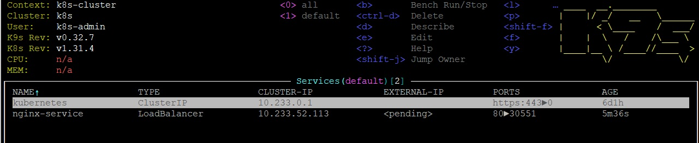
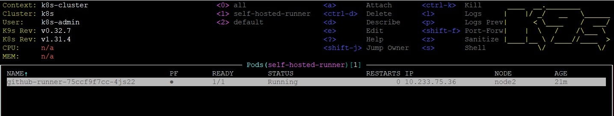
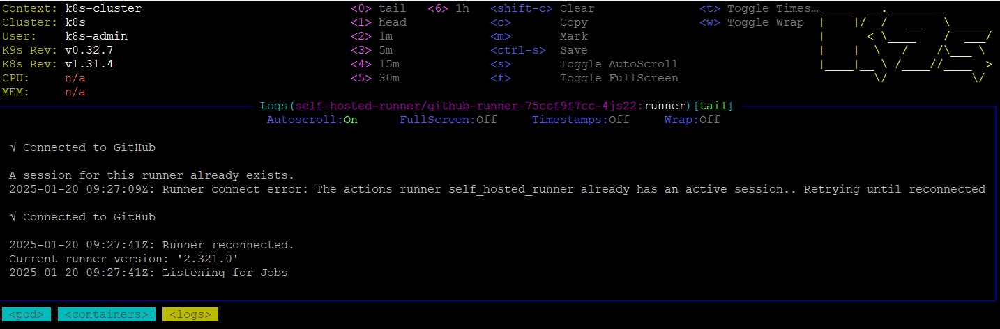
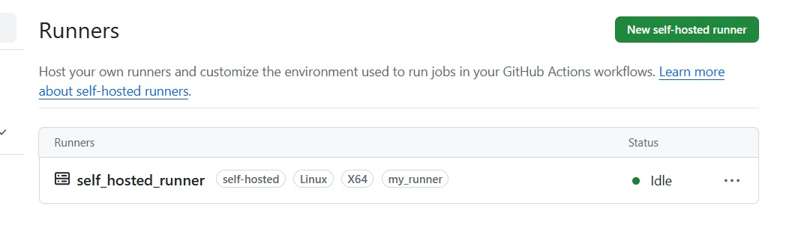
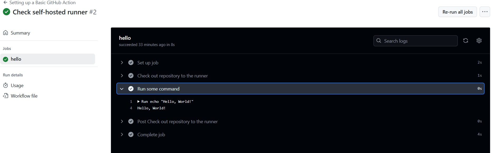

## Homework Assignment 1. Nginx deployment

Create [deployment.yaml](../11.Kubernetes.Basic_objects/deployment.yaml)

Download ingress controller and add nodePort: 30001 there

```shell
wget https://raw.githubusercontent.com/kubernetes/ingress-nginx/refs/tags/controller-v1.12.0/deploy/static/provider/baremetal/deploy.yaml -O ingress-controller.yaml
```

Apply deployment and ingress-controller

```shell
user@vm5:~/sa.it-academy.by/Yuliya_Buyalskaya/11.Kubernetes.Basic_objects$ kubectl apply -f deployment.yaml
deployment.apps/nginx created
service/nginx-service unchanged
ingress.networking.k8s.io/ingress-sa created
user@vm5:~/sa.it-academy.by/Yuliya_Buyalskaya/11.Kubernetes.Basic_objects$ kubectl apply -f ingress-controller.yaml
namespace/ingress-nginx created
serviceaccount/ingress-nginx created
serviceaccount/ingress-nginx-admission created
role.rbac.authorization.k8s.io/ingress-nginx created
role.rbac.authorization.k8s.io/ingress-nginx-admission created
clusterrole.rbac.authorization.k8s.io/ingress-nginx created
clusterrole.rbac.authorization.k8s.io/ingress-nginx-admission created
rolebinding.rbac.authorization.k8s.io/ingress-nginx created
rolebinding.rbac.authorization.k8s.io/ingress-nginx-admission created
clusterrolebinding.rbac.authorization.k8s.io/ingress-nginx created
clusterrolebinding.rbac.authorization.k8s.io/ingress-nginx-admission created
configmap/ingress-nginx-controller created
service/ingress-nginx-controller created
service/ingress-nginx-controller-admission created
deployment.apps/ingress-nginx-controller created
job.batch/ingress-nginx-admission-create created
job.batch/ingress-nginx-admission-patch created
ingressclass.networking.k8s.io/nginx created
validatingwebhookconfiguration.admissionregistration.k8s.io/ingress-nginx-admission created
```
List of pods in default namespace



Ingress



Service



Add record to /etc/hosts

```text
178.124.206.53 app.k8s-3.sa app.k8s-4.sa
```

Check that curl works

```shell
user@vm5:~/sa.it-academy.by/Yuliya_Buyalskaya/11.Kubernetes.Basic_objects$ curl app.k8s-3.sa
<!DOCTYPE html>
<html>
<head>
<title>Welcome to nginx!</title>
<style>
html { color-scheme: light dark; }
body { width: 35em; margin: 0 auto;
font-family: Tahoma, Verdana, Arial, sans-serif; }
</style>
</head>
<body>
<h1>Welcome to nginx!</h1>
<p>If you see this page, the nginx web server is successfully installed and
working. Further configuration is required.</p>

<p>For online documentation and support please refer to
<a href="http://nginx.org/">nginx.org</a>.<br/>
Commercial support is available at
<a href="http://nginx.com/">nginx.com</a>.</p>

<p><em>Thank you for using nginx.</em></p>
</body>
</html>
user@vm5:~/sa.it-academy.by/Yuliya_Buyalskaya/11.Kubernetes.Basic_objects$ curl app.k8s-4.sa
<!DOCTYPE html>
<html>
<head>
<title>Welcome to nginx!</title>
<style>
html { color-scheme: light dark; }
body { width: 35em; margin: 0 auto;
font-family: Tahoma, Verdana, Arial, sans-serif; }
</style>
</head>
<body>
<h1>Welcome to nginx!</h1>
<p>If you see this page, the nginx web server is successfully installed and
working. Further configuration is required.</p>

<p>For online documentation and support please refer to
<a href="http://nginx.org/">nginx.org</a>.<br/>
Commercial support is available at
<a href="http://nginx.com/">nginx.com</a>.</p>

<p><em>Thank you for using nginx.</em></p>
</body>
</html>
```

## Homework Assignment 2. Self-hosted runner inside k8s

Create [deployment](../11.Kubernetes.Basic_objects/self-hosted-runner-deployment.yaml) with one pod.
On that pod run script for creation self-hosted-runner ([configmap](../11.Kubernetes.Basic_objects/self-hosted-runner-configmap.yaml))

Apply configmap and deployment

```shell
kubectl apply -f self-hosted-runner-configmap.yaml
kubectl apply -f self-hosted-runner-deployment.yaml
```

Check that pod was created and ready to accept tasks
 \


[Runner](https://github.com/Julie717/kubernetes/settings/actions/runners) appeared in github 


In order to check runner. Create simple [github-workflow](https://github.com/Julie717/kubernetes/blob/11-kubernetes-basic-objects/.github/workflows/check.yaml)

Result of running workflow
