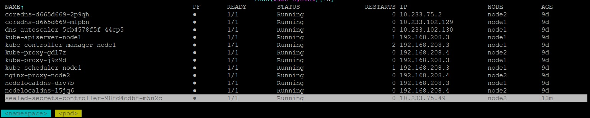
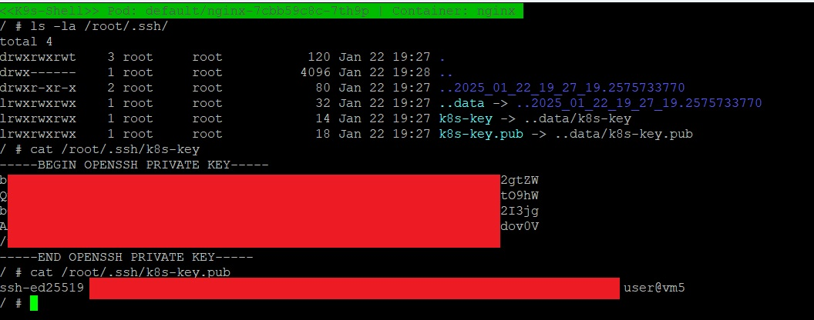

## Homework Assignment 1. Config maps and secrets

Copy deployment file and add configMap there
```yaml
apiVersion: v1
kind: ConfigMap
metadata:
  name: index-html-configmap
data:
  index.html: |
    <!DOCTYPE html>
    <html>
      <head>
        <meta charset="utf-8">
        <title>Name of the current pod</title>
      </head>
      <body>
        <h1>$POD_NAME</h1>
      </body>
    </html>
```

Mount that map to nginx container
```yaml
volumeMounts:
  - name: index-html-volume
    mountPath: /usr/share/nginx/html
```

And add init container to receive pod name and apply it to the index.html
```yaml
initContainers:
  - name: envsubst
    image: ubuntu
    command: ["sh", "-c", "su root -c 'apt-get update;apt upgrade -yqq;apt-get install -y gettext';cat /tmp/volume/index.html | envsubst > /usr/share/nginx/html/index.html"]
    env:
      - name: POD_NAME
        valueFrom:
          fieldRef:
            fieldPath: metadata.name
    volumeMounts:
      - name: index-html-volume
        mountPath: /usr/share/nginx/html
      - name: temp-volume
        mountPath: /tmp/volume
volumes:
  - name: index-html-volume
    emptyDir: {}
  - name: temp-volume
    configMap:
      name: index-html-configmap
```
Check the substitution of pod name
```shell
uuser@vm5:~/sa.it-academy.by/Yuliya_Buyalskaya/12.Kubernetes.Data.Security$ curl app.k8s-3.sa
<!DOCTYPE html>
<html>
  <head>
    <meta charset="utf-8">
    <title>Name of the current pod</title>
  </head>
  <body>
    <h1>nginx-7cbb59c8c-btqrb</h1>
  </body>
</html>
user@vm5:~/sa.it-academy.by/Yuliya_Buyalskaya/12.Kubernetes.Data.Security$ curl app.k8s-4.sa
<!DOCTYPE html>
<html>
  <head>
    <meta charset="utf-8">
    <title>Name of the current pod</title>
  </head>
  <body>
    <h1>nginx-7cbb59c8c-bxkxp</h1>
  </body>
</html>
```

Generate keys
```shell
ssh-keygen
```

Install the SealedSecret CRD and server-side controller into k8s:
```shell
user@vm5:~/sa.it-academy.by/Yuliya_Buyalskaya/12.Kubernetes.Data.Security$ kubectl apply -f https://github.com/bitnami-labs/sealed-secrets/releases/download/v0.28.0/controller.yaml
deployment.apps/sealed-secrets-controller created
service/sealed-secrets-controller-metrics created
rolebinding.rbac.authorization.k8s.io/sealed-secrets-controller created
clusterrolebinding.rbac.authorization.k8s.io/sealed-secrets-controller created
serviceaccount/sealed-secrets-controller created
customresourcedefinition.apiextensions.k8s.io/sealedsecrets.bitnami.com created
service/sealed-secrets-controller created
rolebinding.rbac.authorization.k8s.io/sealed-secrets-service-proxier created
role.rbac.authorization.k8s.io/sealed-secrets-service-proxier created
role.rbac.authorization.k8s.io/sealed-secrets-key-admin created
clusterrole.rbac.authorization.k8s.io/secrets-unsealer created
```
SealedSecret controller


Install the client-side tool into /usr/local/bin/:
```shell
curl -OL "https://github.com/bitnami-labs/sealed-secrets/releases/download/v0.28.0/kubeseal-0.28.0-linux-amd64.tar.gz"
tar -xvzf kubeseal-0.28.0-linux-amd64.tar.gz kubeseal
sudo install -m 755 kubeseal /usr/local/bin/kubeseal
```

Create sealed secret
```shell
kubectl create secret generic ssh-secret --from-file=k8s-key=/home/user/.ssh/k8s-key --from-file=k8s-key.pub=/home/user/.ssh/k8s-key.pub --output=yaml > init-secret.yaml
cat init-secret.yaml | kubeseal --format=yaml > sealed_secret.yaml
kubectl apply -f sealed_secret.yaml
```

Add volume for keys
```yaml
- name: secret-volume
  secret:
    secretName: ssh-secret
```

Mount this volume to the nginx container
```yaml
- name: secret-volume
  mountPath: "/root/.ssh"
```
Apply deployment.yaml
```shell
kubectl apply -f deployment.yaml
```
**Result of deployment.yaml can be found [here](../12.Kubernetes.Data.Security/deployment.yaml)**

Generated files with keys [init-secret.yaml](../12.Kubernetes.Data.Security/init-secret.yaml) and [sealed_secret.yaml](../12.Kubernetes.Data.Security/sealed_secret.yaml)

To check that keys were added to the environments variables in the pod, let's open k9s and any shell of nginx pod

