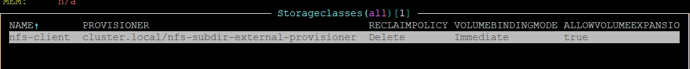
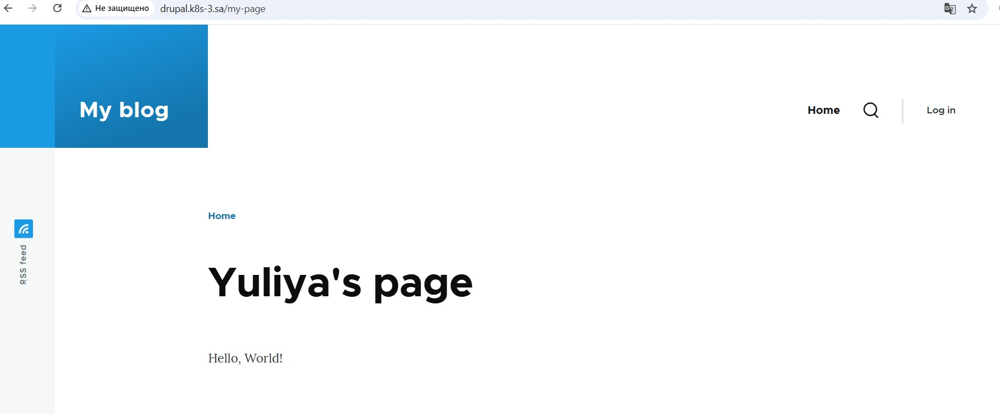
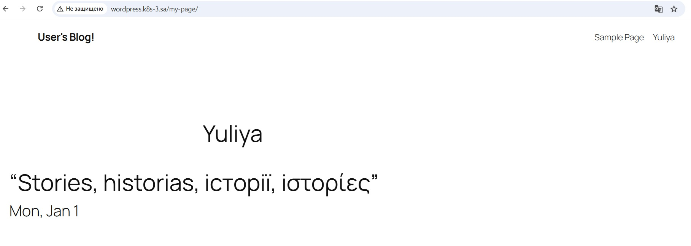

## Homework Assignment 1. Application deployment by Helm

Install helm-cli

```shell
curl -fsSL -o get_helm.sh https://raw.githubusercontent.com/helm/helm/main/scripts/get-helm-3
chmod 700 get_helm.sh
./get_helm.sh
```

Create NFS subdirectory external provisioner using Helm Chart

```shell
helm repo add nfs-subdir-external-provisioner https://kubernetes-sigs.github.io/nfs-subdir-external-provisioner/
helm install nfs-subdir-external-provisioner nfs-subdir-external-provisioner/nfs-subdir-external-provisioner --set nfs.server=192.168.37.105 --set nfs.path=/mnt/IT-Academy/nfs-data/sa2-30-24/Yuliya_Buyalskaya
```

StorageClass was created


Use Mysql-db on host 192.168.201.2. Run ansible-playbook that should install mysql (if not installed), 
create databases for wordpress and drupal and create user to database connection

```shell
ansible-playbook -i inv.yaml mysql.yaml -u root -e "user_db=user pass_db=password"
```
Install drupal and wordpress

```shell
helm install drupal --set persistence.storageClass=nfs-client,persistence.accessMode=ReadWriteMany,mariadb.enabled=false,externalDatabase.host=192.168.201.2,externalDatabase.port=3306,externalDatabase.database=drupal,externalDatabase.user=user,externalDatabase.password=password,ingress.enabled=true,ingress.hostname=drupal.k8s-3.sa,ingress.ingressClassName=nginx,drupalUsername=user,drupalPassword=password oci://registry-1.docker.io/bitnamicharts/drupal
```
```shell
helm install wordpress -f wp-values.yml --set persistence.storageClass=nfs-client,persistence.accessMode=ReadWriteMany,mariadb.enabled=false,externalDatabase.host=192.168.201.2,externalDatabase.port=3306,externalDatabase.database=wordpress,externalDatabase.user=user,externalDatabase.password=password,ingress.enabled=true,ingress.hostname=wordpress.k8s-3.sa,ingress.ingressClassName=nginx,wordpressUsername=wordpress-user,wordpressPassword=password oci://registry-1.docker.io/bitnamicharts/wordpress
```

During the wordpress installation there was an issue that nfs is slow and it takes much more time to persist wordpress files 
to persistent storage than the default wordpress probe makes pod restart. Due to pod restart directory theme was not created 
and wordpress failed to load main page and any created page (Error: The theme directory "twentytwentyone" does not exist.)
Therefore, time for probes were set manually in [wp-values.yml](../13.Kubernetes.Helm/wp-values.yml)

Created pages with my name:

