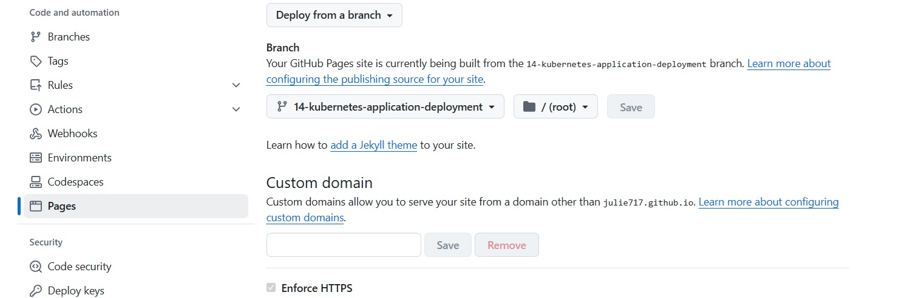
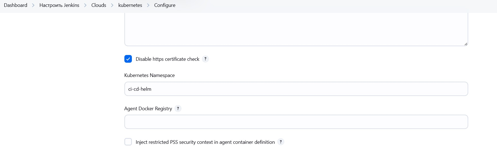
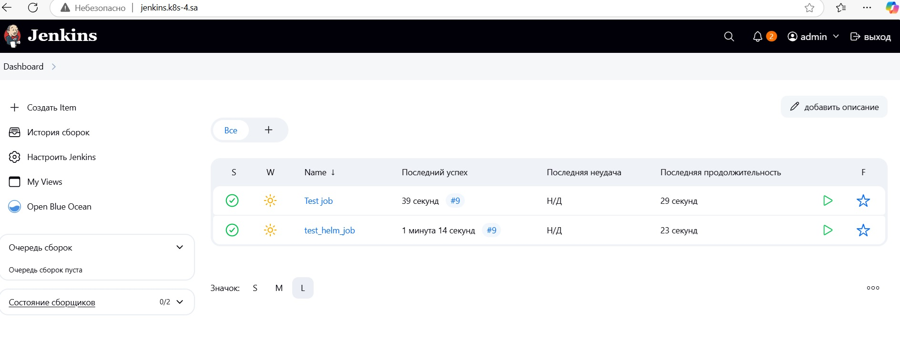

## Homework result
[Link to the github repository with helm](https://github.com/Julie717/kubernetes/tree/14-kubernetes-application-deployment)

## Homework Assignment 1. Transform Jenkins deployment to Helm

To create helm chart run
```shell
helm create jenkins-app
```
Then remove all unnecessary files and make structure changes.

## Homework Assignment 2. Add pre-set tasks to Jenkins deployment

Add config map jenkins-tasks-config to [configmap.yaml](https://github.com/Julie717/kubernetes/blob/14-kubernetes-application-deployment/jenkins-app/templates/configmap.yaml) with config.xml from the mounted path (created on workshop)
/mnt/test/sa2-30-24/Yuliya_Buyalskaya/jenkins/jobs/'Test job'.

Moreover, this config was added to the volumes and volumeMounts at the [values.yaml](https://github.com/Julie717/kubernetes/blob/14-kubernetes-application-deployment/jenkins-app/values.yaml)

Do package of jenkins-app to the jenkins-app-releases directory

```shell
user@vm5:~/kubernetes$ helm package jenkins-app -d jenkins-app-releases/
Successfully packaged chart and saved it to: jenkins-app-releases/jenkins-app-0.1.0.tgz
user@vm5:~/kubernetes$ ls -la jenkins-app-releases/
total 12
drwxrwxr-x 2 user user 4096 Jan 29 20:01 .
drwxrwxr-x 6 user user 4096 Jan 29 20:00 ..
-rw-rw-r-- 1 user user 3193 Jan 29 20:01 jenkins-app-0.1.0.tgz
```
Commit and push it to the github
```shell
user@vm5:~/kubernetes$ git add .
user@vm5:~/kubernetes$ git commit -m "Create jenkins-app"
[14-kubernetes-application-deployment bbb61ad] Create jenkins-app
 10 files changed, 315 insertions(+)
 create mode 100644 jenkins-app-releases/jenkins-app-0.1.0.tgz
 create mode 100644 jenkins-app/.helmignore
 create mode 100644 jenkins-app/Chart.yaml
 create mode 100644 jenkins-app/templates/cluster-role-binding.yaml
 create mode 100644 jenkins-app/templates/configmap.yaml
 create mode 100644 jenkins-app/templates/deployment.yaml
 create mode 100644 jenkins-app/templates/ingress.yaml
 create mode 100644 jenkins-app/templates/secrets.yaml
 create mode 100644 jenkins-app/templates/service.yaml
 create mode 100644 jenkins-app/values.yaml
user@vm5:~/kubernetes$ git push origin 14-kubernetes-application-deployment
Enumerating objects: 16, done.
Counting objects: 100% (16/16), done.
Delta compression using up to 2 threads
Compressing objects: 100% (14/14), done.
Writing objects: 100% (15/15), 7.37 KiB | 397.00 KiB/s, done.
Total 15 (delta 0), reused 0 (delta 0), pack-reused 0
remote:
remote: Create a pull request for '14-kubernetes-application-deployment' on GitH                                 ub by visiting:
remote:      https://github.com/Julie717/kubernetes/pull/new/14-kubernetes-appli                                 cation-deployment
remote:
To github.com:Julie717/kubernetes.git
 * [new branch]      14-kubernetes-application-deployment -> 14-kubernetes-appli                                 cation-deployment
```
Create github page


Generate index file and push it to github
```shell
user@vm5:~/kubernetes$ helm repo index --url "https://julie717.github.io/kubernetes/" .
user@vm5:~/kubernetes$ git add .
user@vm5:~/kubernetes$ git commit -m "Add index"
[14-kubernetes-application-deployment c349717] Add index
 1 file changed, 14 insertions(+)
 create mode 100644 index.yaml
user@vm5:~/kubernetes$ git push origin 14-kubernetes-application-deployment
Enumerating objects: 4, done.
Counting objects: 100% (4/4), done.
Delta compression using up to 2 threads
Compressing objects: 100% (3/3), done.
Writing objects: 100% (3/3), 550 bytes | 550.00 KiB/s, done.
Total 3 (delta 1), reused 0 (delta 0), pack-reused 0
remote: Resolving deltas: 100% (1/1), completed with 1 local object.
To github.com:Julie717/kubernetes.git
   bbb61ad..c349717  14-kubernetes-application-deployment -> 14-kubernetes-application-deployment
```

Add app to the helm repositories
```shell
user@vm5:~/kubernetes$ helm repo add kubernetes https://julie717.github.io/kubernetes/
"kubernetes" has been added to your repositories
```

Delete all resources created on workshop because mount is going to be to the same directories
```shell
kubectl delete all --all --namespace ci-cd
```

Install helm chart
```shell
user@vm5:~/kubernetes$ helm install jenkins-app kubernetes/jenkins-app -n ci-cd-helm
NAME: jenkins-app
LAST DEPLOYED: Wed Jan 29 20:18:04 2025
NAMESPACE: ci-cd-helm
STATUS: deployed
REVISION: 1
TEST SUITE: None
```

In jenkins update namespace


Check by running both jobs

