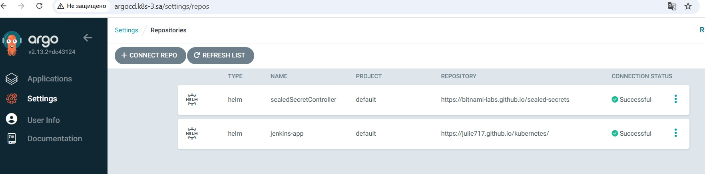
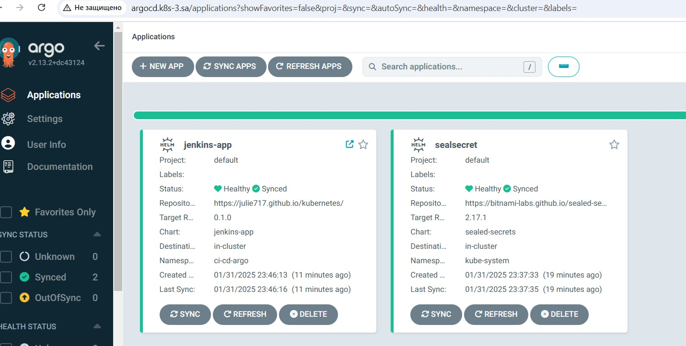
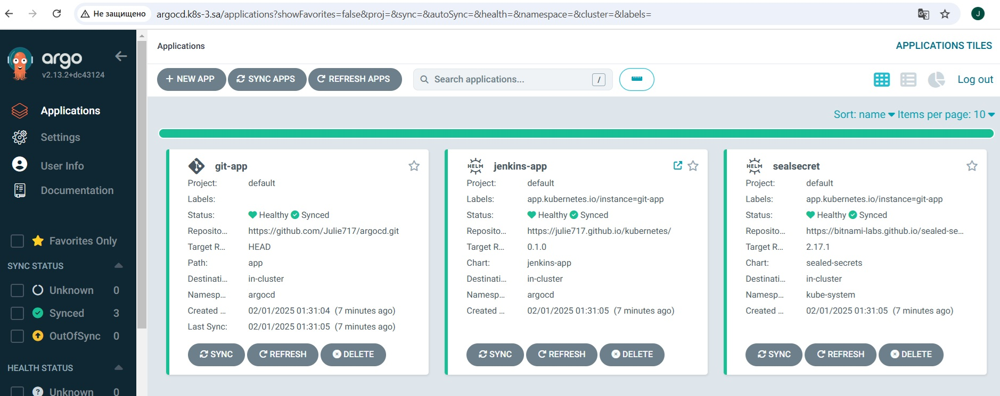
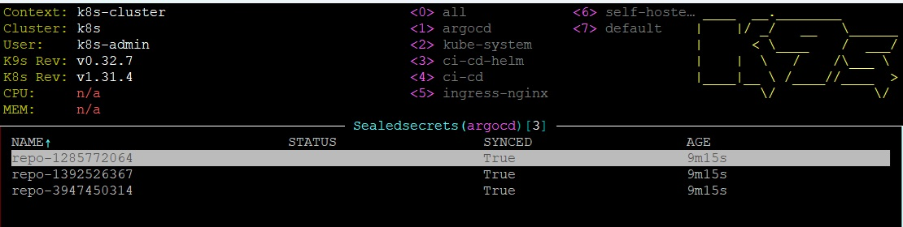
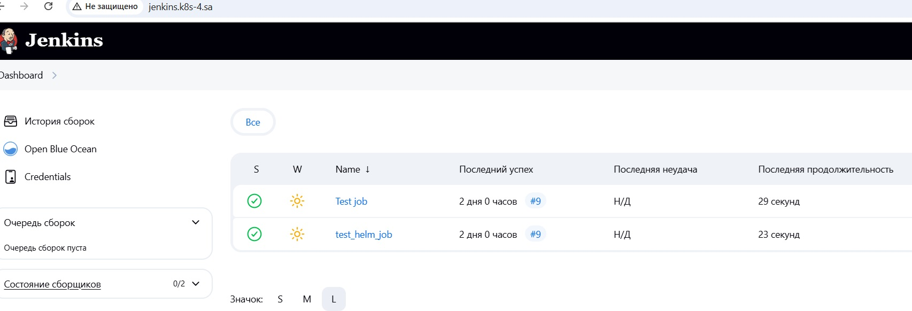

### Repositories
[Application manifests for ArgoCD](https://github.com/Julie717/argocd) \
[Jenkins helm application](https://github.com/Julie717/kubernetes/tree/14-kubernetes-application-deployment)

## Homework Assignment 1. ArgoCD deployment and application
Download argocd
```shell
wget https://raw.githubusercontent.com/argoproj/argo-cd/stable/manifests/install.yaml -O argo-cd-install.yaml
```
Add for argocd-server nodePort
```yaml
spec:
  type: NodePort
  ports:
    - name: http
      nodePort: 30007
```
and -- insecure in args
```yaml
- args:
  - /usr/local/bin/argocd-server
  - --insecure
```

Install argocd
```shell
kubectl apply -f argo-cd-install.yaml -n argocd
```

Add to hosts
```text
178.124.206.53 argocd.k8s-3.sa
```

To enter to the argocd use user admin and password from
```shell
kubectl -n argocd get secret argocd-initial-admin-secret -o jsonpath="{.data.password}" | base64 -d
```

Create sealedSecretController (uses seal-secret helm-chart) and jenkins-app (helm chart from 14 homework, link from github pages) repos
and sealsecret and github apps



Create repo for [argocd](https://github.com/Julie717/argocd)

Copy app files to the yaml-files and push it to the argocd git repository
```shell
user@vm5:~/argocd/app$ kubectl get application sealsecret -n argocd -o yaml > sealsecret.yaml
user@vm5:~/argocd/app$ kubectl get application jenkins-app -n argocd -o yaml > jenkins-app.yaml
```
Create git-app using this git argocd that starts creation of other apps and secret for git will be added.
Then copy all secrets to yaml, create sealedsecrets from them and push it to the argocd git repository

```shell
user@vm5:~/argocd/secret$ kubectl get secret repo-1285772064 -n argocd -o yaml > jenkins-app-secret.yaml
user@vm5:~/argocd/secret$ kubectl get secret repo-3947450314 -n argocd -o yaml > seal-secret-controller-secret.yaml
user@vm5:~/argocd$ kubectl get secret repo-1392526367 -n argocd -o yaml > git-secret.yaml
user@vm5:~/argocd/secret$ kubeseal < jenkins-app-secret.yaml -o yaml > jenkins-app-sealsecret.yaml
user@vm5:~/argocd/secret$ kubeseal < seal-secret-controller-secret.yaml -o yaml > seal-secret-controller-sealsecret.yaml
user@vm5:~/argocd$ kubeseal < git-secret.yaml -o yaml > app/secrets/git-sealsecret.yaml
```

Remove all apps in argocd and secrets in the cluster. Create a new app from argocd repository that will start other apps
(use DIRECTORY RECURSE in order secrets were created)



SealedSecrets were created



and jenkins is available

