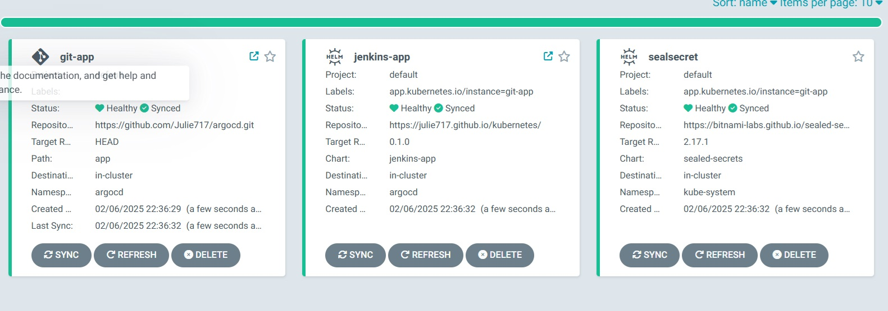
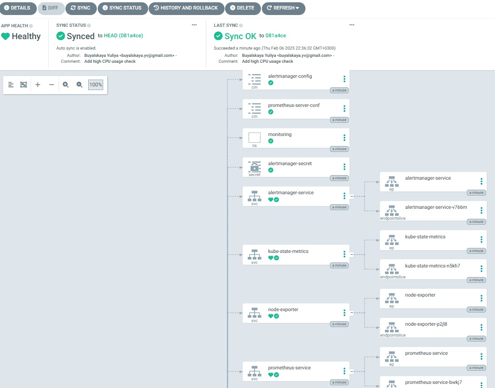
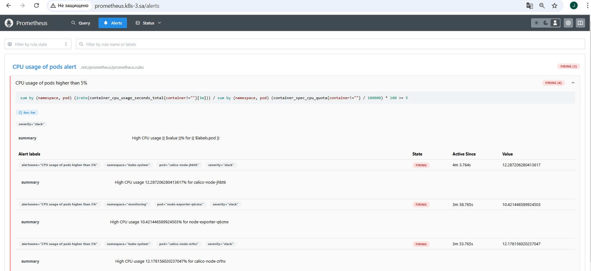
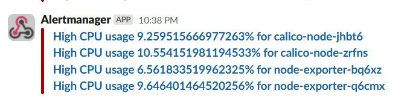
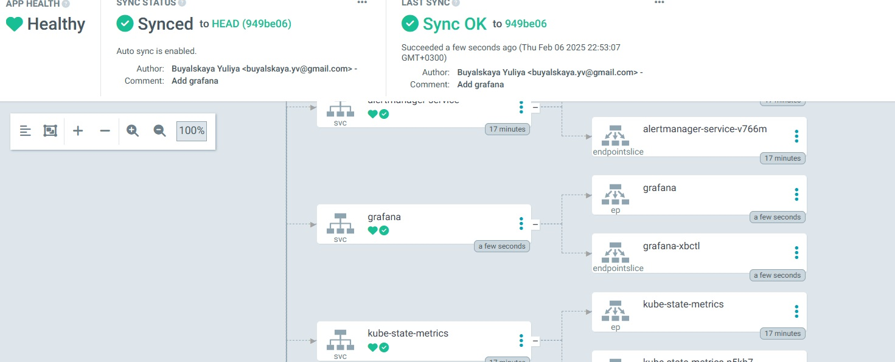
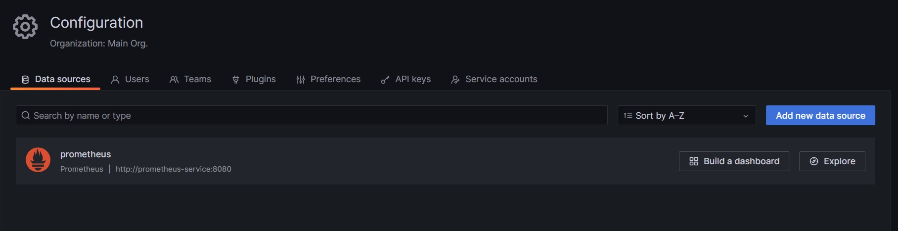
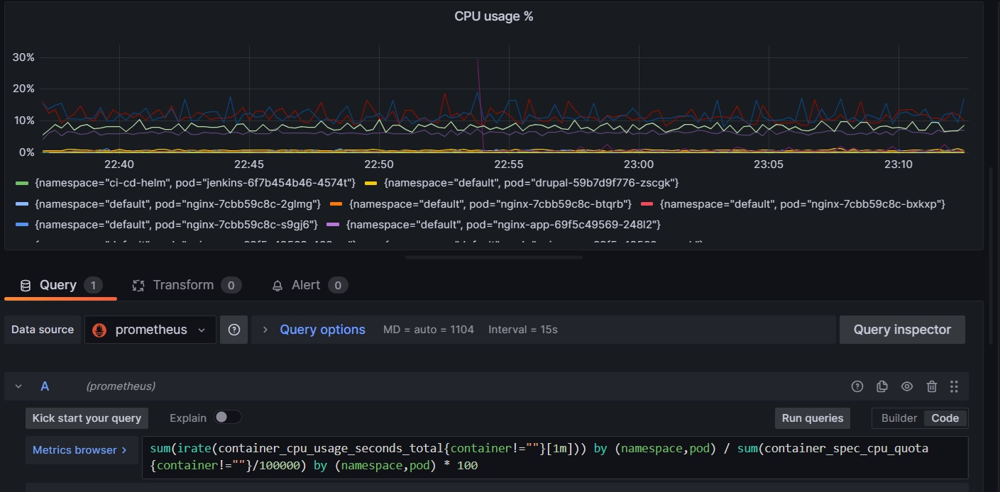
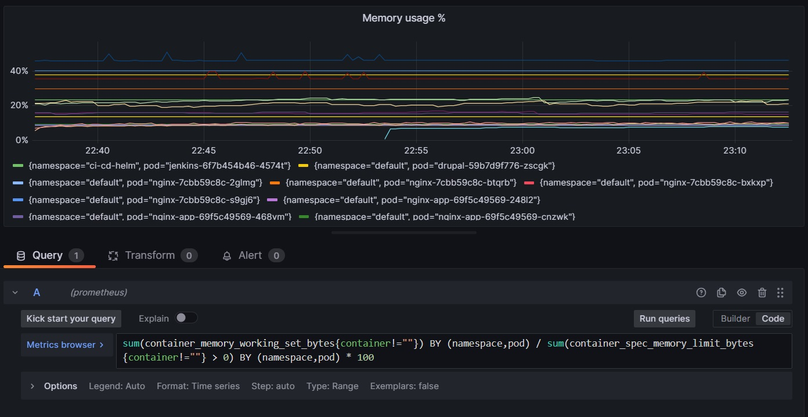
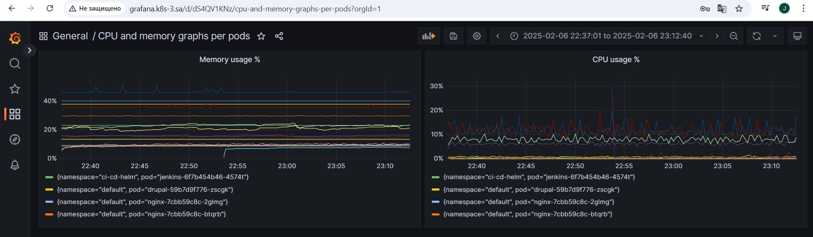

### Git repository with argocd via that all installations were made

[ArgoCD](https://github.com/Julie717/argocd/tree/master/app)

All files referred to monitoring can be found in the [monitoring](https://github.com/Julie717/argocd/tree/master/app/monitoring) folder. Necessary secret for storing slack-url can be found 
[here](https://github.com/Julie717/argocd/blob/master/app/secrets/alert-manager-secret.yaml)

## Homework Assignment 1: Deploy and setup Prometheus Alertmanager

In order to make argocd first deploy namespace name the corresponding file with namespace starting with dot (.ns.yaml)

To create secret with slack url use command

```shell
kubectl create secret generic alertmanager-secrets --from-literal="slack-api-url=XXXXXXXXX"
```

After creation get the corresponding yaml file via k9s (press y on secret) and copy it to alert-manager-secret.yaml. 
Then, remove created secret and push to the git alert-manager-secret.yaml.

In prometheus.yaml change alert rules to
```yaml
alert: CPU usage of pods higher than 5%
expr: sum(irate(container_cpu_usage_seconds_total{container!=""}[1m])) by (namespace,pod) / sum(container_spec_cpu_quota{container!=""}/100000) by (namespace,pod) * 100 >= 5 
for: 1m
labels:
  severity: slack
annotations:
  summary: High CPU usage {{ $value }}% for {{ $labels.pod }}
```
Check argocd deployment




Prometheus alert was created



Alert was sent to the slack



## Homework Assignment 2: Use Grafana to display load of pods

Add grafana.yaml to the git repository. And check deployment via argocd



Default credentials for grafana: login admin password admin

Check that prometheus was added as data source




Create panel and add CPU usage plot



and for memory usage



Result dashboard


