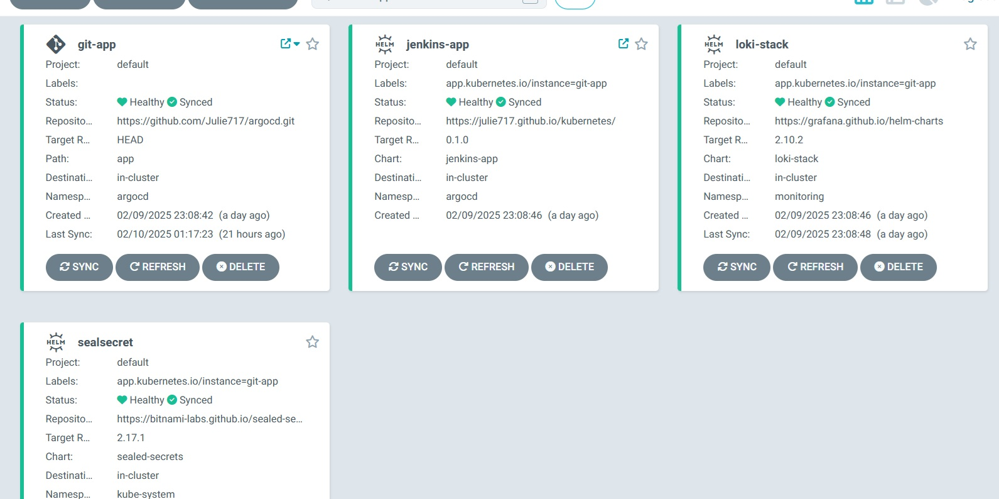
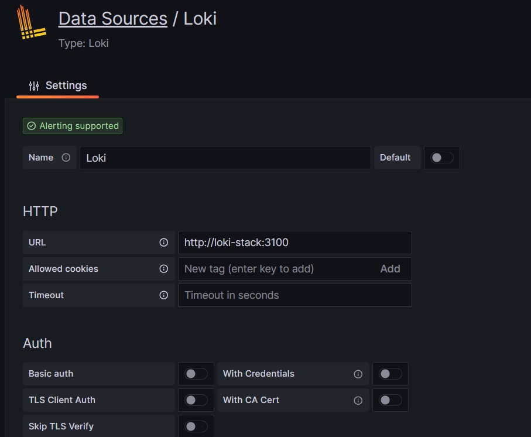
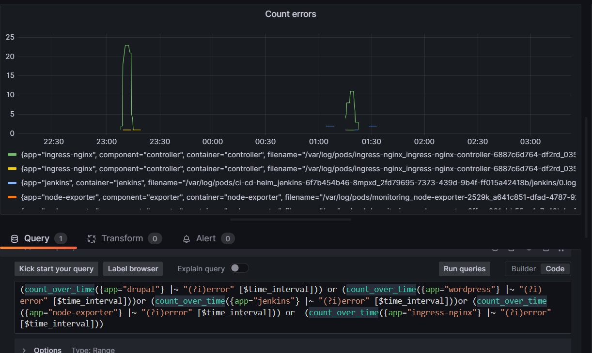
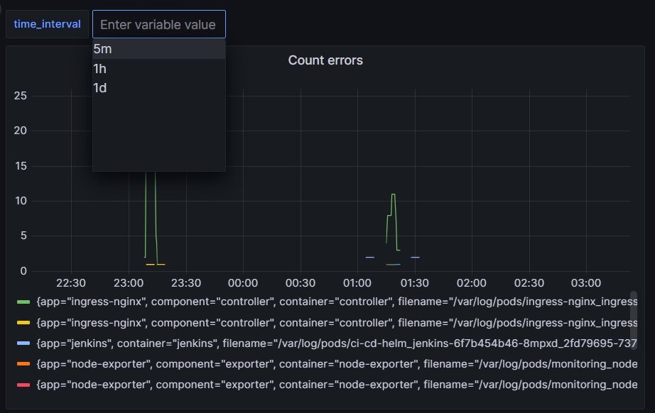

## Homework Assignment 1: Use grafana Loki for log monitoring

To use grafana Loki add corresponding [loki.yaml](https://github.com/Julie717/argocd/blob/master/app/monitoring/loki.yaml) to argocd

Check that Loki appeared in argocd



Add loki data source in grafana



Create grafana dashboard and add variable for intervals


Create graph for counting errors, using logql for writing query
```text
(count_over_time({app="drupal"} |~ "(?i)error" [$time_interval])) or (count_over_time({app="wordpress"} |~ "(?i)error" [$time_interval]))or (count_over_time({app="jenkins"} |~ "(?i)error" [$time_interval]))or (count_over_time({app="node-exporter"} |~ "(?i)error" [$time_interval])) or  (count_over_time({app="ingress-nginx"} |~ "(?i)error" [$time_interval]))
```

Mostly errors happened while restarting pods


On dashboard there is a possibility to change time interval
