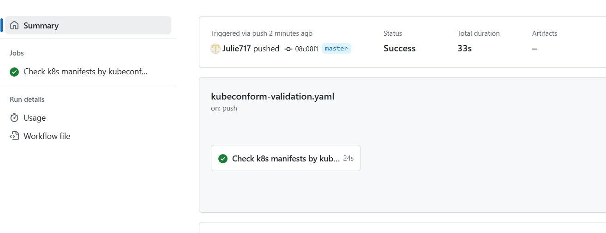
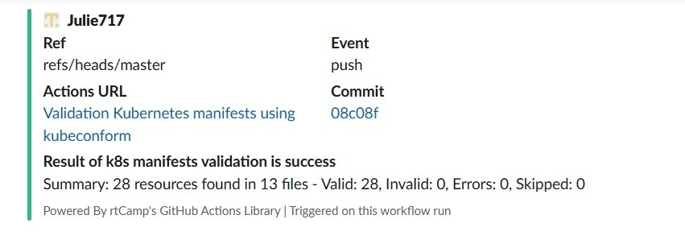
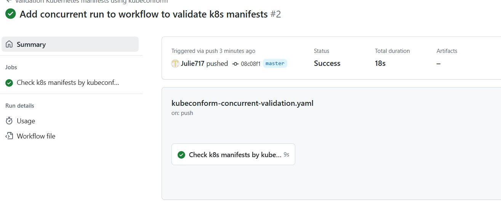
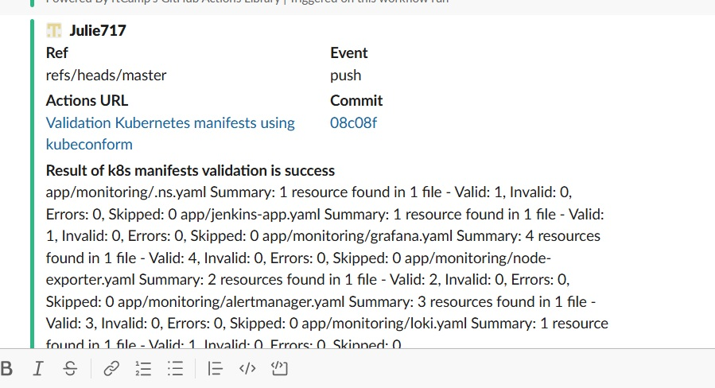

## Homework Assignment 1: Automate Docker images test by github action
To simple-app add [workflow for testing](https://github.com/Julie717/simple-app/blob/master/.github/workflows/test.yaml)

To check rootless mode to [Dockerfile](https://github.com/Julie717/simple-app/blob/master/Dockerfile) was added

```text
RUN useradd -ms /bin/bash user
USER user
```
[Result of workflow run](https://github.com/Julie717/simple-app/actions/runs/13295627563)


## Homework Assignment 2: Create CI for testing Kubernetes manifests using kubeconform
In argocd repository add workflows to check all yaml files by kubeconform

[workflow to check k8s manifests](https://github.com/Julie717/argocd/blob/master/.github/workflows/kubeconform-validation.yaml)

[workflow to check k8s manifests concurrently](https://github.com/Julie717/argocd/blob/master/.github/workflows/kubeconform-concurrent-validation.yaml)

Results of running workflow to check k8s manifests



Results of running workflow to check k8s manifests concurrently


