## Homework Assignment 1: Deploy Jenkins
Create user that has only read rights

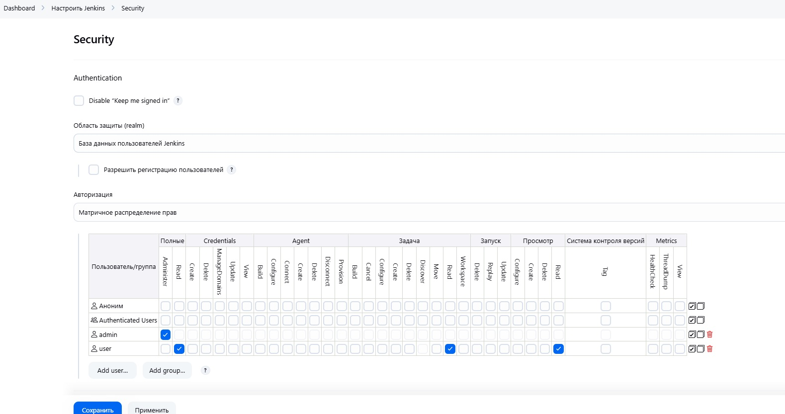
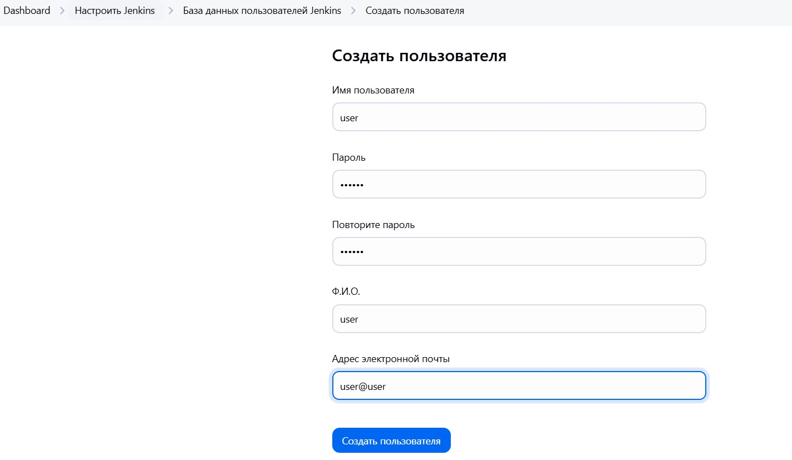

Add node Node_01 to the jenkins

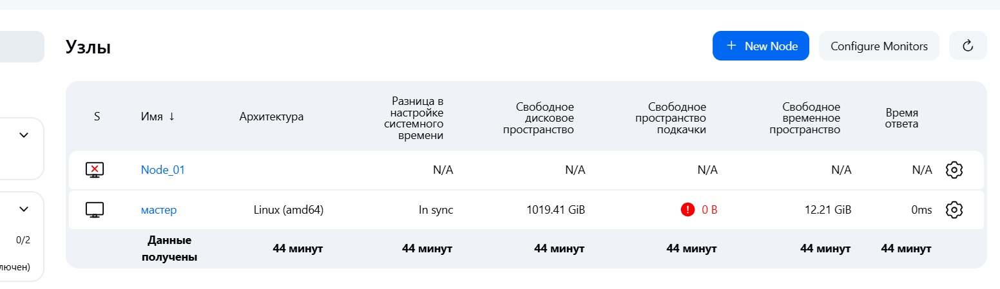

Add nodePort to the [jenkins service](https://github.com/Julie717/kubernetes/blob/14-kubernetes-application-deployment/jenkins-app/templates/service.yaml).
Change helm version to 0.1.1, make new deploy and [apply new helm version to the argocd](https://github.com/Julie717/argocd/blob/master/app/jenkins-app.yaml).
Check that nodePort appeared into the service in k9s

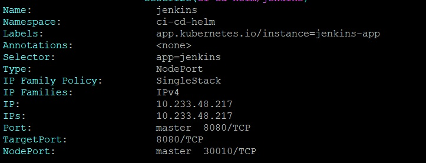

Install agent to the node-machine

```shell
root@sa-3:~# wget http://192.168.208.3:30010/jnlpJars/agent.jar
--2025-02-19 19:37:21--  http://192.168.208.3:30010/jnlpJars/agent.jar
Connecting to 192.168.208.3:30010... connected.
HTTP request sent, awaiting response... 200 OK
Length: 1395562 (1.3M) [application/java-archive]
Saving to: 'agent.jar'

agent.jar                      100%[=================================================>]   1.33M  --.-KB/s    in 0.01s

2025-02-19 19:37:21 (117 MB/s) - 'agent.jar' saved [1395562/1395562]
root@sa-3:~# java -jar agent.jar -url http://192.168.208.3:30010 -secret 5a50ccd262927eda25e14c030f192f16dad9065343dcbfddfc3edace512953ae -name "Node_01" -webSocket -workDir "/var/lib/jenkins"
Feb 19, 2025 7:41:00 PM org.jenkinsci.remoting.engine.WorkDirManager initializeWorkDir
INFO: Using /var/lib/jenkins/remoting as a remoting work directory
Feb 19, 2025 7:41:00 PM org.jenkinsci.remoting.engine.WorkDirManager setupLogging
INFO: Both error and output logs will be printed to /var/lib/jenkins/remoting
Feb 19, 2025 7:41:00 PM hudson.remoting.Launcher createEngine
INFO: Setting up agent: Node_01
Feb 19, 2025 7:41:00 PM hudson.remoting.Engine startEngine
INFO: Using Remoting version: 3283.v92c105e0f819
Feb 19, 2025 7:41:00 PM org.jenkinsci.remoting.engine.WorkDirManager initializeWorkDir
INFO: Using /var/lib/jenkins/remoting as a remoting work directory
Feb 19, 2025 7:41:01 PM hudson.remoting.Launcher$CuiListener status
INFO: WebSocket connection open
Feb 19, 2025 7:41:01 PM hudson.remoting.Launcher$CuiListener status
INFO: Connected
```

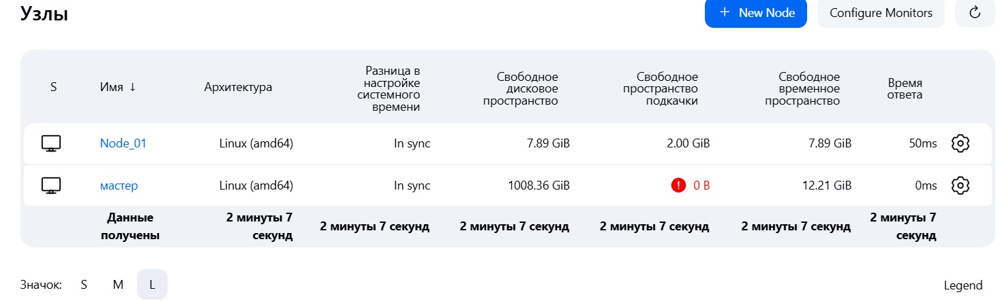

Write bash script to retrieve information if today is a holiday and what is the latest exchange rates (result write to the properties file)

```shell
#!/bin/bash
TODAY=`date +%F`
HOLIDAY_MESSAGE="Today date is $TODAY and it is "
if [ `curl -X 'GET' "https://openholidaysapi.org/PublicHolidaysByDate?date=$TODAY&languageIsoCode=BY" -H 'accept: application/json' | jq 'map(select(.country.isoCode == "BY"))'` == '[]' ]
then
  HOLIDAY_MESSAGE="$HOLIDAY_MESSAGE not"
fi
HOLIDAY_MESSAGE="$HOLIDAY_MESSAGE a holiday"

echo $HOLIDAY_MESSAGE

EXCHANGE_RATES=`curl "https://open.er-api.com/v6/latest/USD" | jq -jr  '.rates | to_entries[] | select(.key == ("USD", "EUR", "RUB")) | .key, ": ",.value, " "'`
EXCHANGE_RATES="Latest exchange rates: ${EXCHANGE_RATES}"

echo $EXCHANGE_RATES

truncate -s0 result.properties
echo "HOLIDAY_MESSAGE=$HOLIDAY_MESSAGE" >> result.properties
echo "EXCHANGE_RATES=$EXCHANGE_RATES" >> result.properties
```

In order to have a possibility to send message to the slack from Jenkins follow [this manual of usage slck notification plugin](https://plugins.jenkins.io/slack/). 
Create app and add it to the necessary channel, retrieved secret via installation put to the Jenkins system config and test connection.

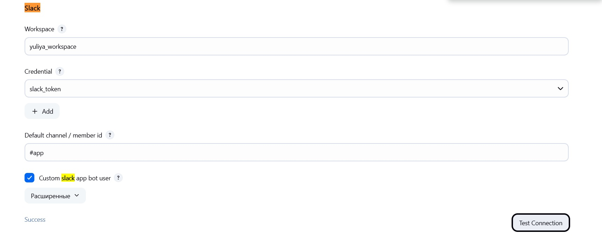

Create job that is going to run on created Node_01


every day

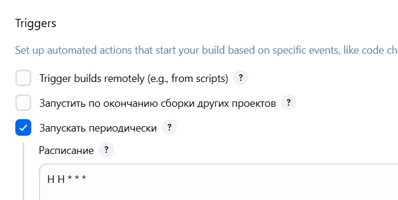

using environment variable properties file (install Inject Environment Variables Plugin)

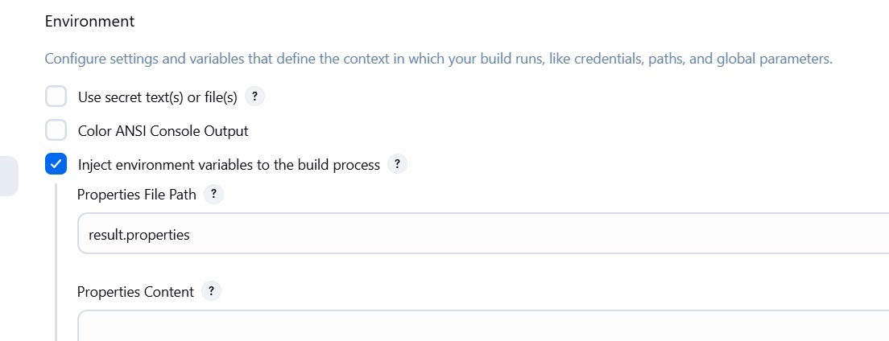

executing created earlier script

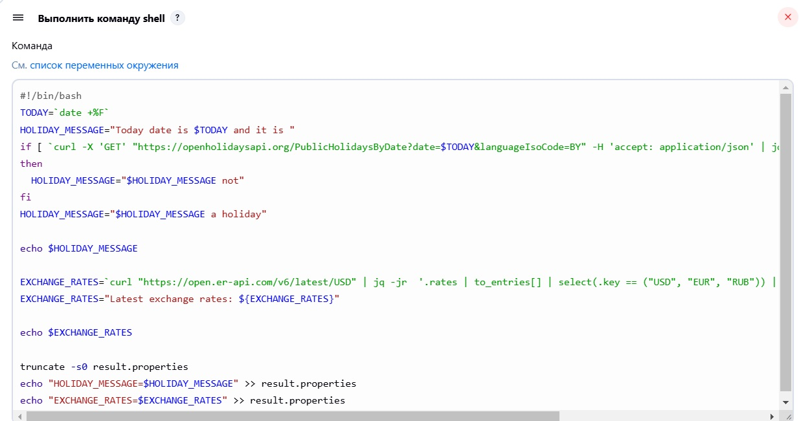

and sending notification to the slack on successful run.

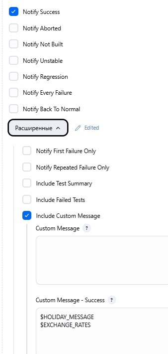

Then, run the job and check the result

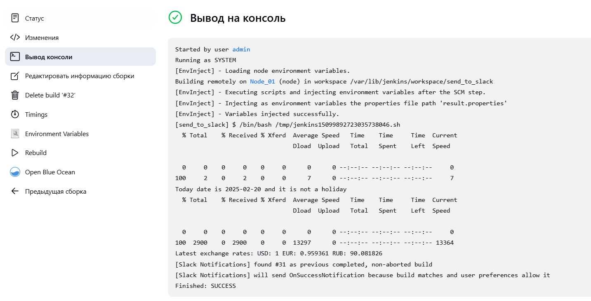

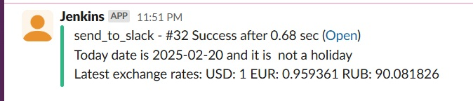