## Homework Assignment 1: Jenkins API

Script to check if user exists in /etc/passwd

```shell
if [[ -z `cat /etc/passwd | grep $user_name` ]]
then
 RESULT="User doesn't exist"
else
 RESULT="User exist"
fi
echo $RESULT
```

[Github-action with parameter user_name](https://github.com/Julie717/github-actions/blob/master/.github/workflows/username_for_jenkins.yaml)

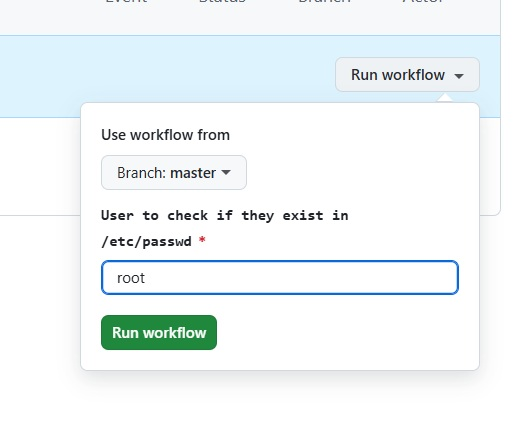
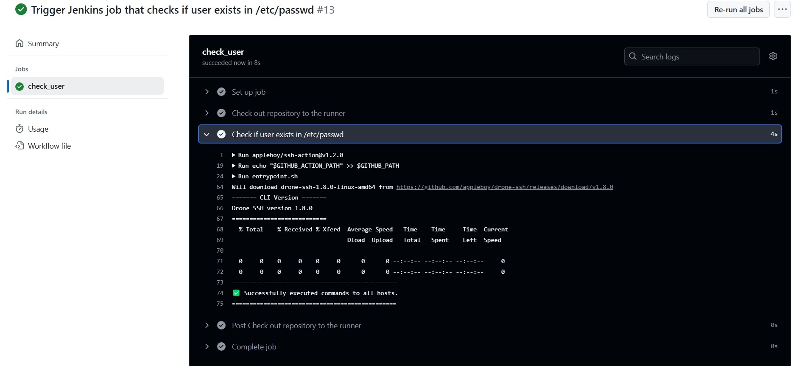

Github action trigger jenkins job

Jenkins job settings

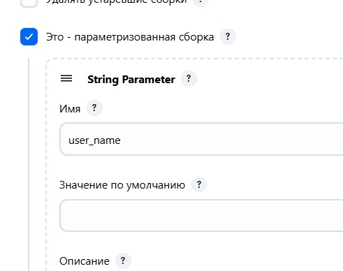
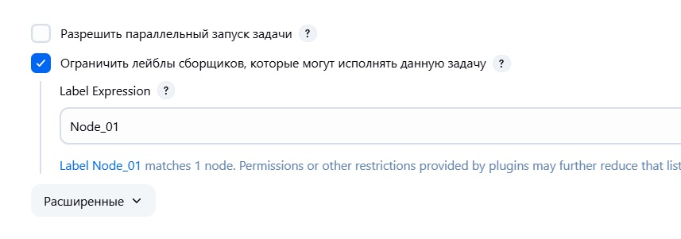
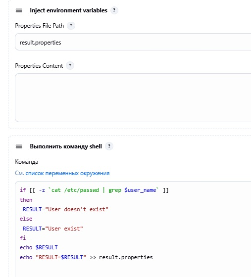
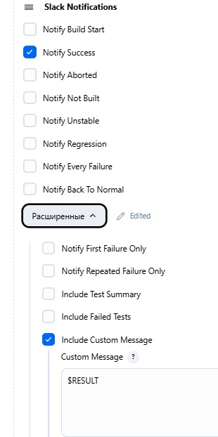

Result of running job

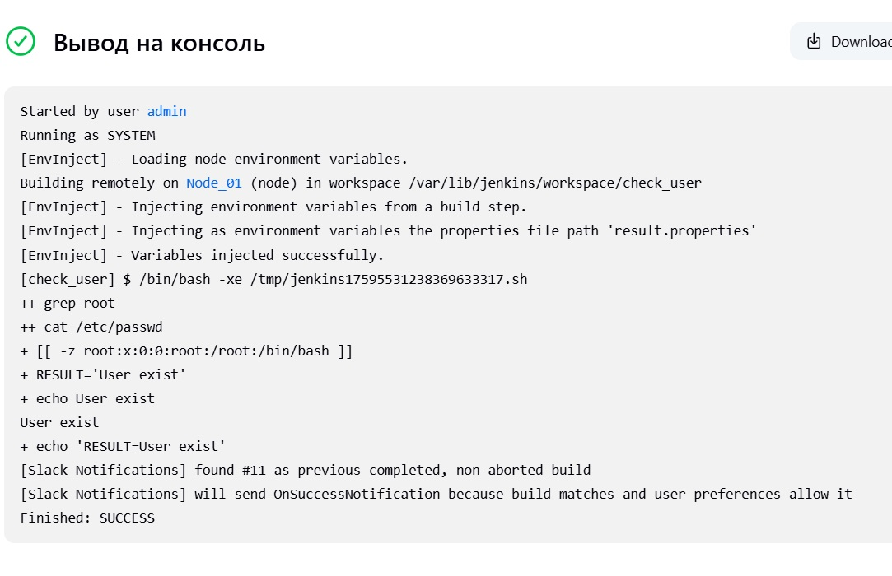
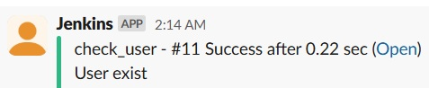

## Homework Assignment 2: Webhook

Go to [smee](https://smee.io/) to receive webhook url. Add [webhook](../20.Jenkins.Routine/smee.yaml) to the cluster

```shell
kubectl apply -f smee.yaml
```
Add webhook to github

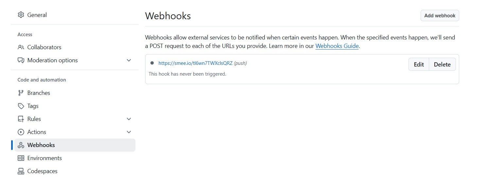

Create Jenkins job to check that this job will start on push to the github

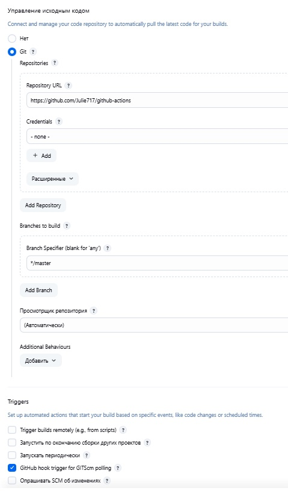
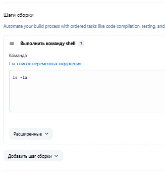

Push something to the [github-actions](https://github.com/Julie717/github-actions)
and check that Jenkins job started to run

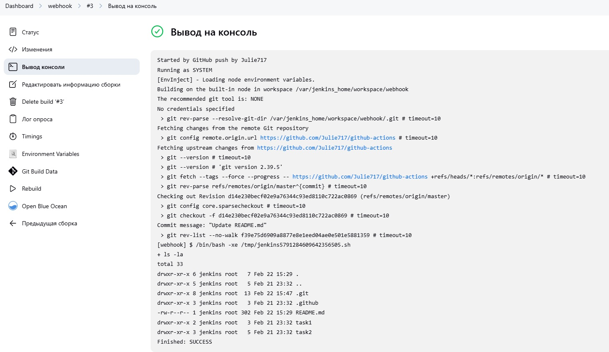