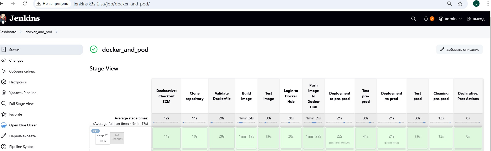
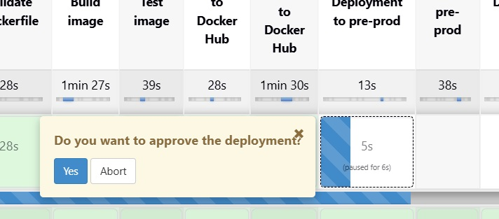
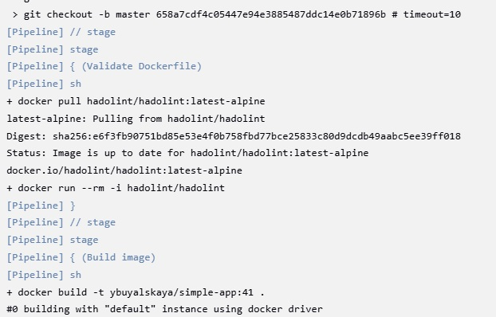
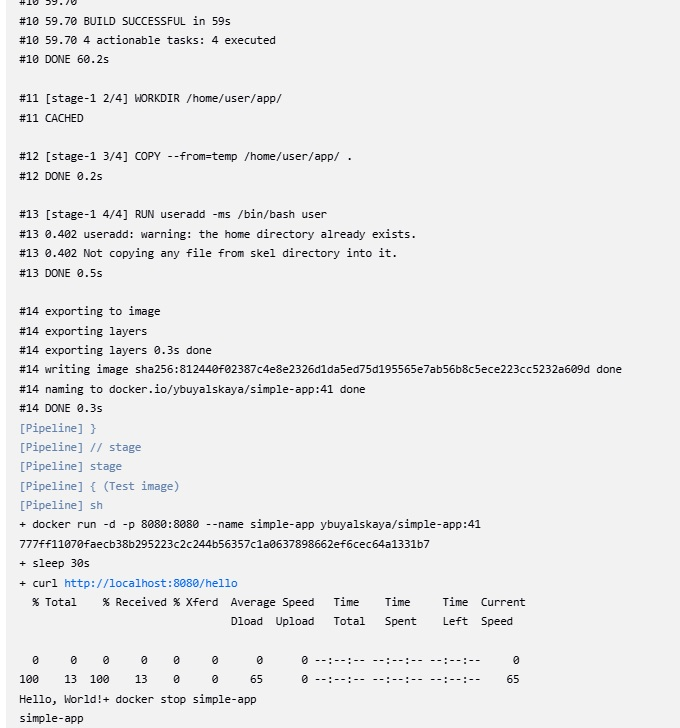
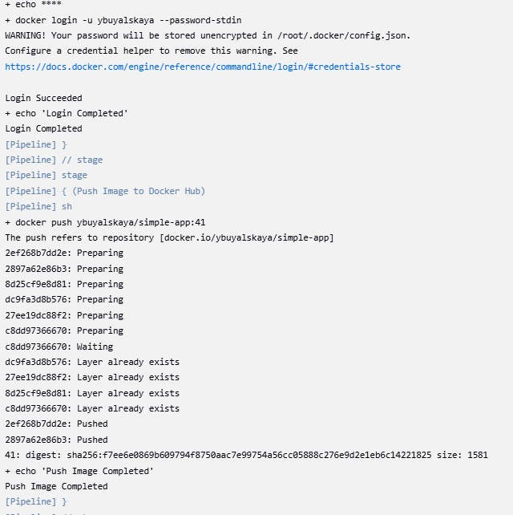
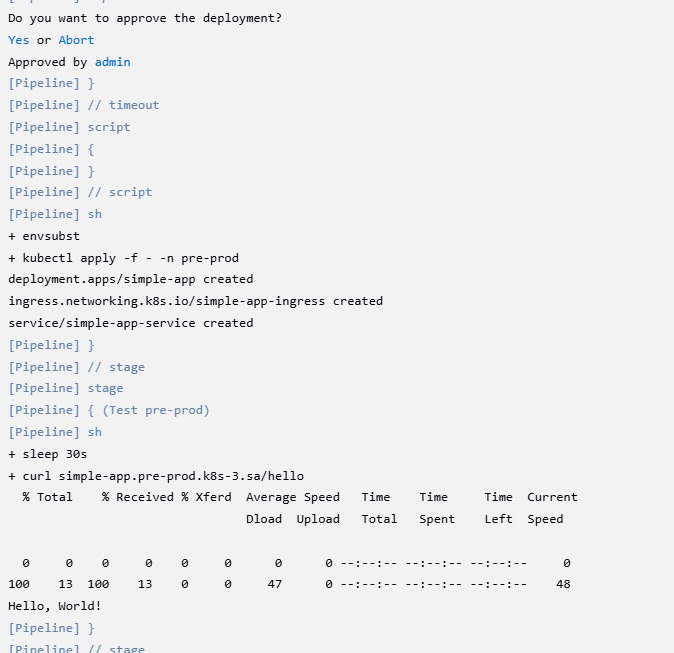
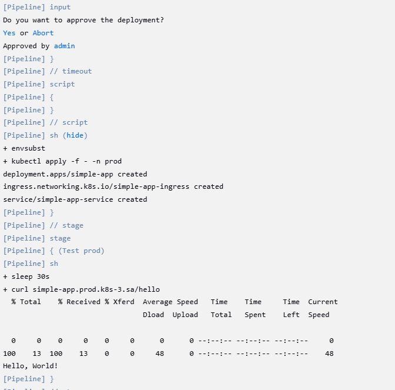
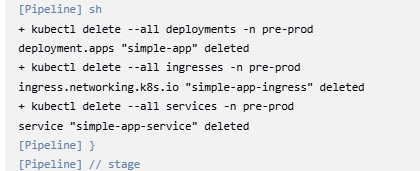
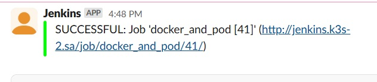

## Homework Assignment 1: Introduce the pipeline

Add credentials of docker hub to the Jenkins->Credentials. Make all necessary installations to the node (docker, kubectl, curl).
Add [Jenkins pipeline](https://github.com/Julie717/simple-app/blob/master/pipelines/Jenkinsfile) to the simple app (Java)

Pipeline run

Deployment confirmation

Dockerfile validation

Build and test image

Push to the docker hub

Deployment to the pre-prod

Deployment to the prod

Cleaning pre-prod

Slack notification

