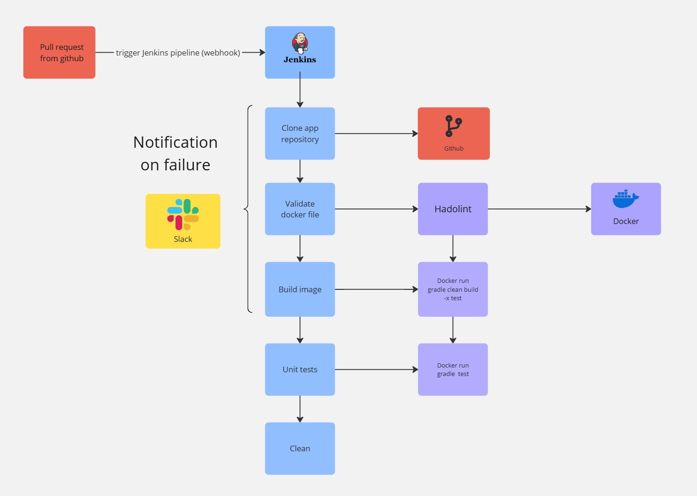
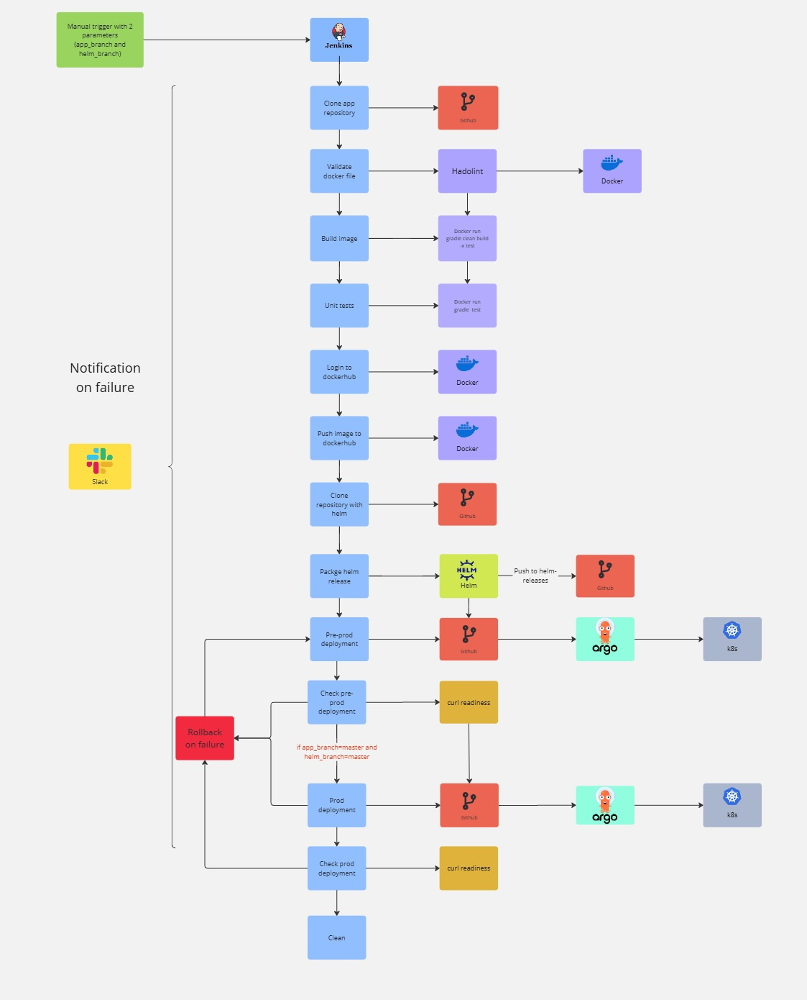
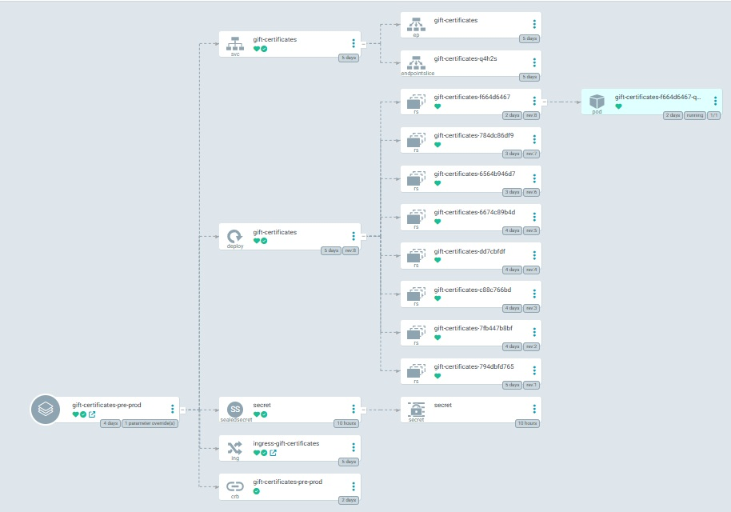

## Project
Project's reporter: Yuliya, Buyalskaya

Group number: m-sa2-30-24

### Description of application for deployment

**Name of application**: gift-certificates \
**Programming language**: Java 8 (Spring boot, build via gradle) \
**Database**: MySQL server (installed outside of cluster on 192.168.201.2) \
**Links**:
- [Application](https://github.com/Julie717/gift-certificates)
- [Jenkins pipelines](https://github.com/Julie717/ci-cd-project/tree/master/pipelines)
- [Helm](https://github.com/Julie717/ci-cd-project/tree/master/helm)
- [Helm releases](https://github.com/Julie717/helm-releases)
- [Argocd deployment on pre-prod](https://github.com/Julie717/argocd/blob/master/app/gift-certificates-pre-prod.yaml)
- [Argocd deployment on prod](https://github.com/Julie717/argocd/blob/master/app/gift-certificates-prod.yaml)

## Jenkins pipelines. High Level Design
- pr_check pipeline

- deploy pipeline

## Technologies which were used in project
Java, Spring boot, Spring boot actuator, hibernate, gradle, Junit 5, MySQL Server,
Jenkins, Ansible (db setup), github, webhook, k8s, argocd, helm, docker, hadorlint, bash

## Pull request check flows short description

- Start Jenkins pipeline from pull request (using webhook)
- Jenkins clone app repository
- Build docker image
- Run unit tests

If any stage fails it triggers slack notification

## Deployment flows short description

- Manual start Jenkins pipeline setting app_branch and helm_branch
- Jenkins clone app repository
- Build docker image
- Run unit tests
- Login to docker hub
- Push image to docker hub
- Perform helm package and push it to helm-releases
- Update argocd pre-prod application and push it to argocd repository, perform hard-refresh via argocd cli
- Curl readiness endpoint to check pre-prod deployment

If app_branch is master and helm_branch is master than perform
- Update argocd prod application and push it to argocd repository, perform hard-refresh via argocd cli
- Curl readiness endpoint to check prod deployment

Last 4 steps have argocd rollback on failure

If any stage fails it triggers slack notification

## How does new/upgrade deployment work

New deployment triggered by argocd due to necessity set up helm app chart with the same version, there was added hard refresh.
DB secrets deployed via sealed secret

## Rollback flow description and implementation

Rollback triggered by Jenkins post action in case of failure and perform:

- in argocd cli disable auto sync (otherwise rollback is not available)
- run argocd rollback
- enable auto sync
- revert changes in argocd repository
