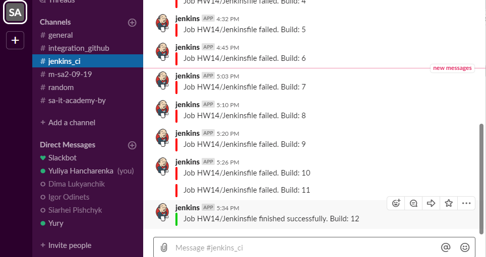
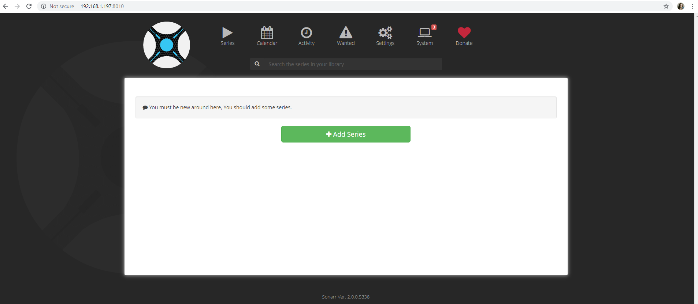
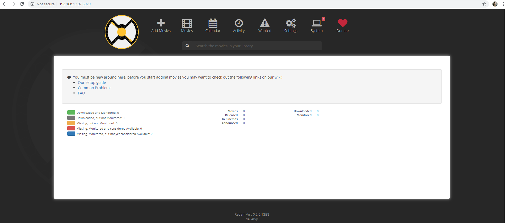

### 14. Docker. Logistics

##### Automate task 13. Docker. Lading by Jenkins
* Use remote repo as source for build image
* Make image locally (on Jenkins master/Slave)
* Push image on Docker Hub

##### Create docker compose file which contains the following applications:
* Web server (with links to the another Web apps)
* sonarr
* radarr
All settings of this applications should be added during docker-compose start from folder of project
Your Dockerfile, docker-compose files, Jenkinsfile and Jenkins output put into folder 14. Docker. Logistics add to your repository, then prepare PR (Pull Request)

https://hub.docker.com/u/dockeryuliya 


###### Consol output from Automation of 13HW:

```bash
[Started by user admin
Running in Durability level: MAX_SURVIVABILITY
[Pipeline] Start of Pipeline
[Pipeline] node
Running on Ubuntu in /var/lib/jenkins/workspace/HW14/Jenkinsfile
[Pipeline] {
[Pipeline] withEnv
[Pipeline] {
[Pipeline] stage
[Pipeline] { (Clone repo)
[Pipeline] git
using credential 66f6eb3b-3cd3-492c-997b-6579c2ab1049
Fetching changes from the remote Git repository
 > git rev-parse --is-inside-work-tree # timeout=10
 > git config remote.origin.url git@github.com:YuliyaHancharenka/test_sa.git # timeout=10
Fetching upstream changes from git@github.com:YuliyaHancharenka/test_sa.git
 > git --version # timeout=10
using GIT_SSH to set credentials 
 > git fetch --tags --progress -- git@github.com:YuliyaHancharenka/test_sa.git +refs/heads/*:refs/remotes/origin/*
Checking out Revision 302ca5f16478f4f0bfb1e63db7824d77e3482763 (refs/remotes/origin/master)
 > git rev-parse refs/remotes/origin/master^{commit} # timeout=10
 > git rev-parse refs/remotes/origin/origin/master^{commit} # timeout=10
 > git config core.sparsecheckout # timeout=10
 > git checkout -f 302ca5f16478f4f0bfb1e63db7824d77e3482763
 > git branch -a -v --no-abbrev # timeout=10
 > git branch -D master # timeout=10
 > git checkout -b master 302ca5f16478f4f0bfb1e63db7824d77e3482763
Commit message: "Second one"
 > git rev-list --no-walk 302ca5f16478f4f0bfb1e63db7824d77e3482763 # timeout=10
[Pipeline] }
[Pipeline] // stage
[Pipeline] stage
[Pipeline] { (Build image)
[Pipeline] script
[Pipeline] {
[Pipeline] sh
+ docker build -t dockeryuliya/yh_docker:12 .
Sending build context to Docker daemon  207.9kB

Step 1/6 : FROM alpine:latest
 ---> 961769676411
Step 2/6 : RUN apk update     && apk upgrade     && apk add --no-cache python py-pip bash    && mkdir /pythonapplication
 ---> Using cache
 ---> d1945e4276e4
Step 3/6 : RUN pip install Flask
 ---> Using cache
 ---> 81f275cc64a6
Step 4/6 : COPY pythonapplication.py /pythonapplication/pythonapplication.py
 ---> Using cache
 ---> 00ea77417e78
Step 5/6 : EXPOSE 80
 ---> Using cache
 ---> c3fcfd13a670
Step 6/6 : CMD ["python", "/pythonapplication/pythonapplication.py"]
 ---> Using cache
 ---> 6419670d75b8
Successfully built 6419670d75b8
Successfully tagged dockeryuliya/yh_docker:12
[Pipeline] }
[Pipeline] // script
[Pipeline] }
[Pipeline] // stage
[Pipeline] stage
[Pipeline] { (Push image to DockerHub)
[Pipeline] script
[Pipeline] {
[Pipeline] withEnv
[Pipeline] {
[Pipeline] withDockerRegistry
$ docker login -u dockeryuliya -p ******** https://index.docker.io/v1/
WARNING! Using --password via the CLI is insecure. Use --password-stdin.
WARNING! Your password will be stored unencrypted in /var/lib/jenkins/workspace/HW14/Jenkinsfile@tmp/a1ef251d-52fe-43d0-978d-5960dca2b449/config.json.
Configure a credential helper to remove this warning. See
https://docs.docker.com/engine/reference/commandline/login/#credentials-store

Login Succeeded
[Pipeline] {
[Pipeline] sh
+ docker tag dockeryuliya/yh_docker:12 dockeryuliya/yh_docker:12
[Pipeline] sh
+ docker push dockeryuliya/yh_docker:12
The push refers to repository [docker.io/dockeryuliya/yh_docker]
edf8e050e7d5: Preparing
c77be70403c5: Preparing
469f67eb96f3: Preparing
03901b4a2ea8: Preparing
03901b4a2ea8: Layer already exists
edf8e050e7d5: Pushed
c77be70403c5: Pushed
469f67eb96f3: Pushed
12: digest: sha256:96f480d6ee0b991df23038ee59305dd3b6c45d8dfd1e7048ceffff868ddbb3df size: 1158
[Pipeline] }
[Pipeline] // withDockerRegistry
[Pipeline] }
[Pipeline] // withEnv
[Pipeline] }
[Pipeline] // script
[Pipeline] }
[Pipeline] // stage
[Pipeline] stage
[Pipeline] { (Remove image)
[Pipeline] sh
+ docker rmi dockeryuliya/yh_docker:12
Untagged: dockeryuliya/yh_docker:12
Untagged: dockeryuliya/yh_docker@sha256:96f480d6ee0b991df23038ee59305dd3b6c45d8dfd1e7048ceffff868ddbb3df
[Pipeline] }
[Pipeline] // stage
[Pipeline] stage
[Pipeline] { (Declarative: Post Actions)
[Pipeline] slackSend
Slack Send Pipeline step running, values are - baseUrl: <empty>, teamDomain: sa-itacademy-by, channel: jenkins_ci, color: #00CC00, botUser: false, tokenCredentialId: 1ebf8e4a-7c38-4995-883e-3edbef57a792, notifyCommitters: false, iconEmoji: <empty>, username: <empty>
[Pipeline] }
[Pipeline] // stage
[Pipeline] }
[Pipeline] // withEnv
[Pipeline] }
[Pipeline] // node
[Pipeline] End of Pipeline
Finished: SUCCESS
```
 
Please see [Jenkinsfile](./Jenkinsfile) and successful slack message



###### Create docker compose file with sonarr and radarr:

```bash
jenkins@ubuntu-bionic:~/14/dockercompose$ vim docker-compose.yml

jenkins@ubuntu-bionic:~/14/dockercompose$ docker-compose up -d
Creating network "dockercompose_default" with the default driver
Pulling nginx (nginx:latest)...
latest: Pulling from library/nginx
b8f262c62ec6: Pull complete
e9218e8f93b1: Pull complete
7acba7289aa3: Pull complete
Digest: sha256:aeded0f2a861747f43a01cf1018cf9efe2bdd02afd57d2b11fcc7fcadc16ccd1
Status: Downloaded newer image for nginx:latest
Pulling radarr (linuxserver/radarr:latest)...
latest: Pulling from linuxserver/radarr
4200d7cb24f1: Pull complete
2ddc086effe7: Pull complete
4cc5d559b859: Pull complete
dcf8f52dfec9: Pull complete
841cf276c599: Pull complete
797dcb12abb0: Pull complete
fdedc21874a9: Pull complete
Digest: sha256:934161003da5d53fe64c51a0a00b3a6ed38068bb3609e4cf0aba093e8f37d6b0
Status: Downloaded newer image for linuxserver/radarr:latest
Pulling sonarr (linuxserver/sonarr:latest)...
latest: Pulling from linuxserver/sonarr
4200d7cb24f1: Already exists
2ddc086effe7: Already exists
4cc5d559b859: Already exists
dcf8f52dfec9: Already exists
841cf276c599: Already exists
68e48f151adb: Pull complete
ce10e0b521b0: Pull complete
Digest: sha256:12af3b2c05bd244113857798633c8594f5115b21e9e00626b9a4bc2f2b59c100
Status: Downloaded newer image for linuxserver/sonarr:latest
Creating nginx ...
Creating nginx ... done
Creating sonarr ...
Creating radarr ...
Creating sonarr
Creating sonarr ... done


jenkins@ubuntu-bionic:~/14/dockercompose$ sudo docker-compose images
Container       Repository        Tag       Image Id      Size
---------------------------------------------------------------
nginx       nginx                latest   f949e7d76d63   120 MB
radarr      linuxserver/radarr   latest   d625e2d4706c   525 MB
sonarr      linuxserver/sonarr   latest   96028f209d40   572 MB

```

Please see [docker-compose file](./docker-compose.yml), sonarr and radarr pages' screen shots

