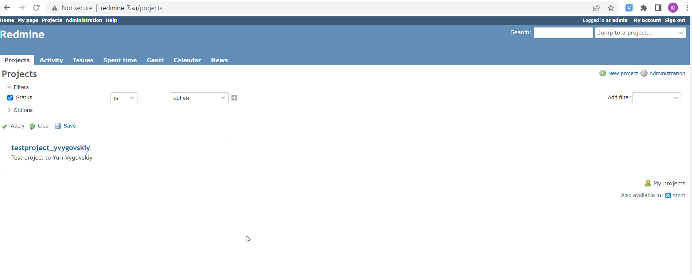

# 08.Ansible.Workshop

## Printscreen of my project in application



## Output from playbook
```bash

ansible-playbook -i inventory.yaml redmine.yaml

PLAY [redmine] **************************************************************************************************

TASK [Gathering Facts] ******************************************************************************************
Wednesday 18 May 2022  14:42:32 +0000 (0:00:00.049)       0:00:00.049 *********
ok: [redmine_7]

TASK [debug] ****************************************************************************************************
Wednesday 18 May 2022  14:42:41 +0000 (0:00:08.959)       0:00:09.008 *********
ok: [redmine_7] => {
    "msg": "192.168.201.7"
}

TASK [Include pre_tasks vars] ***********************************************************************************
Wednesday 18 May 2022  14:42:41 +0000 (0:00:00.119)       0:00:09.128 *********
ok: [redmine_7]

TASK [Redmine. Install packages] ********************************************************************************
Wednesday 18 May 2022  14:42:41 +0000 (0:00:00.118)       0:00:09.247 *********
ok: [redmine_7]

TASK [mysql : MySQL.Install MYSQL] ******************************************************************************
Wednesday 18 May 2022  14:42:46 +0000 (0:00:04.911)       0:00:14.159 *********
ok: [redmine_7]

TASK [mysql : MySQL.Create DB] **********************************************************************************
Wednesday 18 May 2022  14:42:50 +0000 (0:00:04.210)       0:00:18.369 *********
ok: [redmine_7]

TASK [mysql : MySQL.Create DB User] *****************************************************************************
Wednesday 18 May 2022  14:42:54 +0000 (0:00:03.660)       0:00:22.030 *********
ok: [redmine_7]

TASK [redmine : Redmine. Clone repository] **********************************************************************
Wednesday 18 May 2022  14:42:58 +0000 (0:00:03.988)       0:00:26.019 *********
ok: [redmine_7]

TASK [redmine : Redmine. Change permissions] ********************************************************************
Wednesday 18 May 2022  14:43:01 +0000 (0:00:03.521)       0:00:29.540 *********
ok: [redmine_7]

TASK [redmine : Redmine. Change permissions] ********************************************************************
Wednesday 18 May 2022  14:43:05 +0000 (0:00:03.662)       0:00:33.203 *********
ok: [redmine_7]

TASK [redmine : Config database] ********************************************************************************
Wednesday 18 May 2022  14:43:08 +0000 (0:00:03.240)       0:00:36.443 *********
ok: [redmine_7]

TASK [redmine : Redmine. Setup 01] ******************************************************************************
Wednesday 18 May 2022  14:43:14 +0000 (0:00:05.684)       0:00:42.128 *********
changed: [redmine_7]

TASK [redmine : Session store secret generation] ****************************************************************
Wednesday 18 May 2022  14:43:21 +0000 (0:00:07.187)       0:00:49.316 *********
ok: [redmine_7]

TASK [redmine : Redmine. Setup 02] ******************************************************************************
Wednesday 18 May 2022  14:43:24 +0000 (0:00:03.054)       0:00:52.370 *********
changed: [redmine_7]

TASK [redmine : Configuration files for virtualhost] ************************************************************
Wednesday 18 May 2022  14:43:36 +0000 (0:00:12.272)       0:01:04.642 *********
changed: [redmine_7]

TASK [redmine : meta] *******************************************************************************************
Wednesday 18 May 2022  14:43:44 +0000 (0:00:07.257)       0:01:11.900 *********

RUNNING HANDLER [redmine : apache restart] **********************************************************************
Wednesday 18 May 2022  14:43:44 +0000 (0:00:00.000)       0:01:11.900 *********
changed: [redmine_7]

TASK [Include post_tasks variables] *****************************************************************************
Wednesday 18 May 2022  14:43:50 +0000 (0:00:06.677)       0:01:18.579 *********
ok: [redmine_7]

TASK [Add redmine-7.sa to host file] ****************************************************************************
Wednesday 18 May 2022  14:43:50 +0000 (0:00:00.125)       0:01:18.704 *********
changed: [redmine_7]

TASK [uri] ******************************************************************************************************
Wednesday 18 May 2022  14:43:54 +0000 (0:00:03.167)       0:01:21.872 *********
ok: [redmine_7]

TASK [lineinfile] ***********************************************************************************************
Wednesday 18 May 2022  14:44:01 +0000 (0:00:07.709)       0:01:29.581 *********
changed: [redmine_7]

PLAY RECAP ******************************************************************************************************
redmine_7                  : ok=20   changed=6    unreachable=0    failed=0    skipped=0    rescued=0    ignored=0

Wednesday 18 May 2022  14:44:05 +0000 (0:00:03.596)       0:01:33.178 *********
===============================================================================
redmine : Redmine. Setup 02 ----------------------------------------------------------------------------- 12.27s
Gathering Facts ------------------------------------------------------------------------------------------ 8.96s
uri ------------------------------------------------------------------------------------------------------ 7.71s
redmine : Configuration files for virtualhost ------------------------------------------------------------ 7.26s
redmine : Redmine. Setup 01 ------------------------------------------------------------------------------ 7.19s
redmine : apache restart --------------------------------------------------------------------------------- 6.68s
redmine : Config database -------------------------------------------------------------------------------- 5.68s
Redmine. Install packages -------------------------------------------------------------------------------- 4.91s
mysql : MySQL.Install MYSQL ------------------------------------------------------------------------------ 4.21s
mysql : MySQL.Create DB User ----------------------------------------------------------------------------- 3.99s
redmine : Redmine. Change permissions -------------------------------------------------------------------- 3.66s
mysql : MySQL.Create DB ---------------------------------------------------------------------------------- 3.66s
lineinfile ----------------------------------------------------------------------------------------------- 3.60s
redmine : Redmine. Clone repository ---------------------------------------------------------------------- 3.52s
redmine : Redmine. Change permissions -------------------------------------------------------------------- 3.24s
Add redmine-7.sa to host file ---------------------------------------------------------------------------- 3.17s
redmine : Session store secret generation ---------------------------------------------------------------- 3.05s
Include post_tasks variables ----------------------------------------------------------------------------- 0.13s
debug ---------------------------------------------------------------------------------------------------- 0.12s
Include pre_tasks vars ----------------------------------------------------------------------------------- 0.12s
Playbook run took 0 days, 0 hours, 1 minutes, 33 seconds
```

## Testing console output result

```bash
ansible-playbook -i inventory.yaml redmine.yaml -t test

PLAY [redmine] **************************************************************************************************

TASK [Gathering Facts] ******************************************************************************************
Wednesday 18 May 2022  14:45:11 +0000 (0:00:00.045)       0:00:00.045 *********
ok: [redmine_7]

TASK [Include post_tasks variables] *****************************************************************************
Wednesday 18 May 2022  14:45:20 +0000 (0:00:08.580)       0:00:08.625 *********
ok: [redmine_7]

TASK [Add redmine-7.sa to host file] ****************************************************************************
Wednesday 18 May 2022  14:45:20 +0000 (0:00:00.094)       0:00:08.720 *********
changed: [redmine_7]

TASK [uri] ******************************************************************************************************
Wednesday 18 May 2022  14:45:23 +0000 (0:00:03.400)       0:00:12.120 *********
ok: [redmine_7]

TASK [lineinfile] ***********************************************************************************************
Wednesday 18 May 2022  14:45:27 +0000 (0:00:03.575)       0:00:15.695 *********
changed: [redmine_7]

PLAY RECAP ******************************************************************************************************
redmine_7                  : ok=5    changed=2    unreachable=0    failed=0    skipped=0    rescued=0    ignored=0

Wednesday 18 May 2022  14:45:30 +0000 (0:00:03.441)       0:00:19.137 *********
===============================================================================
Gathering Facts ------------------------------------------------------------------------------------------ 8.58s
uri ------------------------------------------------------------------------------------------------------ 3.58s
lineinfile ----------------------------------------------------------------------------------------------- 3.44s
Add redmine-7.sa to host file ---------------------------------------------------------------------------- 3.40s
Include post_tasks variables ----------------------------------------------------------------------------- 0.09s
Playbook run took 0 days, 0 hours, 0 minutes, 19 seconds
```
