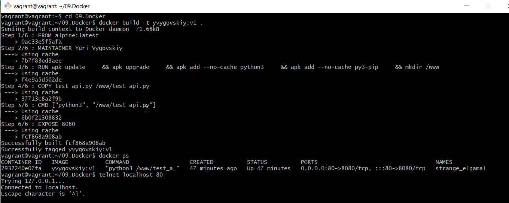
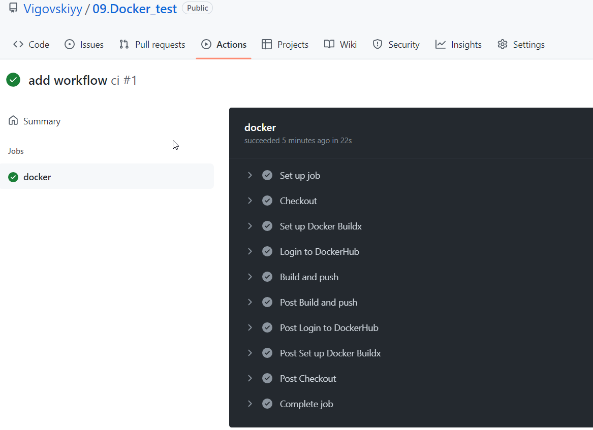

# 09.Docker

## Repository 
* [Dockerhub](https://hub.docker.com/repository/docker/yvygovskiy/docker)
* [Git Hub Repo ](https://github.com/Vigovskiyy/09.Docker_test)

### DockerFile

```bash

FROM alpine:latest
MAINTAINER Yuri_Vygovskiy

RUN apk update \
    && apk upgrade \
    && apk add --no-cache python3 \
    && apk add --no-cache py3-pip \
    && mkdir /www

COPY test_api.py /www/test_api.py

CMD ["python3", "/www/test_api.py"]

EXPOSE 8080

```
## Python PortBinding 

```bash
import socket

server = socket.socket(socket.AF_INET, socket.SOCK_STREAM)
server.setsockopt(socket.SOL_SOCKET, socket.SO_REUSEADDR, 1)


server.bind(('', 8080))
server.listen()
while True:
      client_socket, addr = server.accept()
      request = client_socket.recv(1024)
      print ('Connected ' + addr[0] + ':' + str(addr[1]))
      client_socket.sendall(b'Connection Works!')
      client_socket.close()
```
### GitHub action file

```bash
name: ci

on:
  push:
    branches:
      - 'main'

jobs:
  docker:
    runs-on: ubuntu-latest
    steps:
      -
        name: Checkout
        uses: actions/checkout@v2
      -
        name: Set up Docker Buildx
        uses: docker/setup-buildx-action@v1
      -
        name: Login to DockerHub
        uses: docker/login-action@v1
        with:
          username: ${{ secrets.DOCKERHUB_USERNAME }}
          password: ${{ secrets.DOCKERHUB_TOKEN }}
      -
        name: Build and push
        uses: docker/build-push-action@v2
        with:
          context: .
          push: true
          tags: yvygovskiy/docker:latest
```
##Docker Install and Check screenshots





