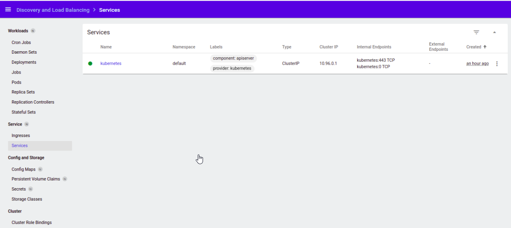

# 10.Kubernetes

## Command for run minikube with different HW options (RAM/CPU)

```bash
minikube start --memory=4048mb --cpus=4
```

## Results to deploy minikube

```bash
- result sudo minikube status
minikube
type: Control Plane
host: Running
kubelet: Running
apiserver: Running
kubeconfig: Configured

- result sudo minikube addons enable ingress
  - Using image k8s.gcr.io/ingress-nginx/kube-webhook-certgen:v1.1.1
  - Using image k8s.gcr.io/ingress-nginx/controller:v1.1.1
  - Using image k8s.gcr.io/ingress-nginx/kube-webhook-certgen:v1.1.1
* Verifying ingress addon...
* The 'ingress' addon is enabled

- result sudo minikube addons list
|-----------------------------|----------|--------------|--------------------------------|
|         ADDON NAME          | PROFILE  |    STATUS    |           MAINTAINER           |
|-----------------------------|----------|--------------|--------------------------------|
| ambassador                  | minikube | disabled     | third-party (ambassador)       |
| auto-pause                  | minikube | disabled     | google                         |
| csi-hostpath-driver         | minikube | disabled     | kubernetes                     |
| dashboard                   | minikube | enabled ✅   | kubernetes                     |
| default-storageclass        | minikube | enabled ✅   | kubernetes                     |
| efk                         | minikube | disabled     | third-party (elastic)          |
| freshpod                    | minikube | disabled     | google                         |
| gcp-auth                    | minikube | disabled     | google                         |
| gvisor                      | minikube | disabled     | google                         |
| helm-tiller                 | minikube | disabled     | third-party (helm)             |
| ingress                     | minikube | enabled ✅   | unknown (third-party)          |
| ingress-dns                 | minikube | disabled     | google                         |
| istio                       | minikube | disabled     | third-party (istio)            |
| istio-provisioner           | minikube | disabled     | third-party (istio)            |
| kong                        | minikube | disabled     | third-party (Kong HQ)          |
| kubevirt                    | minikube | disabled     | third-party (kubevirt)         |
| logviewer                   | minikube | disabled     | unknown (third-party)          |
| metallb                     | minikube | disabled     | third-party (metallb)          |
| metrics-server              | minikube | disabled     | kubernetes                     |
| nvidia-driver-installer     | minikube | disabled     | google                         |
| nvidia-gpu-device-plugin    | minikube | disabled     | third-party (nvidia)           |
| olm                         | minikube | disabled     | third-party (operator          |
|                             |          |              | framework)                     |
| pod-security-policy         | minikube | disabled     | unknown (third-party)          |
| portainer                   | minikube | disabled     | portainer.io                   |
| registry                    | minikube | disabled     | google                         |
| registry-aliases            | minikube | disabled     | unknown (third-party)          |
| registry-creds              | minikube | disabled     | third-party (upmc enterprises) |
| storage-provisioner         | minikube | enabled ✅   | google                         |
| storage-provisioner-gluster | minikube | disabled     | unknown (third-party)          |
| volumesnapshots             | minikube | disabled     | kubernetes                     |
|-----------------------------|----------|--------------|--------------------------------|
```
## Access to the dashboard



## Results deployment of k8s cluster inside IT-ACADEMY environment

```bash
PLAY RECAP ****************************************************************************
localhost                  : ok=4    changed=0    unreachable=0    failed=0    skipped=0    rescued=0    ignored=0
node1                      : ok=768  changed=149  unreachable=0    failed=0    skipped=1315 rescued=0    ignored=6
node2                      : ok=507  changed=94   unreachable=0    failed=0    skipped=772  rescued=0    ignored=2

Monday 23 May 2022  16:45:29 +0000 (0:00:00.089)       0:45:21.512 ************
===============================================================================
kubernetes/preinstall : Install packages requirements ------------------------- 77.85s
download : download_file | Validate mirrors ----------------------------------- 74.52s
kubernetes-apps/ansible : Kubernetes Apps | Lay Down CoreDNS templates -------- 62.15s
kubernetes-apps/ansible : Kubernetes Apps | Start Resources ------------------- 46.12s
network_plugin/calico : Calico | Create calico manifests ---------------------- 37.37s
kubernetes/preinstall : Remove search/domain/nameserver options before block -- 31.58s
download : download_container | Download image if required -------------------- 29.46s
download : download_container | Download image if required -------------------- 29.39s
download : download_container | Download image if required -------------------- 29.35s
kubernetes/control-plane : kubeadm | Initialize first master ------------------ 28.94s
kubernetes/preinstall : Create cni directories -------------------------------- 28.51s
download : download_container | Download image if required -------------------- 26.57s
kubernetes/preinstall : Remove search/domain/nameserver options after block --- 26.53s
policy_controller/calico : Create calico-kube-controllers manifests ----------- 24.71s
bootstrap-os : Assign inventory name to unconfigured hostnames (non-CoreOS, non-Flatcar, Suse and ClearLinux, non-Fedora) -- 24.46s
network_plugin/calico : Start Calico resources -------------------------------- 22.71s
download : download_file | Download item -------------------------------------- 22.01s
kubernetes/preinstall : Ensure kube-bench parameters are set ------------------ 20.43s
container-engine/crictl : download_file | Download item ----------------------- 20.05s
download : download_file | Download item -------------------------------------- 18.89s
```
