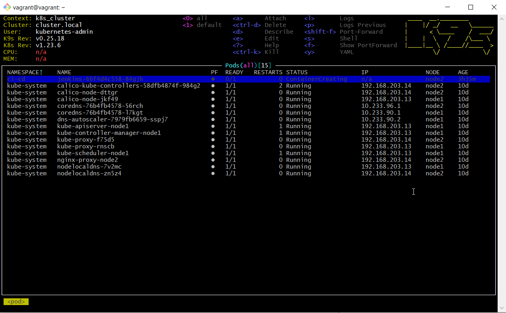

# 11.Kubernetes.install

## Screenshots K9s&K3s:

##Contexts


##pods


## kubectl config:


```yaml
vagrant@vagrant:~$ kubectl config view
apiVersion: v1
clusters:
- cluster:
    certificate-authority-data: DATA+OMITTED
    server: https://127.0.0.1:6443
  name: cluster.local
- cluster:
    certificate-authority-data: DATA+OMITTED
    server: https://127.0.0.1:6443
  name: default
contexts:
- context:
    cluster: default
    user: default
  name: k3s_cluster
- context:
    cluster: cluster.local
    user: kubernetes-admin
  name: k8s_cluster
current-context: k8s_cluster
kind: Config
preferences: {}
users:
- name: default
  user:
    client-certificate-data: REDACTED
    client-key-data: REDACTED
- name: kubernetes-admin
  user:
    client-certificate-data: REDACTED
    client-key-data: REDACTED
```

## kubectl config use-context:

```bash

vagrant@vagrant:~$ kubectl config get-contexts
CURRENT   NAME          CLUSTER         AUTHINFO           NAMESPACE
          k3s_cluster   default         default
*         k8s_cluster   cluster.local   kubernetes-admin

vagrant@vagrant:~$ kubectl get nodes
NAME    STATUS   ROLES                  AGE   VERSION
node1   Ready    control-plane,master   10d   v1.23.6
node2   Ready    <none>                 10d   v1.23.6

vagrant@vagrant:~$ kubectl config use-context k3s_cluster
Switched to context "k3s_cluster".

vagrant@vagrant:~$ kubectl get nodes
NAME    STATUS   ROLES                  AGE   VERSION
test1   Ready    control-plane,master   10d   v1.23.6+k3s1
```
