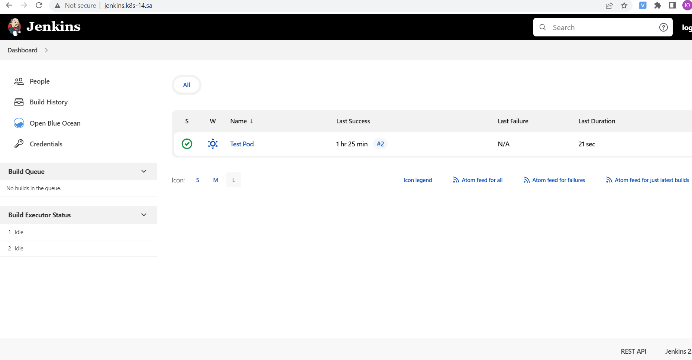
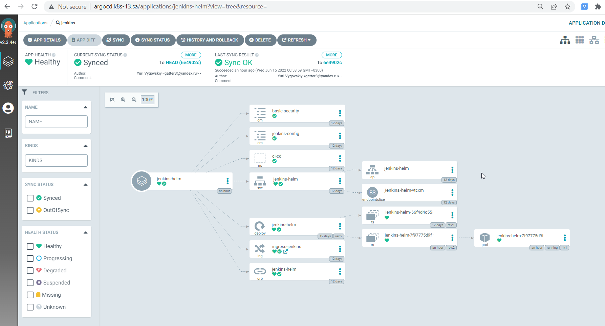

## 14.K8s.Applcation.Deployment
---
### GIT
[GitHub](https://github.com/Vigovskiyy/jenkins_helm)
---
### ArgoCD manifest
``` yaml
vagrant@vagrant:~/14.jenkins-helm/jenkins_helm$ kubectl get application -n argocd jenkins-helm -o yaml
apiVersion: argoproj.io/v1alpha1
kind: Application
metadata:
  creationTimestamp: "2022-06-14T21:50:15Z"
  generation: 2368
  name: jenkins
  namespace: argocd
  resourceVersion: "4322479"
  uid: bd2b843c-b1d7-4049-91fb-8e7d2d546720
spec:
  destination:
    namespace: ci-cd
     server: https://kubernetes.default.svc
  project: default
  source:
    chart: jenkins
    helm:
      valueFiles:
      - values.yaml
    repoURL: https://github.com/Vigovskiyy/jenkins-helm.git
    targetRevision: HEAD
  syncPolicy:
    automated: {}
status:
  health:
    status: Healthy
  history:
  - deployStartedAt: "2022-06-14T21:50:17Z"
    deployedAt: "2022-06-14T21:50:18Z"
    id: 0
    revision: d4accfaf2a8dd060d756ab84c69af3c75ddc363a
     source:
      chart: jenkins
      helm:
        valueFiles:
        - values.yaml
      repoURL: https://github.com/Vigovskiyy/jenkins-helm.git
      targetRevision: HEAD
  - deployStartedAt: "2022-06-14T21:58:59Z"
    deployedAt: "2022-06-14T21:58:59Z"
    id: 0
     revision: 0.1.0
    source:
      chart: jenkins
      helm:
        valueFiles:
        - values.yaml
      repoURL: https://github.com/Vigovskiyy/jenkins-helm.git
      targetRevision: HEAD
  operationState:
    finishedAt: "2022-06-14T21:58:59Z"
    message: successfully synced (all tasks run)
    operation:
      initiatedBy:
        automated: true
      retry:
        limit: 5
      sync:
        revision: 6e4902c8fd8b21790b7166197c6fede7c495da3d
    phase: Succeeded
    startedAt: "2022-06-14T21:58:59Z"
    syncResult:
      resources:
      - group: ""
        hookPhase: Running
        kind: Namespace
        message: namespace/ci-cd unchanged
        name: ci-cd
        namespace: ci-cd
        status: Synced
        syncPhase: Sync
        version: v1
      - group: ""
        hookPhase: Running
        kind: ConfigMap
        message: configmap/basic-security unchanged
        name: basic-security
        namespace: ci-cd
        status: Synced
        syncPhase: Sync
        version: v1
      - group: ""
        hookPhase: Running
        kind: ConfigMap
        message: configmap/jenkins-config unchanged
        name: jenkins-config
        namespace: ci-cd
        status: Synced
        syncPhase: Sync
        version: v1
      - group: rbac.authorization.k8s.io
        hookPhase: Running
        kind: ClusterRoleBinding
        message: clusterrolebinding.rbac.authorization.k8s.io/jenkins reconciled.
          clusterrolebinding.rbac.authorization.k8s.io/jenkins unchanged
        name: jenkins
        namespace: ci-cd
        status: Synced
        syncPhase: Sync
        version: v1
      - group: ""
        hookPhase: Running
        kind: Service
        message: service/jenkins unchanged
        name: jenkins
        namespace: ci-cd
        status: Synced
        syncPhase: Sync
        version: v1
      - group: apps
        hookPhase: Running
        kind: Deployment
        message: deployment.apps/jenkins configured
        name: jenkins
        namespace: ci-cd
        status: Synced
        syncPhase: Sync
        version: v1
      - group: networking.k8s.io
        hookPhase: Running
        kind: Ingress
        message: ingress.networking.k8s.io/ingress-jenkins unchanged
        name: ingress-jenkins
        namespace: ci-cd
        status: Synced
        syncPhase: Sync
        version: v1
      revision: 6e4902c8fd8b21790b7166197c6fede7c495da3d
      source:
        path: ./ci-cd
        repoURL: https://github.com/Vigovskiyy/jenkins-helm.git
        targetRevision: HEAD
  reconciledAt: "2022-06-21T10:09:51Z"
  resources:
  - kind: ConfigMap
    name: basic-security
    namespace: ci-cd
    status: Synced
    version: v1
  - kind: ConfigMap
    name: jenkins-config
    namespace: ci-cd
    status: Synced
    version: v1
  - kind: Namespace
    name: ci-cd
    status: Synced
    version: v1
  - health:
      status: Healthy
    kind: Service
    name: jenkins
    namespace: ci-cd
    status: Synced
    version: v1
  - group: apps
    health:
      status: Healthy
    kind: Deployment
    name: jenkins
    namespace: ci-cd
    status: Synced
    version: v1
  - group: networking.k8s.io
    health:
      status: Healthy
    kind: Ingress
    name: ingress-jenkins
    namespace: ci-cd
    status: Synced
    version: v1
  - group: rbac.authorization.k8s.io
    kind: ClusterRoleBinding
    name: jenkins
    status: Synced
    version: v1
  sourceType: Helm
  summary:
    externalURLs:
    - http://jenkins.k8s-13.sa/
    images:
    - jfrog.it-academy.by/public/jenkins-ci:yvygovskiy
  sync:
    comparedTo:
      destination:
        namespace: ci-cd
        server: https://kubernetes.default.svc
      source:
        chart: jenkins
        helm:
          valueFiles:
          - values.yaml
        repoURL: https://github.com/Vigovskiyy/jenkins-helm.git
        targetRevision: HEAD
    revision: 6e4902c8fd8b21790b7166197c6fede7c495da3d
    status: Synced
```
##Screenshots

##Jenkins Dashboard



##ArgoCD




