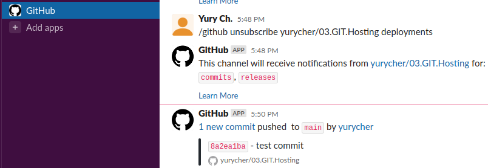

## 03.GIT.Hosting

### Repositories's urls:

[https://github.com/yurycher/03.GIT.Hosting](https://github.com/yurycher/03.GIT.Hosting)
[https://gitlab.com/yurych/03.git.hosting](https://gitlab.com/yurych/03.git.hosting)
[https://bitbucket.org/yurycher/03.git.hosting](https://bitbucket.org/yurycher/03.git.hosting)

### Push script:

```bash
#!/bin/bash
git push -u origin_github main
git push -u origin_gitlab main
git push -u origin_bitbucket main
echo "done!"
```

### Screenshot slack integration:


