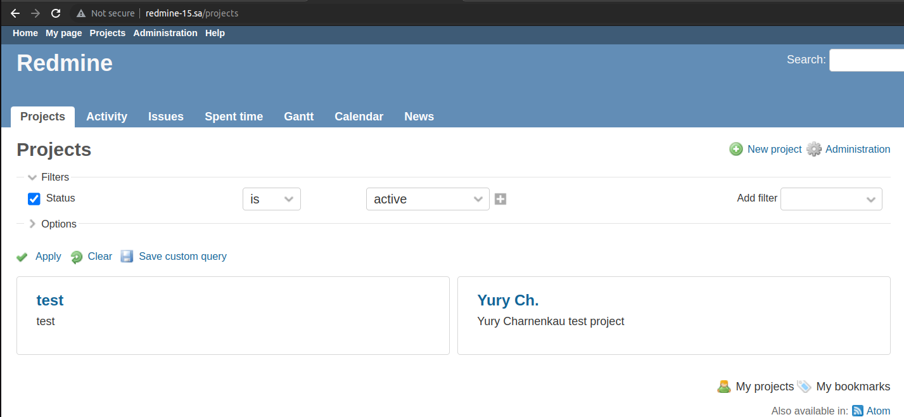

## 08.Ansible.Workshop

### Output of ansible playbook:
```bash
PLAY [redmine] ********************************************************************************************************************************************************************************************

TASK [Gathering Facts] ************************************************************************************************************************************************************************************
Monday 12 September 2022  01:57:22 +0300 (0:00:00.011)       0:00:00.011 ****** 
ok: [redmine_15]

TASK [debug] **********************************************************************************************************************************************************************************************
Monday 12 September 2022  01:57:25 +0300 (0:00:03.380)       0:00:03.391 ****** 
ok: [redmine_15] => {
    "msg": "192.168.201.15"
}

TASK [mysql : Mysql. Install packages] ********************************************************************************************************************************************************************
Monday 12 September 2022  01:57:25 +0300 (0:00:00.046)       0:00:03.437 ****** 
ok: [redmine_15]

TASK [mysql : mysql_db] ***********************************************************************************************************************************************************************************
Monday 12 September 2022  01:57:28 +0300 (0:00:03.076)       0:00:06.514 ****** 
ok: [redmine_15]

TASK [mysql : mysql_user] *********************************************************************************************************************************************************************************
Monday 12 September 2022  01:57:30 +0300 (0:00:01.307)       0:00:07.821 ****** 
ok: [redmine_15]

TASK [mysql : Config database] ****************************************************************************************************************************************************************************
Monday 12 September 2022  01:57:31 +0300 (0:00:01.523)       0:00:09.345 ****** 
ok: [redmine_15]

TASK [app : App. Install packages] ************************************************************************************************************************************************************************
Monday 12 September 2022  01:57:33 +0300 (0:00:02.185)       0:00:11.530 ****** 
ok: [redmine_15]

TASK [app : Redmine. Clone repository] ********************************************************************************************************************************************************************
Monday 12 September 2022  01:57:36 +0300 (0:00:02.960)       0:00:14.491 ****** 
ok: [redmine_15]

TASK [app : Redmine. Change permissions] ******************************************************************************************************************************************************************
Monday 12 September 2022  01:57:38 +0300 (0:00:01.313)       0:00:15.805 ****** 
ok: [redmine_15]

TASK [app : Redmine. Change permissions] ******************************************************************************************************************************************************************
Monday 12 September 2022  01:57:39 +0300 (0:00:01.237)       0:00:17.043 ****** 
ok: [redmine_15]

TASK [app : Redmine. Setup 01] ****************************************************************************************************************************************************************************
Monday 12 September 2022  01:57:40 +0300 (0:00:01.127)       0:00:18.171 ****** 
changed: [redmine_15]

TASK [app : Session store secret generation] **************************************************************************************************************************************************************
Monday 12 September 2022  01:57:45 +0300 (0:00:05.308)       0:00:23.479 ****** 
ok: [redmine_15]

TASK [app : Redmine. Setup 02] ****************************************************************************************************************************************************************************
Monday 12 September 2022  01:57:46 +0300 (0:00:01.235)       0:00:24.715 ****** 
changed: [redmine_15]

TASK [app : Configuration files for virtualhost] **********************************************************************************************************************************************************
Monday 12 September 2022  01:58:00 +0300 (0:00:13.257)       0:00:37.973 ****** 
ok: [redmine_15]

TASK [app : meta] *****************************************************************************************************************************************************************************************
Monday 12 September 2022  01:58:02 +0300 (0:00:02.114)       0:00:40.088 ****** 

TASK [Add redmine-15.sa to host file] *********************************************************************************************************************************************************************
Monday 12 September 2022  01:58:02 +0300 (0:00:00.053)       0:00:40.141 ****** 
changed: [redmine_15]

TASK [uri] ************************************************************************************************************************************************************************************************
Monday 12 September 2022  01:58:03 +0300 (0:00:01.273)       0:00:41.414 ****** 
ok: [redmine_15]

TASK [lineinfile] *****************************************************************************************************************************************************************************************
Monday 12 September 2022  01:58:05 +0300 (0:00:01.426)       0:00:42.841 ****** 
changed: [redmine_15]

PLAY RECAP ************************************************************************************************************************************************************************************************
redmine_15                 : ok=17   changed=4    unreachable=0    failed=0    skipped=0    rescued=0    ignored=0   

Monday 12 September 2022  01:58:06 +0300 (0:00:01.359)       0:00:44.200 ****** 
=============================================================================== 
app : Redmine. Setup 02 --------------------------------------------------------------------------------------------------------------------------------------------------------------------------- 13.26s
app : Redmine. Setup 01 ---------------------------------------------------------------------------------------------------------------------------------------------------------------------------- 5.31s
Gathering Facts ------------------------------------------------------------------------------------------------------------------------------------------------------------------------------------ 3.38s
mysql : Mysql. Install packages -------------------------------------------------------------------------------------------------------------------------------------------------------------------- 3.08s
app : App. Install packages ------------------------------------------------------------------------------------------------------------------------------------------------------------------------ 2.96s
mysql : Config database ---------------------------------------------------------------------------------------------------------------------------------------------------------------------------- 2.19s
app : Configuration files for virtualhost ---------------------------------------------------------------------------------------------------------------------------------------------------------- 2.11s
mysql : mysql_user --------------------------------------------------------------------------------------------------------------------------------------------------------------------------------- 1.52s
uri ------------------------------------------------------------------------------------------------------------------------------------------------------------------------------------------------ 1.43s
lineinfile ----------------------------------------------------------------------------------------------------------------------------------------------------------------------------------------- 1.36s
app : Redmine. Clone repository -------------------------------------------------------------------------------------------------------------------------------------------------------------------- 1.31s
mysql : mysql_db ----------------------------------------------------------------------------------------------------------------------------------------------------------------------------------- 1.31s
Add redmine-15.sa to host file --------------------------------------------------------------------------------------------------------------------------------------------------------------------- 1.27s
app : Redmine. Change permissions ------------------------------------------------------------------------------------------------------------------------------------------------------------------ 1.24s
app : Session store secret generation -------------------------------------------------------------------------------------------------------------------------------------------------------------- 1.24s
app : Redmine. Change permissions ------------------------------------------------------------------------------------------------------------------------------------------------------------------ 1.13s
app : meta ----------------------------------------------------------------------------------------------------------------------------------------------------------------------------------------- 0.05s
debug ---------------------------------------------------------------------------------------------------------------------------------------------------------------------------------------------- 0.05s
Playbook run took 0 days, 0 hours, 0 minutes, 44 seconds
```

### Printscreen of my project in application:

