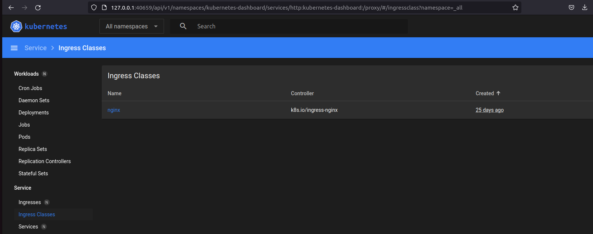

# 10.Kubernetes

## Install minikube:
### Enable plugin: ingress:
```bash
minikube addons enable ingress
💡  ingress is an addon maintained by Kubernetes. For any concerns contact minikube on GitHub.
You can view the list of minikube maintainers at: https://github.com/kubernetes/minikube/blob/master/OWNERS
    ▪ Using image k8s.gcr.io/ingress-nginx/controller:v1.2.1
    ▪ Using image k8s.gcr.io/ingress-nginx/kube-webhook-certgen:v1.1.1
    ▪ Using image k8s.gcr.io/ingress-nginx/kube-webhook-certgen:v1.1.1
🔎  Verifying ingress addon...
🌟  The 'ingress' addon is enabled

kubectl get pods -n ingress-nginx
NAME                                        READY   STATUS      RESTARTS      AGE
ingress-nginx-admission-create-w2tbz        0/1     Completed   0             25d
ingress-nginx-admission-patch-dz4w2         0/1     Completed   1             25d
ingress-nginx-controller-755dfbfc65-m5z2g   1/1     Running     1 (25d ago)   25d
```
### Command for run minikube with different HW options (RAM/CPU):
```bash
minikube start --memory 4096 --cpus 2
😄  minikube v1.26.1 on Ubuntu 22.04
✨  Automatically selected the virtualbox driver. Other choices: ssh, qemu2 (experimental)
👍  Starting control plane node minikube in cluster minikube
🔥  Creating virtualbox VM (CPUs=2, Memory=4096MB, Disk=20000MB) ...
🐳  Preparing Kubernetes v1.24.3 on Docker 20.10.17 ...
    ▪ Generating certificates and keys ...
    ▪ Booting up control plane ...
    ▪ Configuring RBAC rules ...
🔎  Verifying Kubernetes components...
    ▪ Using image gcr.io/k8s-minikube/storage-provisioner:v5
🌟  Enabled addons: default-storageclass, storage-provisioner
🏄  Done! kubectl is now configured to use "minikube" cluster and "default" namespace by default
```
### Printscreen of minikube dashboard:


## Ansible result (deployment k8s cluster):
```bash
PLAY RECAP ******************************************************************************************
localhost                  : ok=3    changed=0    unreachable=0    failed=0    skipped=0    rescued=0    ignored=0   
node1                      : ok=732  changed=141  unreachable=0    failed=0    skipped=1245 rescued=0    ignored=9   
node2                      : ok=479  changed=85   unreachable=0    failed=0    skipped=737  rescued=0    ignored=2   

Tuesday 13 September 2022  23:23:27 +0300 (0:00:00.049)       1:48:05.133 ***** 
=============================================================================== 
kubernetes/preinstall : Install packages requirements -------------------------------------- 782.18s
download : download_file | Download item --------------------------------------------------- 593.46s
container-engine/containerd : download_file | Download item -------------------------------- 563.61s
download : download_file | Download item --------------------------------------------------- 327.84s
bootstrap-os : Update Apt cache ------------------------------------------------------------ 223.48s
container-engine/crictl : download_file | Download item ------------------------------------ 193.12s
download : download_file | Download item --------------------------------------------------- 192.58s
container-engine/nerdctl : download_file | Download item ----------------------------------- 161.57s
download : download_file | Download item --------------------------------------------------- 125.78s
container-engine/runc : download_file | Download item -------------------------------------- 113.26s
kubernetes-apps/ansible : Kubernetes Apps | Lay Down CoreDNS templates --------------------- 104.82s
download : download_file | Validate mirrors ------------------------------------------------- 87.83s
kubernetes-apps/ansible : Kubernetes Apps | Start Resources --------------------------------- 74.11s
network_plugin/calico : Calico | Create calico manifests ------------------------------------ 62.90s
download : download_container | Download image if required ---------------------------------- 38.82s
network_plugin/calico : Start Calico resources ---------------------------------------------- 35.48s
kubernetes/preinstall : Ensure kube-bench parameters are set -------------------------------- 34.17s
download : download_container | Download image if required ---------------------------------- 33.10s
kubernetes-apps/ansible : Kubernetes Apps | Lay Down nodelocaldns Template ------------------ 33.01s
download : download_container | Download image if required ---------------------------------- 31.62s
```