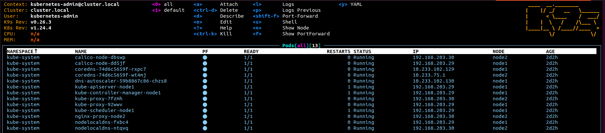

# 11. Kubernetes installation

## Aliases for local run kubectl:
```bash
~/.bashrc:
...
source <(kubectl completion bash)
alias k=kubectl
alias kg='kubectl get'
complete -o default -F __start_kubectl k

kg ns
NAME              STATUS   AGE
default           Active   2d2h
kube-node-lease   Active   2d2h
kube-public       Active   2d2h
kube-system       Active   2d2h
```
## Print-screen of k9s with pods in kube-system namespace:


## Kubectl config:
```bash
Merge two configs:
KUBECONFIG=./k8s:./k3s kubectl config view --flatten > ./config

Merged config:
apiVersion: v1
clusters:
- cluster:
    certificate-authority-data: LS0tLS...
    server: https://127.0.0.1:6443
  name: cluster.local
- cluster:
    certificate-authority-data: LS0tLS...
    server: https://192.168.56.213:6443
  name: default
contexts:
- context:
    cluster: default
    user: default
  name: default
- context:
    cluster: cluster.local
    user: kubernetes-admin
  name: kubernetes-admin@cluster.local
current-context: kubernetes-admin@cluster.local
kind: Config
preferences: {}
users:
- name: default
  user:
    client-certificate-data: LS0tLS...
    client-key-data: LS0tLS...
- name: kubernetes-admin
  user:
    client-certificate-data: LS0tLS...
    client-key-data: LS0tLS...
```