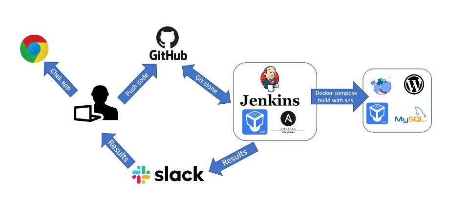

# Project report

### Project's reporter: Yury Valevatyi
### Group number: m-sa2-14-20

## Description of application for deployment
- Name: Wordpress
- Application is written in PHP, Web - Apache
- Database: MySQL
- [CI & CD GitHub repository](https://github.com/yura-4wojxb/project.git)

## Pipeline. High Level Design

## Technologies which were used in project
- **Orchestration:** Jenkins
- **Automation tools:** Ansible
- **Infrastructure:** VirtualBox, Vagrant
- **Container:** Docker, docker-compose
- **SCM:** GitHub
- **Notification:** Slack

## Preparing infrastructure and app installation description:

  * Deployment starts with Jenkins
  * After pushing the code to SCM, Jenkins (master) downloads GitHub repository and runs .yaml files with Ansible
  * Ansible run playbook **.yaml** with inventory file **hosts.yaml**
  * Installing and Configuring Docker, Docker-compose
  * Running Docker containers (DB & App images) with docker-compose
  * Notify Slack about the results of pipeline