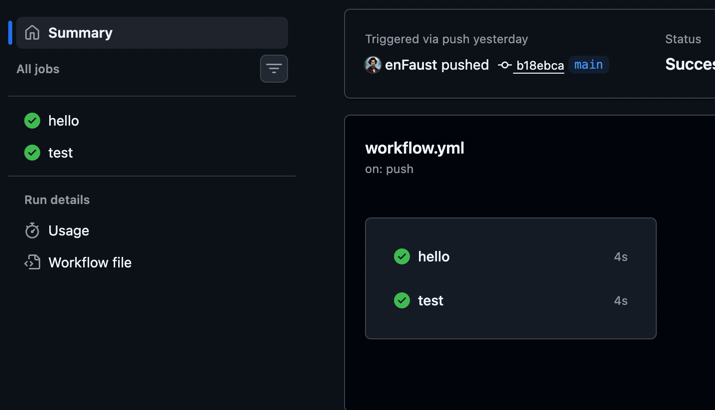

# 04. GitOps

The screenshot shows the workflow in action.

You can also check the repository for the optional tasks, where I implemented a multi-branch pipeline. A significant portion of the code was generated using AI, but I reviewed it and did not find any major issues.
Note: I did not deploy the dev and stage environments to GitHub Pages (GitOps-staging and GitOps-dev), as I considered it unnecessary for this task.

**Repository**: [enFaust/GitOps](https://github.com/enFaust/GitOps)
**📄 View Complete Report**: [REPORT.md](REPORT.md)