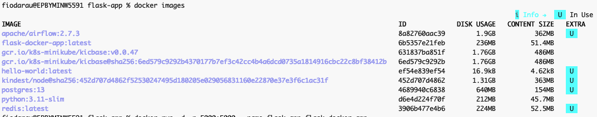

## Homework Assignment 1: Docker Installation and Basic Commands

```bash 
brew install docker colima
docker --version
colima version
colima start
docker run hello-world
```

```log
Hello from Docker!
This message shows that your installation appears to be working correctly.

To generate this message, Docker took the following steps:
 1. The Docker client contacted the Docker daemon.
 2. The Docker daemon pulled the "hello-world" image from the Docker Hub.
    (arm64v8)
 3. The Docker daemon created a new container from that image which runs the
    executable that produces the output you are currently reading.
 4. The Docker daemon streamed that output to the Docker client, which sent it
    to your terminal.

To try something more ambitious, you can run an Ubuntu container with:
 $ docker run -it ubuntu bash

Share images, automate workflows, and more with a free Docker ID:
 https://hub.docker.com/

For more examples and ideas, visit:
 https://docs.docker.com/get-started/
```

```bash
docker ps
```

```log
CONTAINER ID   IMAGE                  COMMAND                  CREATED        STATUS                PORTS                                         NAMES
f17d1a6f6046   kindest/node:v1.35.0   "/usr/local/bin/entr…"   4 days ago     Up 4 days             127.0.0.1:61643->6443/tcp                     kind-single-control-plane
d7a8abe7bad7   apache/airflow:2.7.3   "/usr/bin/dumb-init …"   2 months ago   Up 4 days (healthy)   0.0.0.0:8080->8080/tcp, [::]:8080->8080/tcp   airflow-docker-airflow-webserver-1
5e598e233d96   apache/airflow:2.7.3   "/usr/bin/dumb-init …"   2 months ago   Up 4 days (healthy)   8080/tcp                                      airflow-docker-airflow-scheduler-1
4ee3090ef781   apache/airflow:2.7.3   "/usr/bin/dumb-init …"   2 months ago   Up 4 days (healthy)   8080/tcp                                      airflow-docker-airflow-worker-1
aefcada57505   apache/airflow:2.7.3   "/usr/bin/dumb-init …"   2 months ago   Up 4 days (healthy)   8080/tcp                                      airflow-docker-airflow-triggerer-1
1b4596fbc57a   postgres:13            "docker-entrypoint.s…"   2 months ago   Up 4 days (healthy)   5432/tcp                                      airflow-docker-postgres-1
f1332ada3779   redis:latest           "docker-entrypoint.s…"   2 months ago   Up 4 days (healthy)   6379/tcp                                      airflow-docker-redis-1
```

## Homework Assignment 2: Building a Docker Image with Dockerfile

```bash
mkdir -p flask-app
cd flask-app
vim app.py
vim requirements.txt
vim Dockerfile
docker build -t flask-docker-app .
docker images
docker run -d -p 5000:5000 --name flask_app flask-docker-app
docker ps
```



```log
CONTAINER ID   IMAGE                  COMMAND                  CREATED          STATUS                PORTS                                         NAMES
d8dcf801fe3b   flask-docker-app       "python app.py"          54 seconds ago   Up 53 seconds         0.0.0.0:8888->5000/tcp, [::]:8888->5000/tcp   flask_app
```

```bash
curl http://127.0.0.1:8888
```

```log
curl http://127.0.0.1:8888
Hello from Flask running in Docker!%
```