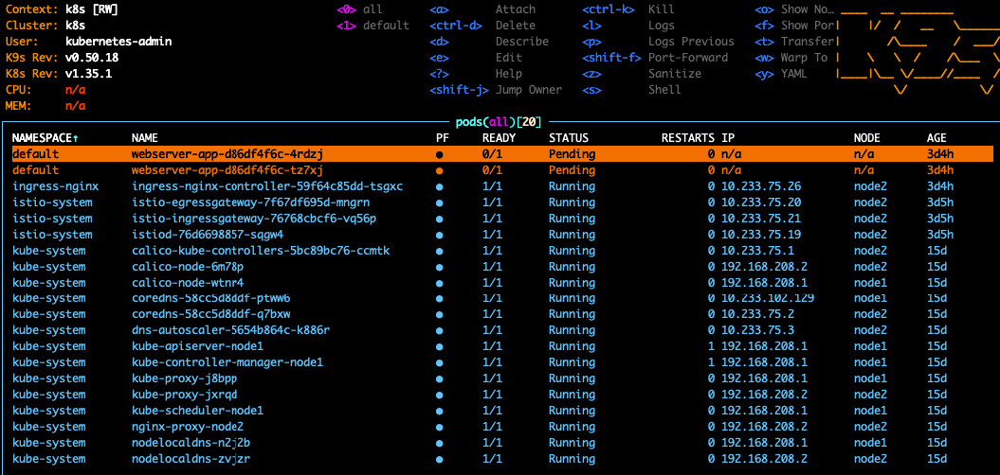
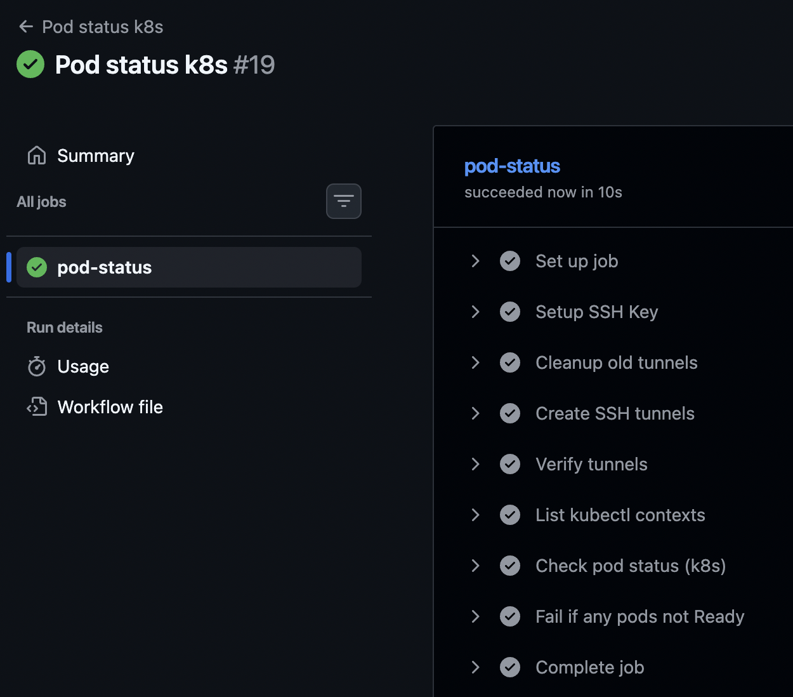

## Homework Assignment 1. K8s Installation

Localhost:
Install kubectl for local run

```bash
brew install kubectl
kubectl version --client
```

Install k9s to maintain cluster

```bash
brew install derailed/k9s/k9s
k9s version

git clone git@github.com:kubernetes-sigs/kubespray.git
cd kubespray/
```

Make print-screen of k9s with pods in all namespaces



Create GitHub action to check status of pods and create slack notification if you have crashed/failed pods
Your print-screen, github action file add to PR



https://github.com/enFaust/k8s-cluster-monitoring