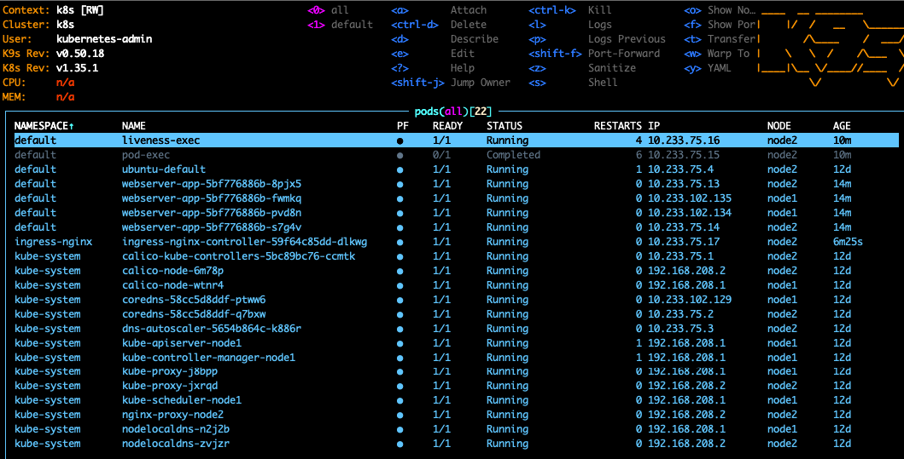
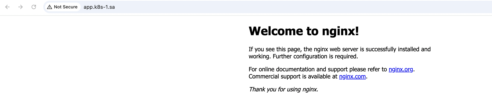
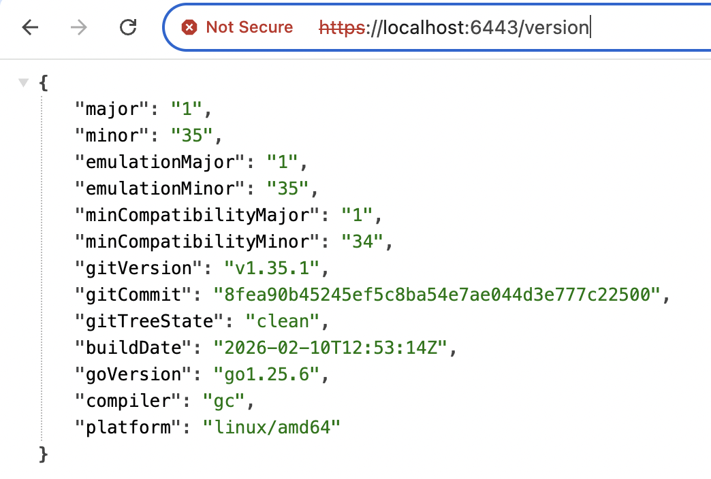

Homework Assignment 1. Nginx deployment
Create deployment of nginx service:

replicas: 4
set resources (request/limits) for pods
deployment shouldn't have any outage (service is available all time)
ingress rule for host name (nginx-test.k8s-<NUMBER>.sa)

```bash
kubectl apply -f deployment.yaml
kubectl apply -f pod_exec.yaml
kubectl apply -f pod_live.yaml
kubectl apply -f service.yaml
kubectl apply -f ingress.yaml

wget https://raw.githubusercontent.com/kubernetes/ingress-nginx/refs/heads/main/deploy/static/provider/baremetal/deploy.yaml -O ingress-controller.yaml

kubectl apply -f ingress-controller.yaml --context k8s
```







