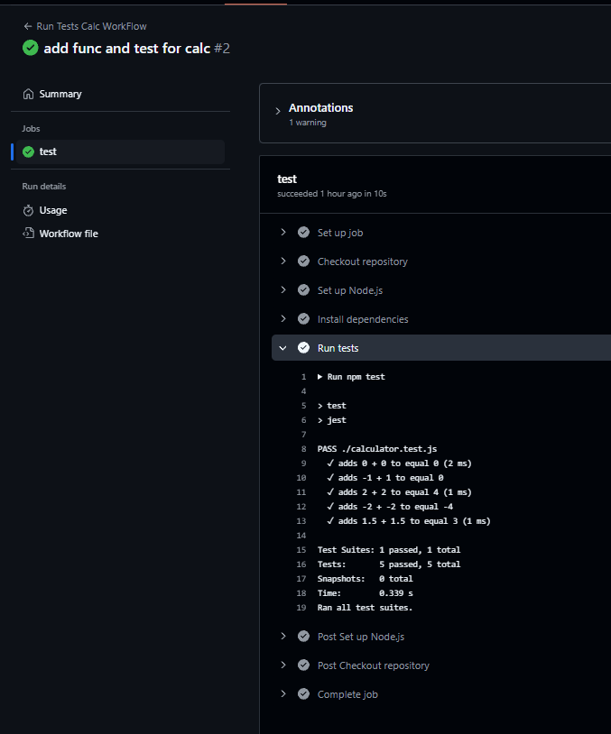
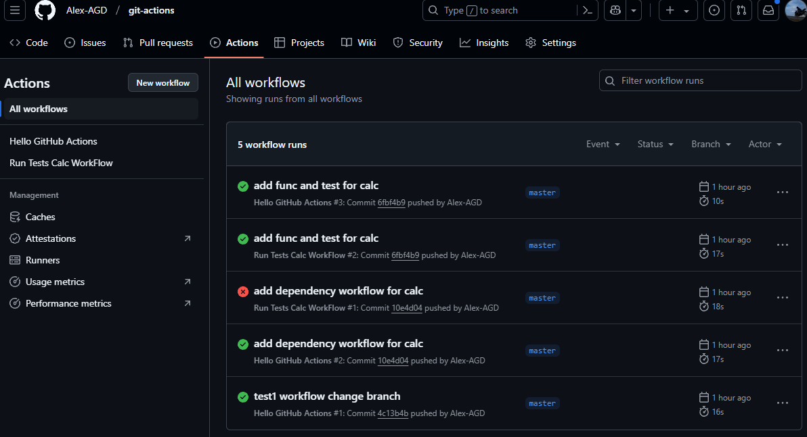
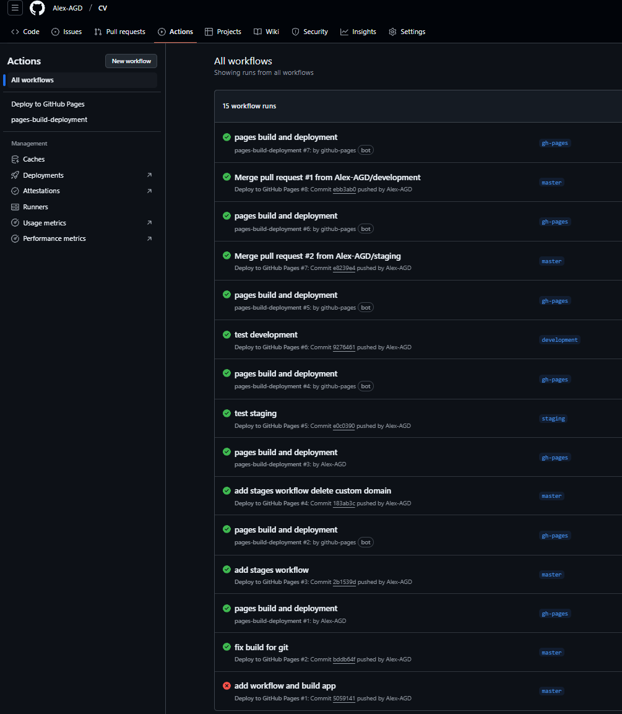

# 04.GitAction

## Repositories


[gitlab](https://gitlab.com/Alex-AGD/it-acad-devops.git)


### Homework Assignment 1

-  [github](https://github.com/Alex-AGD/git-actions.git)
- ### hello.yml
- ```yaml
  name: Hello GitHub Actions
    on:
    push:
    branches:
    - master
    
    jobs:
    run-script:
    runs-on: ubuntu-latest
    steps:
    - name: Checkout repository
    uses: actions/checkout@v4

      - name: Set up JavaScript
        uses: actions/setup-node@v4
        with:
          node-version: 18

      - name: Run hello script
        run: node hello.js

### Homework Assignment 2: Building and Testing with GitHub Actions
- ### testCalcWorkFlow.yml
- ```yaml
    name: Hello GitHub Actions
    
    on:
    push:
    branches:
    - master
    
    jobs:
    run-script:
    runs-on: ubuntu-latest
    steps:
    - name: Checkout repository
    uses: actions/checkout@v4

      - name: Set up JavaScript
        uses: actions/setup-node@v4
        with:
          node-version: 18

      - name: Run hello script
        run: node hello.js



- ### AllWorkFlows 
- 


### Homework Assignment 3: Continuous Deployment with GitHub Actions (Optional) && Homework Assignment 4: Customizing GitHub Actions Workflow (Optional)
 - [github] (https://github.com/Alex-AGD/CV.git)
 -  [githubPages] (https://alex-agd.github.io/CV/)

### WORKFLOW

### deployApp.yml
- ```yaml
  name: Deploy to GitHub Pages

on:
push:
branches:
- master
- staging
- development

jobs:
build:
runs-on: ubuntu-latest

    steps:
      - name: Checkout repository
        uses: actions/checkout@v4

      - name: Set up Node.js
        uses: actions/setup-node@v4
        with:
          node-version: 18

      - name: Install dependencies
        run: npm install

      - name: Build project
        run: npm run build

      - name: Deploy to GitHub Pages
        if: github.ref == 'refs/heads/master'
        uses: peaceiris/actions-gh-pages@v4
        with:
          github_token: ${{ secrets.GITHUB_TOKEN }}
          publish_dir: ./dist

      - name: Deploy to Staging
        if: github.ref == 'refs/heads/staging'
        uses: peaceiris/actions-gh-pages@v4
        with:
          github_token: ${{ secrets.GITHUB_TOKEN }}
          publish_dir: ./dist

      - name: Deploy to Development
        if: github.ref == 'refs/heads/development'
        uses: peaceiris/actions-gh-pages@v4
        with:
          github_token: ${{ secrets.GITHUB_TOKEN }}
          publish_dir: ./dist

### allWorkFlowsTesting


