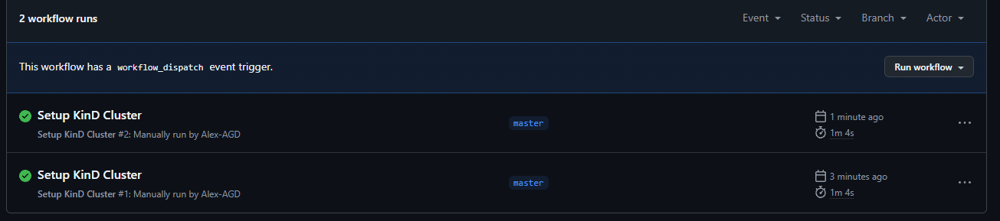
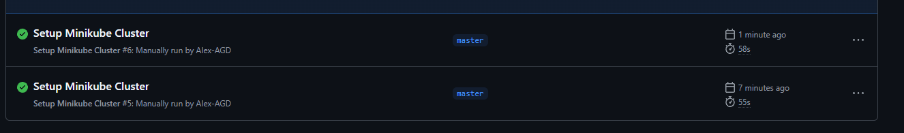

# 09.Kubernetes
### Homework Assignment 1: KinD Kubernetes Cluster Setup
## History
```shell
 [ $(uname -m) = x86_64 ] && curl -Lo ./kind https://kind.sigs.k8s.io/dl/v0.26.0/kind-linux-amd64
  % Total    % Received % Xferd  Average Speed   Time    Time     Time  Current
                                 Dload  Upload   Total   Spent    Left  Speed
100    97  100    97    0     0    244      0 --:--:-- --:--:-- --:--:--   243
  0     0    0     0    0     0      0      0 --:--:-- --:--:-- --:--:--     0
100  9.9M  100  9.9M    0     0  3313k      0  0:00:03  0:00:03 --:--:-- 5565k
❯ chmod +x ./kind
❯ sudo mv ./kind /usr/local/bin/kind
[sudo] password for admin: 
❯ kind create cluster --name kind-cluster
Creating cluster "kind-cluster" ...
 ✓ Ensuring node image (kindest/node:v1.32.0) 🖼 
 ✓ Preparing nodes 📦  
 ✓ Writing configuration 📜 
 ✓ Starting control-plane 🕹️ 
 ✓ Installing CNI 🔌 
 ✓ Installing StorageClass 💾 
Set kubectl context to "kind-kind-cluster"
You can now use your cluster with:

kubectl cluster-info --context kind-kind-cluster

Thanks for using kind! 😊
❯    curl -LO "https://dl.k8s.io/release/$(curl -L -s https://dl.k8s.io/release/stable.txt)/bin/linux/amd64/kubectl"

  % Total    % Received % Xferd  Average Speed   Time    Time     Time  Current
                                 Dload  Upload   Total   Spent    Left  Speed
100   138  100   138    0     0    520      0 --:--:-- --:--:-- --:--:--   522
100 54.6M  100 54.6M    0     0  6103k      0  0:00:09  0:00:09 --:--:-- 6797k

❯ sudo install -o root -g root -m 0755 kubectl /usr/local/bin/kubectl

❯ kubectl cluster-info --context kind-kind-cluster
Kubernetes control plane is running at https://127.0.0.1:33151
CoreDNS is running at https://127.0.0.1:33151/api/v1/namespaces/kube-system/services/kube-dns:dns/proxy

To further debug and diagnose cluster problems, use 'kubectl cluster-info dump'.
❯ kubectl get nodes
NAME                         STATUS   ROLES           AGE   VERSION
kind-cluster-control-plane   Ready    control-plane   5m    v1.32.0
```
## Alias

### Homework Assignment 2: Minikube Kubernetes Cluster Setup
## History
```shell
   54  curl -Lo minikube https://storage.googleapis.com/minikube/releases/latest/minikube-linux-amd64 \\n  && chmod +x minikube
   55  clear
   56  sudo mkdir -p /usr/local/bin/
   57  sudo install minikube /usr/local/bin/\n
   58  sudo apt-get update
   59  sudo apt-get install -y virtualbox virtualbox-ext-pack
   60  minikube start --driver=virtualbox
   61  kubectl cluster-info
   62  kubectl get nodes
❯ kubectl cluster-info
Kubernetes control plane is running at https://127.0.0.1:33151
CoreDNS is running at https://127.0.0.1:33151/api/v1/namespaces/kube-system/services/kube-dns:dns/proxy

To further debug and diagnose cluster problems, use 'kubectl cluster-info dump'.
❯ kubectl get nodes
NAME                         STATUS   ROLES           AGE   VERSION
kind-cluster-control-plane   Ready    control-plane   15m   v1.32.0
❯ kubectl get nodes
NAME                         STATUS   ROLES           AGE   VERSION
kind-cluster-control-plane   Ready    control-plane   16m   v1.32.0
```
### Homework Assignment 3: GitHub Actions for KinD Cluster Setup
## History
[GIT](https://github.com/Alex-AGD/kindCluster/actions/workflows/kind-cluster-setup.yml)

```yaml
name: Setup KinD Cluster

on:
  workflow_dispatch:
    inputs:
      button_name:
        description: 'Запустить настройку кластера KinD'
        required: true
        default: 'Start'

jobs:
  setup-kind:
    runs-on: ubuntu-latest

    steps:
      - name: Checkout repository
        uses: actions/checkout@v4

      - name: Set up QEMU
        uses: docker/setup-qemu-action@v3

      - name: Set up Docker Buildx
        uses: docker/setup-buildx-action@v3

      - name: Install KinD
        run: |
          curl -Lo ./kind https://kind.sigs.k8s.io/dl/v0.20.0/kind-linux-amd64
          chmod +x ./kind
          sudo mv ./kind /usr/local/bin/kind

      - name: Create KinD cluster
        run: |
          start_time=$(date +%s)
          kind create cluster --name kind-cluster
          end_time=$(date +%s)
          elapsed_time=$((end_time - start_time))
          echo "Cluster setup time: $((elapsed_time / 60)) minutes and $((elapsed_time % 60)) seconds"

      - name: Verify cluster
        run: kubectl cluster-info --context kind-kind-cluster

      - name: Get nodes info
        run: kubectl get nodes

      - name: Get Kubernetes version
        run: kubectl version
```

## Сколько нод у них

| Имя      | Статус | Роли          | Возраст | Версия  |
|----------|--------|---------------|---------|---------|
| minikube | Ready  | control-plane | 5s      | v1.31.0 |

## Какая последняя версия Kubernetes у них используется

| Клиентская версия | Версия Kustomize | Серверная версия |
|-------------------|------------------|------------------|
| v1.32.0           | v5.5.0           | v1.31.0          |

## Сколько времени занимает запуск (можно указать только время)

**Время настройки кластера:** 0 минут и 44 секунды



### Homework Assignment 4: GitHub Actions for Minikube Cluster Setup
### minikube-cluster-setup.yml
```yaml
name: Setup Minikube Cluster

on:
  workflow_dispatch:
    inputs:
      button_name:
        description: 'Запустить настройку кластера Minikube'
        required: true
        default: 'Start'

jobs:
  setup-minikube:
    runs-on: ubuntu-latest

    steps:
      - name: Checkout repository
        uses: actions/checkout@v4

      - name: Install Minikube
        run: |
          curl -Lo minikube https://storage.googleapis.com/minikube/releases/latest/minikube-linux-amd64
          chmod +x minikube
          sudo mv minikube /usr/local/bin/

      - name: Install kubectl
        run: |
          curl -LO "https://dl.k8s.io/release/$(curl -L -s https://dl.k8s.io/release/stable.txt)/bin/linux/amd64/kubectl"
          chmod +x kubectl
          sudo mv kubectl /usr/local/bin/

      - name: Start Minikube
        run: |
          start_time=$(date +%s)
          minikube start --driver=docker
          end_time=$(date +%s)
          elapsed_time=$((end_time - start_time))
          echo "Cluster setup time: $((elapsed_time / 60)) minutes and $((elapsed_time % 60)) seconds"

      - name: Verify cluster
        run: kubectl cluster-info

      - name: Get nodes info
        run: kubectl get nodes

      - name: Get Kubernetes version
        run: kubectl version
```



## Сколько нод у них

| Имя      | Статус | Роли          | Возраст | Версия  |
|----------|--------|---------------|---------|---------|
| minikube | Ready  | control-plane | 4s      | v1.31.0 |

## Какая последняя версия Kubernetes у них используется

| Клиентская версия | Версия Kustomize | Серверная версия |
|-------------------|------------------|------------------|
| v1.32.0           | v5.5.0           | v1.31.0          |

## Сколько времени занимает запуск (можно указать только время)

**Время настройки кластера:** 0 минут и 32 секунды

