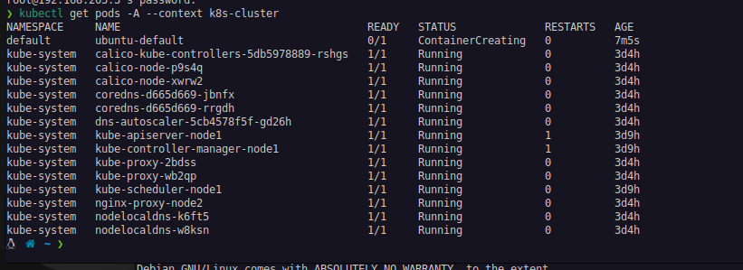
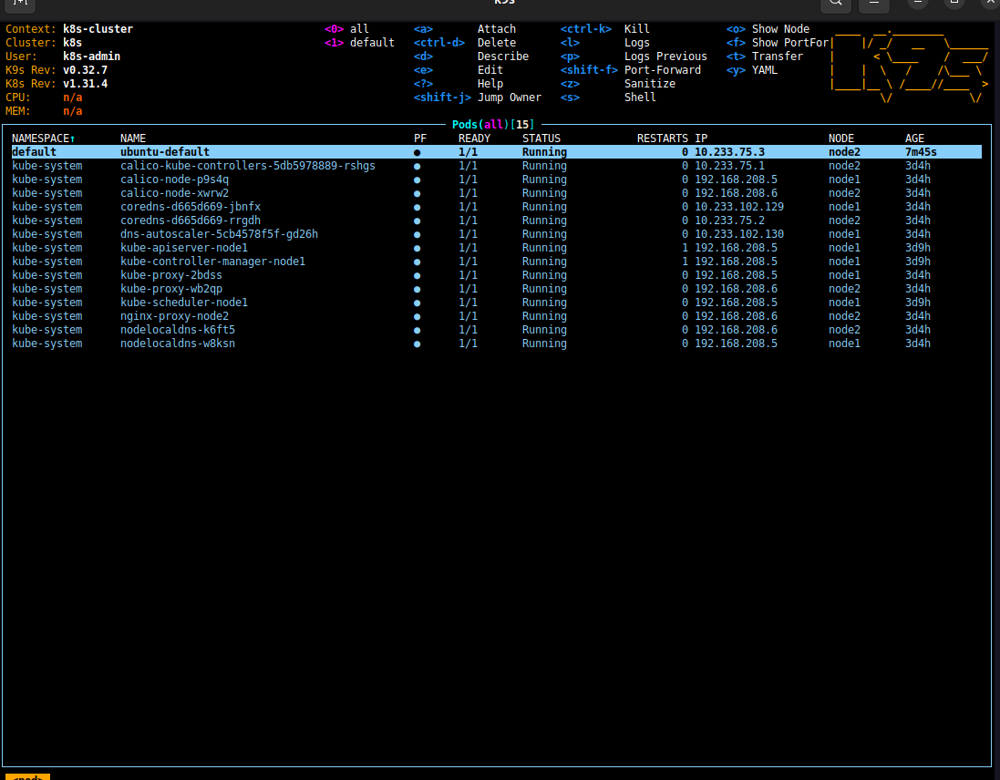
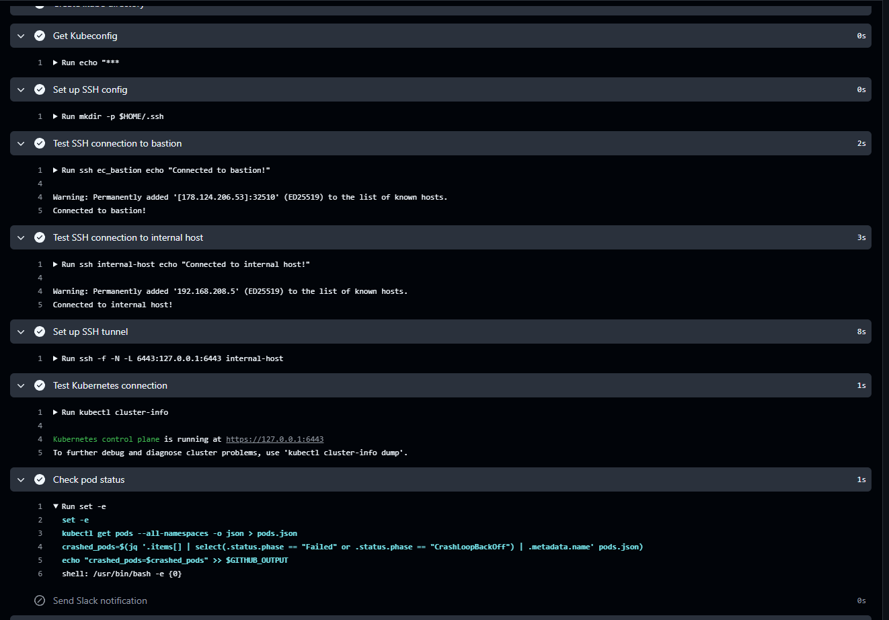
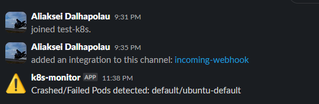

# 10.K8s.Install

### Homework Assignment 1. K8s Installation



## Deploy shell pod in default namespace which you can you use for internal checks inside the cluster





### Skack noifications

name: Monitor Kubernetes Pods

```yaml
# 10.K8s.Install
### Homework Assignment 1. K8s Installation

  
  ## Deploy shell pod in default namespace which you can you use for internal checks inside the cluster
  
  

  # 10.K8s.Install
  ### Homework Assignment 1. K8s Installation

  

  ## Deploy shell pod in default namespace which you can you use for internal checks inside the cluster
  


  
```

# 10.K8s.Install

### Homework Assignment 1. K8s Installation


## Deploy shell pod in default namespace which you can you use for internal checks inside the cluster


### Skack noifications

# 10.K8s.Install

### Homework Assignment 1. K8s Installation


## Deploy shell pod in default namespace which you can you use for internal checks inside the cluster


### Monitor Kubernetes Pods

```yaml
name: Monitor Kubernetes Pods

on:
  schedule:
    - cron: '*/30 * * * *' # Запуск каждые 30 минут
  workflow_dispatch: # Запуск вручную

jobs:
  check-pods:
    runs-on: ubuntu-latest

    steps:
      - name: Checkout repository
        uses: actions/checkout@v4

      - name: Set up kubectl
        uses: azure/setup-kubectl@v4
        id: kubectl

      - name: Install jq and sshpass
        run: |
          sudo apt-get update
          sudo apt-get install -y jq sshpass

      - name: Create .kube directory
        run: mkdir -p $HOME/.kube

      - name: Get Kubeconfig
        run: echo "${{ secrets.KUBECONFIG }}" > $HOME/.kube/config

      - name: Set up SSH config
        run: |
          mkdir -p $HOME/.ssh
          echo "${{ secrets.SSH_PRIVATE_KEY }}" | tr -d '\r' > $HOME/.ssh/id_rsa
          chmod 600 $HOME/.ssh/id_rsa
          echo "Host ec_bastion
                HostName 178.124.206.53
                User jump_sa
                Port 32510
                IdentityFile $HOME/.ssh/id_rsa
                StrictHostKeyChecking no

                Host internal-host
                HostName 192.168.208.5
                User root
                ProxyJump ec_bastion
                IdentityFile $HOME/.ssh/id_rsa
                StrictHostKeyChecking no" > $HOME/.ssh/config
          chmod 600 $HOME/.ssh/config

      - name: Test SSH connection to bastion
        run: ssh ec_bastion echo "Connected to bastion!"

      - name: Test SSH connection to internal host
        run: ssh internal-host echo "Connected to internal host!"

      - name: Set up SSH tunnel
        run: ssh -f -N -L 6443:127.0.0.1:6443 internal-host

      - name: Test Kubernetes connection
        run: kubectl cluster-info

      - name: Check pod status
        id: pod-status
        run: |
          set -e
          kubectl get pods --all-namespaces -o json > pods.json
          cat pods.json
          crashed_pods=$(jq -r '.items[] | select(.status.phase == "Failed" or (.status.containerStatuses[]? | (.state.waiting.reason == "ErrImagePull" or .state.waiting.reason == "ImagePullBackOff" or .state.waiting.reason == "CrashLoopBackOff"))) | .metadata.namespace + "/" + .metadata.name' pods.json)
          echo "crashed_pods=$crashed_pods"
          crashed_pods_trimmed=$(echo "$crashed_pods" | xargs)
          echo "crashed_pods=$crashed_pods_trimmed" >> $GITHUB_OUTPUT

      - name: Debug crashed podsа
        run: |
          echo "Crashed pods: ${{ steps.pod-status.outputs.crashed_pods }}"

      - name: Send Slack notification
        if: ${{ steps.pod-status.outputs.crashed_pods != '' }}
        uses: 8398a7/action-slack@v3
        with:
          status: custom
          fields: repo,message
          custom_payload: |
            {
              "text": "Crashed/Failed Pods detected: ${{ steps.pod-status.outputs.crashed_pods }}",
              "username": "k8s-monitor",
              "icon_emoji": ":warning:"
            }
        env:
          SLACK_WEBHOOK_URL: ${{ secrets.SLACK_WEBHOOK_URL }}
`````

### Skack noifications
### 
