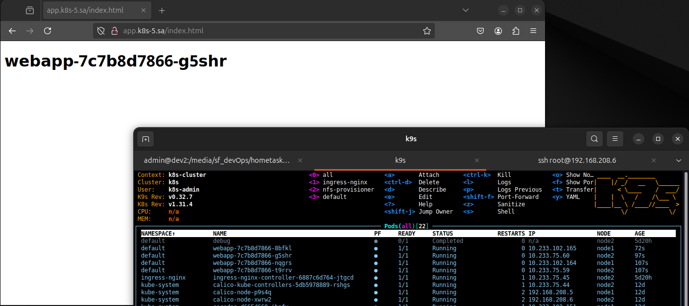
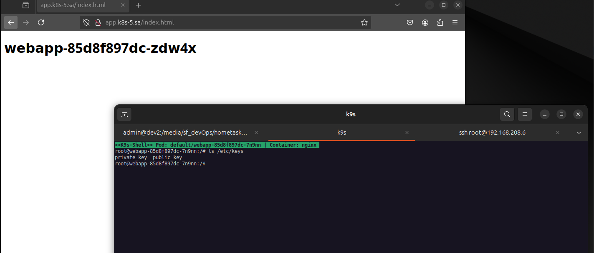

# 11.Kubernetes.Basic objects

## Homework Assignment 1. Config maps and secrets

### Add index.php page as config map, which should display hostname of pod as first level header, or generate index.html inside init container
```yaml
apiVersion: apps/v1
kind: Deployment
metadata:
  name: webapp
  namespace: default
  labels:
    app: nginx
spec:
  replicas: 4
  selector:
    matchLabels:
      app: nginx
  template:
    metadata:
      labels:
        app: nginx
    spec:
      initContainers:
        - name: init-webapp
          image: busybox
          command: ['sh', '-c', 'echo "<h1>$(hostname)</h1>" > /var/www/html/index.html']
          volumeMounts:
            - name: persistent-storage-app
              mountPath: "/var/www/html"
      containers:
        - name: nginx
          image: nginx:latest
          ports:
            - containerPort: 80
          volumeMounts:
            - name: nginx-config
              mountPath: /etc/nginx/conf.d/default.conf
              subPath: default.conf
            - name: persistent-storage-app
              mountPath: "/var/www/html"
      volumes:
        - name: nginx-config
          configMap:
            name: nginx-config
        - name: persistent-storage-app
          persistentVolumeClaim:
            claimName: app02-pv-claim

```


## generate pair public and private keys (or use existing) and add them to the pod for user root as secrets, please use sealsecret object for that
```yaml
apiVersion: apps/v1
kind: Deployment
metadata:
  name: webapp
  namespace: default
  labels:
    app: nginx
spec:
  replicas: 4
  selector:
    matchLabels:
      app: nginx
  template:
    metadata:
      labels:
        app: nginx
    spec:
      initContainers:
        - name: init-webapp
          image: busybox
          command: ['sh', '-c', 'echo "<h1>$(hostname)</h1>" > /var/www/html/index.html']
          volumeMounts:
            - name: persistent-storage-app
              mountPath: "/var/www/html"
      containers:
        - name: nginx
          image: nginx:latest
          ports:
            - containerPort: 80
          envFrom:
          - secretRef:
              name: secret-from-manifest
          resources:
            requests:
              cpu: 50m
              memory: 50Mi
            limits:
              cpu: 100m
              memory: 100Mi
          volumeMounts:
            - name: nginx-config
              mountPath: /etc/nginx/conf.d/default.conf
              subPath: default.conf
            - name: persistent-storage-app
              mountPath: "/var/www/html"
            - name: keys
              mountPath: /etc/keys
              readOnly: true
      volumes:
        - name: nginx-config
          configMap:
            name: nginx-config
        - name: persistent-storage-app
          persistentVolumeClaim:
            claimName: app02-pv-claim
        - name: keys
          secret:
            secretName: keypair-secret
```
## Sealed secret
```yaml
---
apiVersion: bitnami.com/v1alpha1
kind: SealedSecret
metadata:
  creationTimestamp: null
  name: keypair-secret
  namespace: default
spec:
  encryptedData:
    private_key: AgCOMVd90mMKTxdycuKWcZ
    public_key: AgCewlBKAIwa9t3qcMC7Qk82xSntm
  template:
    metadata:
      creationTimestamp: null
      name: keypair-secret
      namespace: default
    type: Opaque
```




