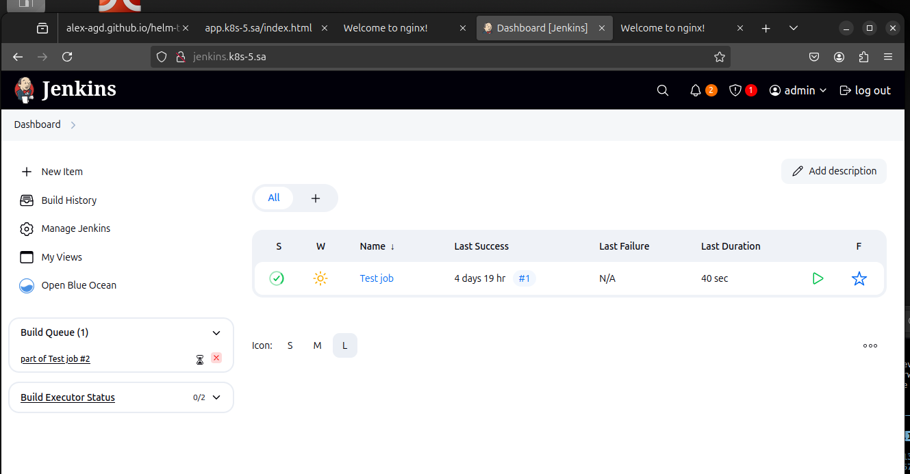

# Homework Assignment 1. Transform Jenkins deployment to Helm

## Homework Assignment 1. Transform Jenkins deployment to Helm

- [templates](https://github.com/Alex-AGD/helm-jenkins/tree/main/helm-sources/jenkins/templates)
- [hilm-releases ](https://alex-agd.github.io/helm-jenkins/index.yaml)
- 

```bash
helm install jenkins helm-releases/jenkins-0.3.1.tgz -n ci-cd
NAME: jenkins
LAST DEPLOYED: Sat Feb  1 14:37:34 2025
NAMESPACE: ci-cd
STATUS: deployed
REVISION: 1
NOTES:
1. Get the application URL by running these commands:
```

### ConfigMap
- [github](https://github.com/Alex-AGD/helm-jenkins/blob/main/helm-sources/jenkins/templates/configmap.yaml)
