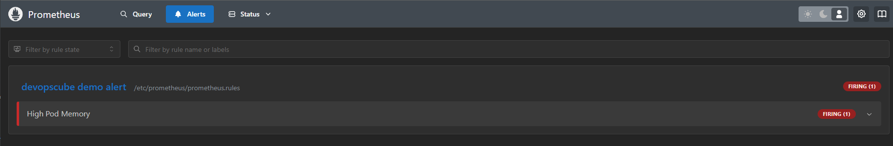
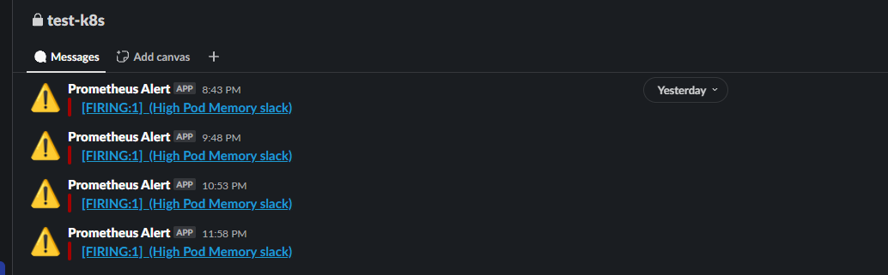
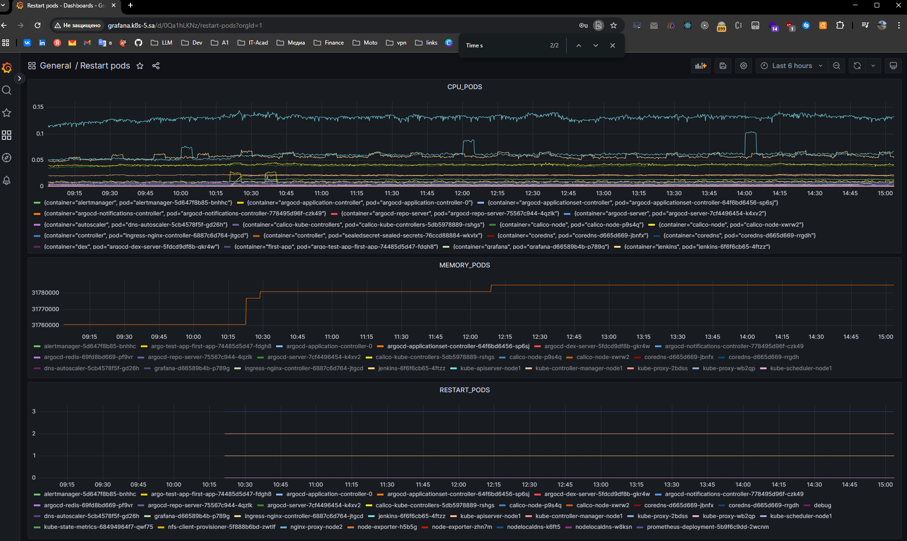

# 16.Technical and service monitoring

## Homework Assignment 1: Deploy and setup Prometheus Alertmanager

- 
- 

### alertmanager.yaml
```yaml
apiVersion: v1
kind: ConfigMap
metadata:
  name: alertmanager-config
  namespace: monitoring
data:
  alertmanager.yml: |
    global:
      resolve_timeout: 5m

    route:
      receiver: slack-notifications
      group_wait: 30s
      group_interval: 5m
      repeat_interval: 1h

    receivers:
      - name: slack-notifications
        slack_configs:
          - api_url_file: /etc/alertmanager/slack-webhook/SLACK_API_URL
            channel: 'test-k8s'
            username: 'Prometheus Alert'
            icon_emoji: ':warning:'
            send_resolved: true
---
apiVersion: apps/v1
kind: Deployment
metadata:
  name: alertmanager
  namespace: monitoring
spec:
  replicas: 1
  selector:
    matchLabels:
      app: alertmanager
  template:
    metadata:
      labels:
        app: alertmanager
    spec:
      containers:
        - name: alertmanager
          image: prom/alertmanager
          args:
            - "--config.file=/etc/alertmanager/alertmanager.yml"
          ports:
            - containerPort: 9093
          volumeMounts:
            - name: alertmanager-config
              mountPath: /etc/alertmanager
            - name: slack-webhook-secret
              mountPath: /etc/alertmanager/slack-webhook
              readOnly: true
      volumes:
        - name: alertmanager-config
          configMap:
            name: alertmanager-config
        - name: slack-webhook-secret
          secret:
            secretName: slack-webhook-secret
---
apiVersion: v1
kind: Service
metadata:
  name: alertmanager
  namespace: monitoring
spec:
  selector:
    app: alertmanager
  ports:
    - port: 9093
      targetPort: 9093
```
## Homework Assignment 2: Use Grafana to display load of pods

- 


