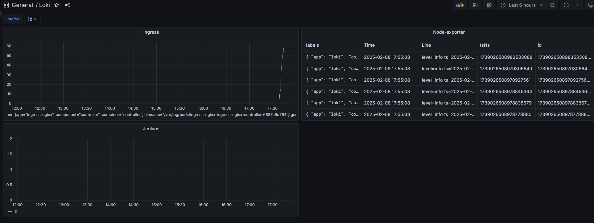

# 17. Log monitoring

## Homework Assignment 1: Use grafana Loki for log monitoring


 

### Ingress json export
```json
{
  "datasource": {
    "uid": "t7RYfYFHk",
    "type": "loki"
  },
  "gridPos": {
    "h": 8,
    "w": 12,
    "x": 0,
    "y": 0
  },
  "id": 4,
  "options": {
    "tooltip": {
      "mode": "single",
      "sort": "none"
    },
    "legend": {
      "showLegend": true,
      "displayMode": "list",
      "placement": "bottom",
      "calcs": []
    }
  },
  "targets": [
    {
      "datasource": {
        "type": "loki",
        "uid": "t7RYfYFHk"
      },
      "editorMode": "code",
      "expr": "count_over_time({job=\"ingress-nginx/ingress-nginx\"} |= \"ERROR\"[$timeRange])",
      "queryType": "range",
      "refId": "A"
    }
  ],
  "title": "Ingress",
  "type": "timeseries",
  "fieldConfig": {
    "defaults": {
      "custom": {
        "drawStyle": "line",
        "lineInterpolation": "linear",
        "barAlignment": 0,
        "lineWidth": 1,
        "fillOpacity": 0,
        "gradientMode": "none",
        "spanNulls": false,
        "showPoints": "auto",
        "pointSize": 5,
        "stacking": {
          "mode": "none",
          "group": "A"
        },
        "axisPlacement": "auto",
        "axisLabel": "",
        "axisColorMode": "text",
        "scaleDistribution": {
          "type": "linear"
        },
        "axisCenteredZero": false,
        "hideFrom": {
          "tooltip": false,
          "viz": false,
          "legend": false
        },
        "thresholdsStyle": {
          "mode": "off"
        }
      },
      "color": {
        "mode": "palette-classic"
      },
      "mappings": [],
      "thresholds": {
        "mode": "absolute",
        "steps": [
          {
            "value": null,
            "color": "green"
          },
          {
            "value": 80,
            "color": "red"
          }
        ]
      }
    },
    "overrides": []
  },
  "pluginVersion": "9.4.0"
}
```

