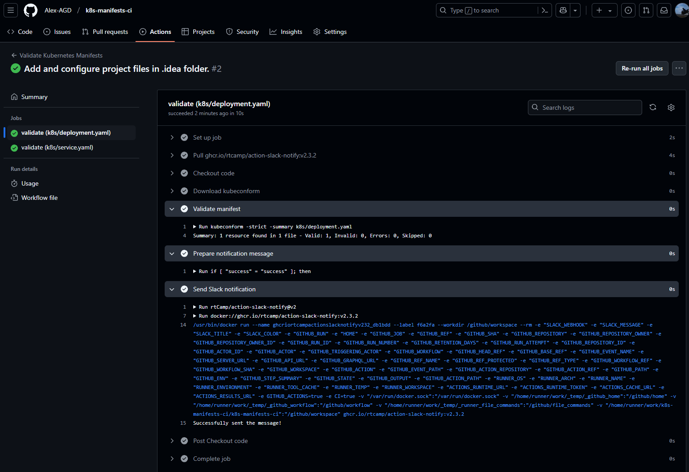
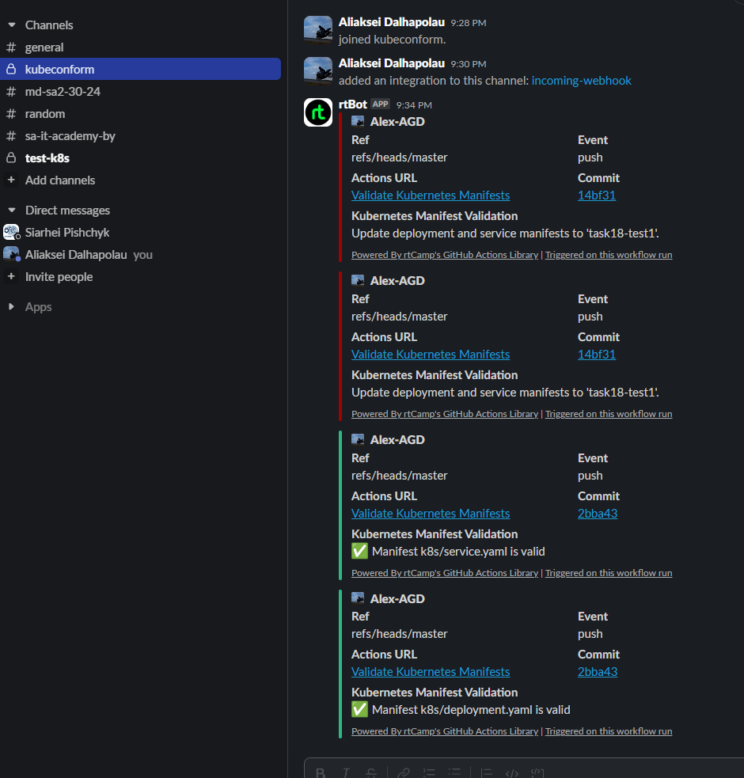

# 18.Testing

## Homework Assignment 1: Automate Docker images test by github action

# link
[repo](https://github.com/Alex-AGD/git-actions)
[link test repo](https://github.com/Alex-AGD/git-actions/actions/runs/13291708871/job/37113891859)
```yaml
name: Docker Image Test

on:
  push:
    branches: [ master ]
  pull_request:
    branches: [ master ]

jobs:
  test:
    runs-on: ubuntu-latest

    steps:
      - name: Checkout repository
        uses: actions/checkout@v4

      - name: Set up Docker Buildx
        uses: docker/setup-buildx-action@v3

      - name: Build Docker image
        uses: docker/build-push-action@v5
        with:
          context: .
          load: true
          tags: test-app:latest
          cache-from: type=gha
          cache-to: type=gha,mode=max

      - name: Run Docker container
        run: |
          docker run -d --name test-container -p 8000:8000 test-app:latest
          sleep 5

      - name: Test health endpoint
        run: |
          response=$(curl -s -o /dev/null -w "%{http_code}" http://localhost:8000/health)
          if [ "$response" != "200" ]; then
            echo "Health check failed with status code $response"
            exit 1
          fi
          echo "Health check passed"

      - name: Test main endpoint
        run: |
          response=$(curl -s http://localhost:8000/)
          if ! echo "$response" | grep -q "Hello, World!"; then
            echo "Main endpoint check failed"
            exit 1
          fi
          echo "Main endpoint check passed"

      - name: Test non-root user
        run: |
          # Проверяем, что процесс в контейнере запущен не от root
          user_id=$(docker exec test-container id -u)
          user_name=$(docker exec test-container id -un)
          if [ "$user_id" = "0" ]; then
            echo "Container is running as root!"
            exit 1
          fi
          echo "Container is running as $user_name (UID: $user_id)"

      - name: Clean up
        if: always()
        run: docker rm -f test-container || true
```
### Homework Assignment 2: Create CI for testing Kubernetes manifests using kubeconform
# link
[repo](https://github.com/Alex-AGD/k8s-manifests-ci)
[link test repo](https://github.com/Alex-AGD/k8s-manifests-ci/actions/runs/13292465869/job/37116357165)

## test result

## Slack notification


```yaml
name: Validate Kubernetes Manifests

on:
  push:
    paths:
      - 'k8s/**'
  pull_request:
    paths:
      - 'k8s/**'

jobs:
  validate:
    runs-on: ubuntu-latest

    strategy:
      matrix:
        manifest: [k8s/deployment.yaml, k8s/service.yaml]
      fail-fast: false

    steps:
      - name: Checkout code
        uses: actions/checkout@v4

      - name: Download kubeconform
        run: |
          wget https://github.com/yannh/kubeconform/releases/download/v0.6.4/kubeconform-linux-amd64.tar.gz
          tar xf kubeconform-linux-amd64.tar.gz
          sudo mv kubeconform /usr/local/bin/
          rm kubeconform-linux-amd64.tar.gz

      - name: Validate manifest
        id: validate
        run: |
          kubeconform -strict -summary ${{ matrix.manifest }}
        continue-on-error: true

      - name: Prepare notification message
        if: always()
        id: notification
        run: |
          if [ "${{ steps.validate.outcome }}" = "success" ]; then
            echo "message=✅ Manifest ${{ matrix.manifest }} is valid" >> $GITHUB_OUTPUT
          else
            echo "message=❌ Manifest ${{ matrix.manifest }} validation failed" >> $GITHUB_OUTPUT
          fi

      - name: Send Slack notification
        if: always()
        uses: rtCamp/action-slack-notify@v2
        env:
          SLACK_WEBHOOK: ${{ secrets.SLACK_WEBHOOK }}
          SLACK_MESSAGE: ${{ steps.notification.outputs.message }}
          SLACK_TITLE: Kubernetes Manifest Validation
          SLACK_COLOR: ${{ steps.validate.outcome == 'success' && 'good' || 'danger' }}
```
